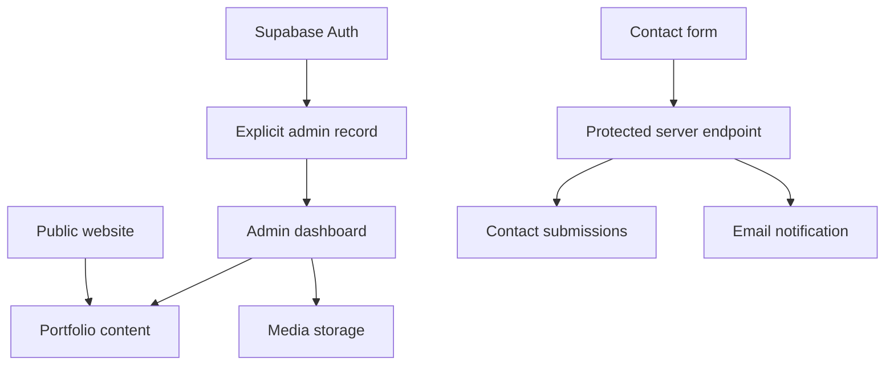
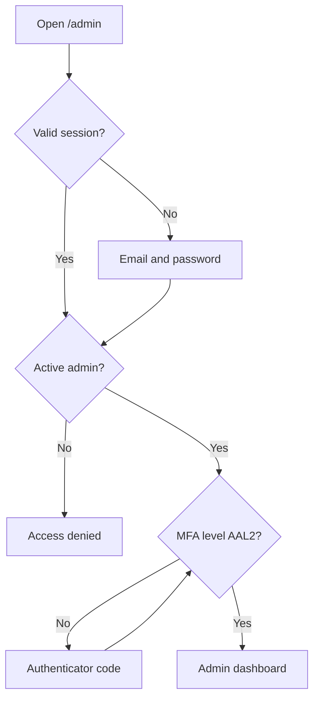
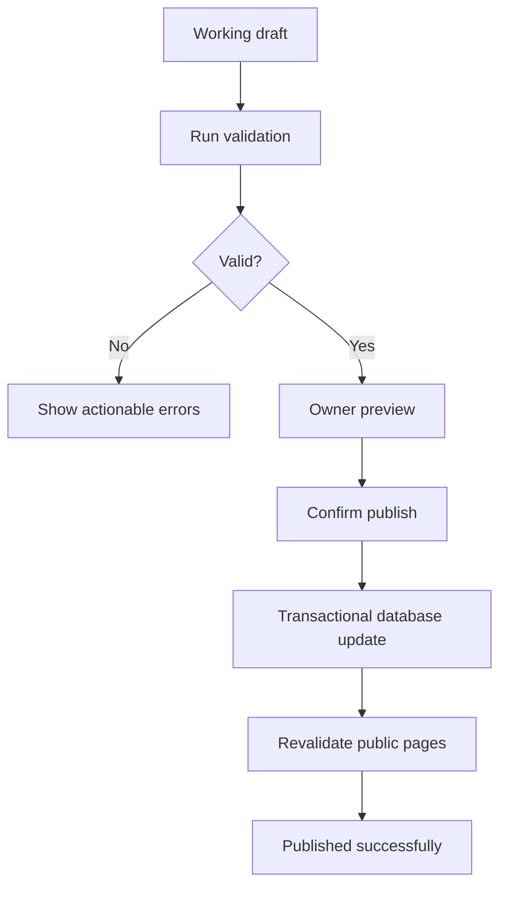
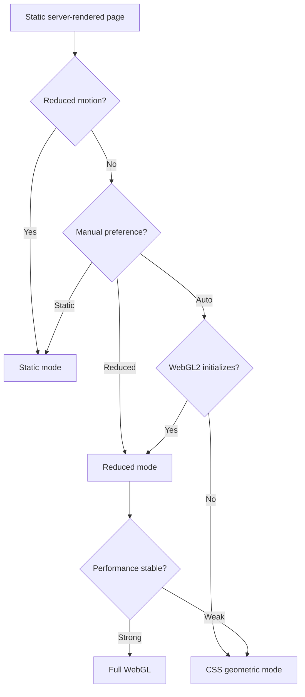
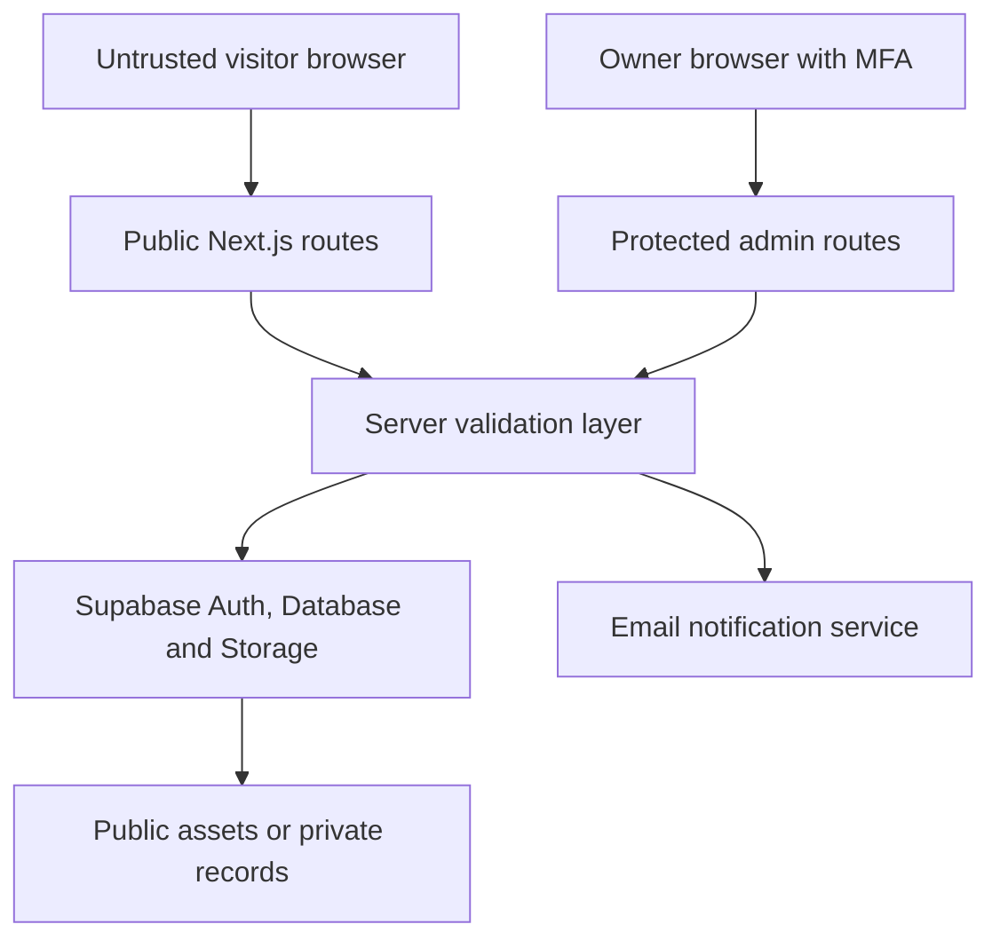
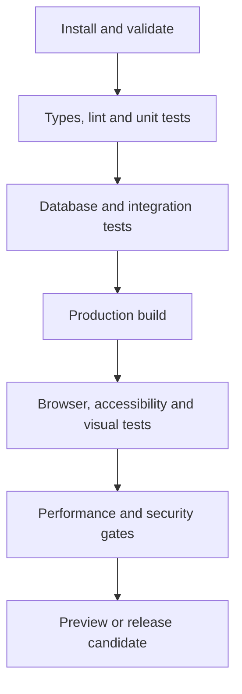
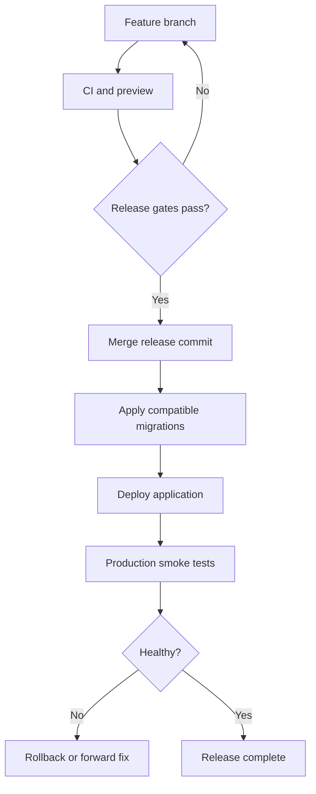
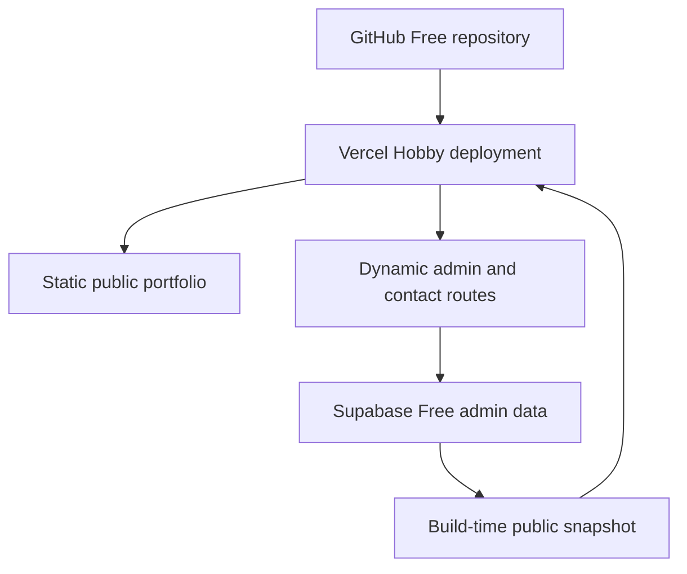

# Project Understanding Summary

**User:** Anonymous  
**Created:** 8/24/2026 17:28:32  
**Updated:** 8/27/2026 14:29:39  
**Exported:** 8/27/2026 14:30:14  
**Link:** [https://chatgpt.com/g/g-p-6a8c2b9da2c88191ba3b8ee9a122cdae/c/6a8c31a9-ce80-83e8-9947-1eb200b522f0](https://chatgpt.com/g/g-p-6a8c2b9da2c88191ba3b8ee9a122cdae/c/6a8c31a9-ce80-83e8-9947-1eb200b522f0)  

## Prompt:
24/08/2026, 17:28:26

@GitHubAbsolute Mode: Read the MD file and the PDF You will get the idea And the intent behind project and we will the implementation you tell me what you have understood

## Response:
24/08/2026, 17:28:33

I’m using the PDF workflow to inspect the design plan accurately. I’ll also check the selected GitHub integration for repository context, then give only my understanding of the project—no implementation yet.

The two files align on the core intent: this is a professional portfolio first and an anime-inspired experience second. I’m checking the PDF’s visual hierarchy and architecture details now, including where the plan overstates certainty or leaves implementation gaps.

> **Reading PDF Skill and Design Document**
>
>
> **Reviewed PDF skill, design documents, and project sources**
>
> 
>
> **Creating Contact Sheet From PDF Pages**
>
>
> **Created a contact sheet from PDF pages**
>
> 
>
> Worked for 35s

## What I understood

This project is a production-ready personal portfolio website inspired by the visual language of the Tensura anime opening—especially its geometric patterns, magic-circle motifs, particles, neon colours, glow effects, kinetic typography, and cinematic motion.

It is not intended to be:

- A Tensura fan website.
- A direct recreation of copyrighted scenes or characters.
- A graphics demo with portfolio content added afterward.
- A website requiring powerful hardware or fast internet.

The core product remains a professional developer portfolio suitable for resumes, recruiters, internship applications, and future job applications. The Tensura influence defines its visual identity.

## Intended visitor experience

The public website should:

- Introduce you, your career direction, and technical identity immediately.
- Present projects, skills, education, experience, achievements, and contact information.
- Use scroll-driven visual storytelling.
- Transform particles and geometric formations as visitors move between sections.
- Remain readable even when WebGL effects are active.
- Work properly on phones, tablets, laptops, and desktops.
- Remain functional when WebGL is unavailable or disabled.
- Load efficiently on normal mobile data and standard hardware.
- Provide direct links to GitHub, LinkedIn, live projects, résumé, and contact methods.

The visual system should support the content, not compete with it.

## Architecture described in the documents

The system has three separated layers:

| Layer | Responsibility |
|---|---|
| Next.js DOM layer | Content, navigation, SEO, accessibility, responsive layouts and admin interface |
| WebGL graphics layer | Magic circles, particles, grids, shader effects and bloom |
| Supabase layer | Portfolio data, authentication, images and authorization |

The proposed stack is:

- Next.js 15 with App Router
- TypeScript
- Tailwind CSS
- shadcn/ui
- Three.js with React Three Fiber
- Custom GLSL shaders
- `@react-three/postprocessing`
- GSAP with ScrollTrigger
- Supabase PostgreSQL
- Supabase Authentication
- Supabase Storage
- Zod and React Hook Form

The WebGL canvas remains persistent while the semantic HTML content sits above it. GSAP communicates scroll progress directly to shader uniforms instead of forcing React state updates every frame.

## Visual direction

The primary visual vocabulary is:

- Deep black or blue-black backgrounds.
- Neon cyan as the dominant energy colour.
- Electric violet as the secondary colour.
- Selective white highlights.
- Concentric circles and segmented arcs.
- HUD grids, glyphs and targeting marks.
- Particle fields that morph between formations.
- Controlled bloom and atmospheric glow.
- Fast but intentional transitions.
- Strong typographic hierarchy.

The website should capture the opening’s energy and geometry without copying its protected artwork, footage, logos, characters, music, or exact compositions.

## Content-management intent

You want complete ownership of portfolio content without editing source code whenever something changes.

A protected `/admin` area should allow you to:

- Edit your profile.
- Create, edit, publish, unpublish and delete projects.
- Update skills and categories.
- Manage education and experience.
- Upload project images.
- Change display order.
- Control featured content.
- Update links and résumé information.

Public visitors receive read-only access. Only your authenticated owner account receives mutation permissions. Supabase Row Level Security must enforce this at the database level; hiding the admin interface alone is insufficient.

## Performance strategy

The intended safeguards include:

- Procedural graphics instead of video backgrounds.
- GPU-based particle calculations.
- Half-resolution bloom.
- Selective bloom only on emissive elements.
- Device-pixel-ratio capping around `1.5`.
- Reduced particle counts on weaker devices.
- Adaptive effect quality based on performance.
- Mobile-specific composition adjustments.
- Lazy loading for noncritical components.
- Reduced-motion support.
- Static or lightweight fallback when WebGL is unavailable.
- No continuous React re-rendering from animation frames.

The documents propose performance targets such as 60 FPS on desktop, approximately 50 FPS on mid-range mobile, LCP below 2.5 seconds, FCP below 1.2 seconds, and CLS below 0.1. These are targets requiring measurement, not guaranteed outcomes.

## Implementation sequence

The effective implementation order is:

1. Confirm requirements, information architecture and content model.
2. Establish the Next.js project and design-token system.
3. Build the responsive semantic portfolio without advanced graphics.
4. Configure Supabase tables, storage, authentication and RLS.
5. Implement the protected admin dashboard.
6. Add the persistent WebGL environment.
7. Develop magic-circle and particle shader prototypes.
8. Connect scroll progress to visual transitions.
9. Add progressive performance tiers and fallbacks.
10. Test accessibility, responsiveness, security, SEO and performance.
11. Deploy and perform real-device verification.

The portfolio must be complete and usable before WebGL enhancement begins. This prevents the visual engine from becoming a dependency for basic navigation or content access.

## Important gaps in the supplied design

The research provides a strong architectural direction, but it is not yet an implementation-complete specification.

Missing or insufficiently defined areas include:

- Final page and section structure.
- Exact desktop, tablet and mobile compositions.
- Navigation behaviour.
- Real portfolio content and copy.
- Contact-form behaviour and spam protection.
- Résumé storage and update workflow.
- Education and certification schemas.
- Project-detail page structure.
- SEO metadata and structured data.
- Analytics and privacy decisions.
- Error, loading and empty states.
- Accessibility acceptance criteria.
- WebGL fallback hierarchy.
- Exact adaptive-performance thresholds.
- Browser-support policy.
- Testing framework and test cases.
- Deployment environment and domain configuration.
- Backup and database migration strategy.
- Admin account allowlisting.
- Draft and preview workflow.

The proposed RLS rule also needs correction. Treating every row in `profiles` as an administrator is unsafe if additional profiles can ever be created. Ownership should be enforced with an explicit admin allowlist, owner table, custom claim, or immutable owner identifier.

The category constraints in the example database are also too narrow for your actual profile. Your portfolio includes AI/ML, Android, IoT, networking, data analytics, cybersecurity, academic projects, internships, and hackathons. These categories should be data-driven rather than permanently hard-coded into PostgreSQL checks and Zod enums.

## Final interpretation

The intended product is a secure, content-managed, responsive developer portfolio with a distinctive Tensura-inspired anime-geometric presentation. Its engineering priorities are ordered as follows:

1. Professional credibility.
2. Clear presentation of your work.
3. Accessibility and responsiveness.
4. Secure owner-controlled content management.
5. Performance on ordinary devices.
6. Cinematic visual differentiation.

The PDF is the architectural proposal. The Markdown file provides the original motivation, clarifications, and operational intent behind that proposal. Together they establish the vision, but they still require conversion into a concrete product requirements document, content model, interface specification, technical task plan, and verified implementation.

No GitHub repository or repository identifier was included, so no repository code has been inspected or modified.

Sources: [Design conversation](sandbox:/workspace/scratch/bf27ea47a49b/project_sources/01-Tensura-Themed_Portfolio_Website_Design_Doc-2026-08-24-17-20-56.md) and [architectural design plan](sandbox:/workspace/scratch/bf27ea47a49b/project_sources/02-Tensura-Inspired-Portfolio-Design-Plan.pdf).

## Prompt:
24/08/2026, 17:38:07

So what needs to be done before getting started

## Response:
24/08/2026, 17:38:13

Before writing code, complete a short pre-development phase. The research document provides the vision and architecture, but several product decisions remain unresolved.

## 1. Define the MVP

Version 1 should include:

- Home/hero
- About
- Skills
- Projects
- Experience and education
- Certifications or achievements
- Contact
- Résumé download
- Individual project pages
- Secure admin login and dashboard
- Responsive WebGL visual layer
- Reduced-motion and non-WebGL fallbacks

Exclude initially:

- Blog
- Visitor accounts
- Comments
- Multilingual support
- Complex real-time features
- Excessive 3D models
- Music or anime footage
- Advanced analytics dashboards

## 2. Prepare the actual content

Collect finalized content before UI development:

- Full name and professional headline
- Short and detailed biography
- Professional photograph or avatar
- Résumé PDF
- Email and location
- GitHub and LinkedIn URLs
- Education details
- Internship and experience records
- Technical skills grouped by category
- Certifications
- Achievements and hackathons
- Project descriptions
- Project screenshots
- GitHub and live-demo links
- Technologies used
- Measurable outcomes for each project

Use approximately four to six strong projects. Weak or unfinished projects should not dominate the portfolio.

## 3. Define the information architecture

Recommended public routes:

```text
/
├── /about
├── /projects
├── /projects/[slug]
├── /experience
├── /contact
├── /resume
└── /admin
    ├── /login
    └── /dashboard
```

The homepage can contain condensed versions of all major sections. Dedicated project pages should hold technical detail.

## 4. Create the visual specification

Convert the general anime inspiration into measurable design rules:

- Primary background colour
- Primary cyan colour
- Secondary violet colour
- Text and muted-text colours
- Heading and body fonts
- Spacing scale
- Border and corner system
- Glow intensity
- Maximum particle density
- Animation durations
- Desktop, tablet and mobile breakpoints
- Reduced-motion behaviour
- Visual hierarchy for every section

Create low-fidelity wireframes before implementing shaders:

- Desktop homepage
- Mobile homepage
- Project listing
- Project-detail page
- Admin dashboard

The interface must remain understandable with the WebGL canvas disabled.

## 5. Finalize the data model

The database should include at least:

| Entity | Purpose |
|---|---|
| `site_profile` | Name, headline, biography, avatar and social links |
| `projects` | Project content, links, publication state and ordering |
| `project_media` | Screenshots and media metadata |
| `skills` | Skills and categories |
| `skill_categories` | Data-driven skill grouping |
| `experiences` | Internships and work history |
| `education` | Degree and college information |
| `certifications` | Certificates and credentials |
| `achievements` | Hackathons and notable accomplishments |
| `site_settings` | SEO, résumé and contact configuration |
| `admins` | Explicit administrative authorization |

Do not use the existence of a `profiles` record as proof that someone is an administrator.

## 6. Define the admin workflow

Specify which actions the dashboard must support:

- Create, edit and delete records
- Save drafts
- Publish and unpublish projects
- Upload and replace images
- Reorder content
- Preview unpublished changes
- Replace the résumé
- Edit SEO information
- Sign out
- Confirm destructive operations
- Display validation and database errors

Use one explicitly authorized owner account.

## 7. Define responsive behaviour

For each breakpoint, specify:

| Device | Layout | Graphics |
|---|---|---|
| Mobile | Single-column, compact navigation | Low particle count, reduced bloom |
| Tablet | One or two columns | Medium graphics quality |
| Desktop | Multi-column cinematic layout | Full approved effects |
| Low-power device | Normal content layout | Static or minimal animated background |
| Reduced motion | Normal content layout | No scroll-bound or continuous movement |

Responsiveness must involve recomposition, not merely shrinking desktop graphics.

## 8. Establish performance budgets

Use enforceable limits:

- First Contentful Paint: under 1.8 seconds
- Largest Contentful Paint: under 2.5 seconds
- Cumulative Layout Shift: under 0.1
- Initial JavaScript: controlled through route-level loading
- WebGL canvas: lazy-loaded after essential content
- Desktop graphics target: approximately 60 FPS
- Mid-range mobile target: at least approximately 45–50 FPS
- Device pixel ratio: capped
- Images: WebP or AVIF with responsive sizing
- No video background
- No essential information rendered only inside WebGL

The original FCP target of 1.2 seconds is ambitious and should be treated as an optimization target rather than a release requirement.

## 9. Define the visual fallback system

Use progressive enhancement:

```text
Full WebGL
    ↓ performance failure
Reduced particles and bloom
    ↓ unsupported or weak device
CSS geometric animation
    ↓ reduced-motion preference
Static geometric background
```

Content and navigation must continue working at every level.

## 10. Define security requirements

Before development, establish:

- Explicit admin allowlisting
- Supabase Row Level Security
- Server-side user verification
- No service-role key in browser code
- Zod validation on the server
- File type and upload-size restrictions
- Safe rendering of rich project content
- Rate limiting for contact submissions
- CAPTCHA or honeypot spam protection
- Secure environment-variable handling
- Database backup and migration process
- Confirmation before destructive admin actions

## 11. Decide deployment infrastructure

Recommended baseline:

- GitHub for source control
- Vercel for Next.js deployment
- Supabase for database, authentication and storage
- Custom domain
- Separate development and production environment variables
- Preview deployment for each pull request
- Supabase migrations stored in the repository

## 12. Establish repository structure

```text
app/
├── (public)/
├── admin/
└── api/

components/
├── ui/
├── sections/
├── graphics/
└── admin/

lib/
├── supabase/
├── validation/
├── queries/
└── utilities/

features/
├── projects/
├── skills/
├── experience/
└── profile/

shaders/
├── magic-circle/
└── particles/

supabase/
├── migrations/
└── seed.sql

public/
├── images/
└── resume/

tests/
```

Keep portfolio content logic, admin logic and graphics code separated.

## 13. Define testing requirements

Required verification:

- Mobile, tablet and desktop layouts
- Chrome, Edge, Firefox and Safari
- Keyboard-only navigation
- Screen-reader structure
- Colour contrast
- Reduced-motion behaviour
- WebGL-disabled fallback
- Slow-network loading
- Admin authorization
- Unauthorized database mutations
- Image upload validation
- Project CRUD operations
- Contact-form spam protection
- Lighthouse performance
- Real mid-range Android testing

## 14. Create the implementation backlog

Break development into controlled milestones:

1. Requirements and content inventory
2. Wireframes and design tokens
3. Repository and development environment
4. Responsive static portfolio
5. Supabase schema and RLS
6. Admin authentication
7. Admin content management
8. Project-detail pages
9. Basic geometric visual prototype
10. Particle and magic-circle shaders
11. GSAP scroll integration
12. Adaptive graphics system
13. Accessibility and fallback implementation
14. Testing and optimization
15. Production deployment

## Definition of ready

Development is ready to begin when these outputs exist:

- Approved MVP scope
- Complete content inventory
- Final route map
- Desktop and mobile wireframes
- Design-token sheet
- Final database schema
- Admin authorization model
- Performance budgets
- Graphics fallback policy
- Deployment decision
- Prioritized implementation backlog

The immediate next deliverable is not code. It is a consolidated Product Requirements and Technical Specification document that resolves these decisions and converts the research report into an executable development plan.

## Prompt:
25/08/2026, 14:51:25

Let's tackle the things that you have listed one by one

## Response:
25/08/2026, 14:51:49

## Step 1 — Define the MVP

The MVP is the smallest version that functions as a professional portfolio, supports content updates through an admin dashboard, and establishes the Tensura-inspired visual identity.

### Public portfolio

The first release will include:

1. **Home page**
   - Hero introduction
   - Professional headline
   - Short biography
   - Featured projects
   - Core skills
   - Experience summary
   - Contact section
   - Résumé download

2. **Projects page**
   - Project grid
   - Category filtering
   - Technology labels
   - Featured-project distinction
   - GitHub and live-demo links

3. **Individual project pages**
   - Problem statement
   - Project objective
   - Technical solution
   - Technology stack
   - Screenshots
   - Challenges and solutions
   - Results
   - Repository and demonstration links

4. **About page**
   - Detailed introduction
   - Education
   - Career direction toward AI/ML and LLM engineering
   - Technical interests
   - Personal strengths

5. **Experience page**
   - Internship
   - Hackathons
   - Relevant training
   - Certifications
   - Important academic and independent work

6. **Contact system**
   - Contact form
   - Email
   - GitHub
   - LinkedIn
   - Spam protection
   - Submission success and error states

7. **Résumé**
   - Downloadable PDF
   - Replaceable through the admin dashboard

### Admin dashboard

The MVP admin system will support:

- Secure owner-only login
- Profile editing
- Project creation and editing
- Draft, published and featured project states
- Project deletion with confirmation
- Project image uploads
- Skill management
- Experience management
- Education management
- Certification management
- Content reordering
- Résumé replacement
- Basic SEO editing
- Sign-out functionality

No public registration will exist.

### Visual system

The first release will contain:

- Persistent geometric background
- Procedural magic-circle effect
- GPU particle field
- Cyan, violet and deep-black colour system
- Scroll-linked visual transitions
- Selective bloom
- Kinetic typography
- HUD-inspired borders and interface details
- Desktop, tablet and mobile compositions
- Reduced-motion mode
- Static fallback for unsupported devices
- Automatic graphics-quality reduction on weaker hardware

The anime influence will remain abstract. No Tensura characters, logos, footage, music, copyrighted symbols or copied compositions will be used.

### Initial portfolio content

The MVP should prioritize approximately six projects:

1. Road Sense AI
2. ESP32 Body Temperature Monitoring System
3. Fire Detection System
4. BGP Inter-Domain Routing Simulation
5. Health and Fitness Tracking Apps Awareness
6. Green Computing Practices Survey

Road Sense AI and the ESP32 system should receive the strongest visual and technical treatment. Academic survey projects should appear as research or academic work, not be presented as equivalent to production software projects.

### Excluded from the MVP

These features will not be part of the first release:

- Blog
- Visitor accounts
- Comments
- Likes or social features
- Real-time chat
- Newsletter
- Multilingual support
- Built-in analytics dashboard
- Multiple administrators
- Music or background audio
- Heavy 3D character models
- Visitor-controlled shader editor
- Excessive page-transition effects
- AI chatbot
- Complex role-based access control

These exclusions prevent scope inflation.

### MVP success criteria

The MVP is complete only when:

- Visitors can understand who you are within the first screen.
- Every major project has a dedicated case-study page.
- All essential content can be updated without changing source code.
- Unauthorized users cannot modify portfolio data.
- The website works without WebGL.
- Mobile layouts remain readable and visually intentional.
- Keyboard navigation works.
- Reduced-motion preferences are respected.
- Project images are optimized.
- Public pages are indexable by search engines.
- Core pages meet reasonable Lighthouse and Core Web Vitals targets.
- The deployed URL is suitable for inclusion in your résumé and LinkedIn profile.

### Scope decision

This is the approved working MVP baseline:

```text
Professional portfolio
+ secure personal CMS
+ responsive anime-geometric visual system
+ project case studies
+ performance and accessibility fallbacks
```

Step 1 is structurally complete. The next item is the portfolio content inventory.

## Prompt:
25/08/2026, 15:10:43

step one structurally completed, Let's move on to the next step

## Response:
25/08/2026, 15:10:49

> **Drafting content inventory v0.1**
>
> **Drafting content inventory v0.1**
>
> **Drafted content inventory version 0.1**
>
> 
>
> Worked for 7s

## Step 2 — Portfolio Content Inventory

This step determines what information the portfolio must store and display. Content must be separated into confirmed, draft, and missing material.

## 2.1 Identity

| Field | Current value | Status |
|---|---|---|
| Full name | Sufiyan Mohammed Usman Mansoori | Confirmed |
| Professional name | Sufiyan Mansoori | Proposed |
| Location | Ulhasnagar, Maharashtra, India | Confirmed |
| Degree | B.Sc. Computer Science | Confirmed |
| College | R.K. Talreja College of Arts, Science and Commerce | Confirmed |
| University | University of Mumbai | Confirmed |
| Graduation year | 2027 | Confirmed |
| Email | Not supplied | Missing |
| Phone number | Not required publicly | Excluded |
| Profile photograph | Not supplied | Missing |
| Résumé PDF | Not supplied | Missing |

### Proposed professional headline

> Computer Science Student | Aspiring AI/ML Engineer | Building Intelligent Software and Connected Systems

This is accurate without claiming professional expertise that has not yet been established.

### Proposed short introduction

> I am a Computer Science student focused on artificial intelligence, machine learning and software engineering. I build practical projects across AI, web development, IoT and computer networks while developing the technical foundations required for an AI/ML engineering career.

Status: Draft.

## 2.2 Career direction

The portfolio should communicate this progression:

```text
Computer Science foundation
        ↓
Software and data projects
        ↓
Machine learning and intelligent systems
        ↓
Long-term AI/ML and LLM engineering career
```

The website should not present unrelated interests as equal career targets. AI/ML is the primary direction. IoT, networking, data analytics, cybersecurity and mobile development demonstrate technical breadth.

## 2.3 Public links

| Platform | Value | Status |
|---|---|---|
| GitHub | `github.com/sufiyan547-it` | Confirmed |
| LinkedIn | `linkedin.com/in/sufiyan-shaihk006` | Requires URL verification |
| Live portfolio | Not created | Pending deployment |
| Email | Not supplied | Missing |
| Downloadable résumé | Not supplied | Missing |

The LinkedIn URL contains the earlier surname spelling and may remain valid, but the visible portfolio name should use the current name.

## 2.4 Education

### Primary education record

- Degree: Bachelor of Science in Computer Science
- Institution: R.K. Talreja College of Arts, Science and Commerce
- University: University of Mumbai
- Location: Ulhasnagar, Maharashtra
- Period: 2024–2027
- Current stage: Third year
- Graduation status: Expected 2027

Relevant coursework should be limited to career-relevant subjects:

- Artificial Intelligence
- Data Structures and Algorithms
- Computer Networks
- Operating Systems
- Software Engineering
- Data Analytics
- Internet of Things
- Ethical Hacking
- Regression Analysis using R
- Theory of Computation

Marks and SGPA should only be displayed if they strengthen the application.

## 2.5 Experience

### Innovant Software Pvt. Ltd.

| Field | Content |
|---|---|
| Type | Remote internship |
| Duration | Three months |
| Role | Requires confirmation |
| Domain | Mobile application development |
| Technology | Android Studio and Kotlin |
| Work performed | Requires complete task inventory |
| Outcome | Certificate or completion status required |
| Dates | Missing |

Current information is insufficient for a strong experience entry. The final record requires actual responsibilities, completed tasks and measurable outcomes.

### Tata iQ Forage simulation

| Field | Content |
|---|---|
| Programme | Data Analytics Job Simulation |
| Organisation | Tata iQ / Forage |
| Project context | Geldium delinquency analysis |
| Skills | Data analysis, predictive reasoning and business communication |
| Completion date | Missing |
| Credential link | Missing |

This should appear under training or virtual experience, not conventional employment.

## 2.6 Project inventory

### Tier A — Featured technical projects

#### 1. Road Sense AI

- Type: AI-enabled web application
- Context: Algorithm X Hackathon
- Technologies: React, TypeScript and Supabase
- Known issue encountered: user records not appearing correctly in Supabase
- Required content:
  - Exact problem statement
  - AI functionality
  - Model or API used
  - Personal contribution
  - Team size
  - Application screenshots
  - Repository URL
  - Live demonstration URL
  - Final project status
  - Hackathon result

Status: High priority, incomplete content.

#### 2. IoT Body Temperature Monitoring System

- ESP32
- DS18B20 waterproof sensor
- 16×2 I2C LCD
- Celsius/Fahrenheit switching
- Manual and automatic measurement modes
- Normal, light-fever and high-fever classification
- LED and buzzer alerts
- ThingSpeak cloud monitoring
- Non-blocking embedded logic

Required evidence:

- Final prototype photographs
- Circuit diagram
- Repository
- Demonstration video
- Accuracy and calibration explanation
- Final working status

Status: Strong featured project.

#### 3. Fire Detection System

- Arduino UNO
- Flame sensor
- I2C LCD
- Active buzzer
- Fire-state display and alarm logic

Required evidence:

- Prototype photograph
- Circuit diagram
- Repository
- Demonstration video
- Final sensor logic
- Limitations

Status: Suitable technical project, lower complexity.

#### 4. BGP Inter-Domain Routing Simulation

- Cisco Packet Tracer
- Multiple autonomous routing domains
- BGP configuration
- Connectivity and route verification
- Troubleshooting of interface and packet-loss behaviour

Required evidence:

- Topology screenshot
- Packet Tracer file
- Router configuration
- Final routing table
- Testing results
- Repository or downloadable documentation

Status: Suitable networking project.

### Tier B — Research and field projects

#### 5. Health & Fitness Tracking Apps Awareness

- Six field visits
- Twenty survey responses
- Fourteen interviews
- Awareness and usage analysis
- Samsung Health and Google Fit demonstrations
- Privacy and participation challenges

Required evidence:

- Final report
- Charts
- Survey methodology
- Photographs permitted for publication
- Key findings
- Personal contribution

Classification: Research and community-engagement project.

#### 6. Green Computing Practices Survey

- Electronic repair and retail-shop research
- College IT department visit
- E-waste and refurbishment practices
- Awareness-gap analysis
- Field-report preparation

Required evidence:

- Final report
- Survey charts
- Approved photographs
- Team size
- Personal contribution
- Final recommendations

Classification: Research and sustainability project.

## 2.7 Additional projects requiring evaluation

These should only be included if source code and documentation are available:

- Text editor with undo/redo
- Infix-to-postfix converter
- CPU scheduling implementations
- Readers–Writers synchronization
- Java backup and recovery application
- Java Fibonacci GUI
- Data analytics dashboards
- Android internship work

Small laboratory programs should be grouped under a single “Programming Practicals” repository rather than displayed as major individual projects.

## 2.8 Skills inventory

### Programming languages

- Python
- C++
- C
- Java
- Kotlin
- JavaScript
- TypeScript
- SQL
- R

Proficiency percentages should not be used. They are subjective and difficult to defend.

### AI and data

- Machine-learning fundamentals
- Data analysis
- Pandas
- NumPy
- Matplotlib
- Seaborn
- Scikit-learn
- Power BI
- Regression analysis

### Web development

- React
- TypeScript
- HTML
- CSS
- Supabase
- Git and GitHub

### Mobile development

- Android Studio
- Kotlin

### IoT and embedded systems

- ESP32
- Arduino
- Sensors and actuators
- ThingSpeak
- Embedded C/C++

### Networking and systems

- Cisco Packet Tracer
- BGP
- Static routing
- DHCP
- DNS
- HTTP and FTP
- Windows networking tools

### Development tools

- VS Code
- GitHub
- Arduino IDE
- Supabase
- Power BI

Every displayed skill must satisfy at least one condition:

- Used in a completed project.
- Studied through substantial coursework.
- Supported by a credential.
- Currently used at a defensible practical level.

## 2.9 Certifications and training

Known entries:

- IBM Introduction to Data Analytics — Coursera
- Career Essentials in Data Analysis — LinkedIn Learning
- Tata Data Analytics Job Simulation — Forage

Missing information:

- Completion dates
- Credential IDs
- Credential URLs
- Certificate files
- Exact course titles
- Completion status

Incomplete courses must not be shown as completed credentials.

## 2.10 Achievements and activities

Potential entries:

- Selected for Innovant Software Pvt. Ltd. remote internship
- Participant in Algorithm X Hackathon
- Delivered technical presentations on IoT-generated big data
- Completed field research projects involving surveys and interviews
- Developed multiple embedded-systems and networking projects

These need dates, evidence and concise outcome statements.

## 2.11 Assets inventory

| Asset | Required format | Status |
|---|---|---|
| Profile photograph | WebP/AVIF, high resolution | Missing |
| Résumé | PDF | Missing |
| Project screenshots | WebP/AVIF | Missing |
| Project diagrams | SVG/PNG | Missing |
| GitHub repositories | Public URLs | Partially missing |
| Demo videos | YouTube/unlisted or compressed MP4 | Missing |
| Certificates | PDF or image | Missing |
| College logo | Not necessary | Excluded |
| Anime screenshots | Copyright risk | Excluded |
| Custom geometric graphics | SVG/shader-generated | Pending design |

## 2.12 Content still required

Supply the following data:

```text
PUBLIC EMAIL:
PROFILE PHOTO AVAILABLE: Yes/No
CURRENT RÉSUMÉ AVAILABLE: Yes/No

INNOVANT INTERNSHIP:
Role:
Start date:
End date:
Tasks completed:
Technologies used:
Certificate received:
Measurable result:

ROAD SENSE AI:
One-sentence problem:
Your contribution:
Team size:
AI/model/API used:
Current status:
GitHub URL:
Live URL:
Hackathon result:

CERTIFICATIONS:
Exact title:
Issuer:
Completion date:
Credential URL:

PROJECT REPOSITORIES:
Project name:
GitHub URL:
Live/demo URL:
Screenshots available: Yes/No
```

Step 2 remains open until the missing identity, experience, credential and project-evidence fields are supplied.

## Prompt:
25/08/2026, 15:32:48

| FieldCurrent valueStatus |                                                    |                         |
| ------------------------ | -------------------------------------------------- | ----------------------- |
| Full name                | Sufiyan Mohammed Usman Shaikh                      | Confirmed               |
| Professional name        | Sufiyan Shaikh                                     | Confirmed               |
| Location                 | Ambarnath, Maharashtra, India                      | Confirmed               |
| Degree                   | B.Sc. Computer Science                             | Confirmed               |
| College                  | R.K. Talreja College of Arts, Science and Commerce | Confirmed               |
| University               | University of Mumbai                               | Confirmed               |
| Graduation year          | 2027                                               | Confirmed               |
| Email                    | shaikhsufiyan0660\@gmail.com                       | Confirmed               |
| Phone number             | Not required publicly                              | Excluded                |
| Profile photograph       | Not supplied                                       | will be given at coding |
| Résumé PDF               | Not supplied                                       | will be given at coding |

Proposed headline: Accepted
Proposed Short introduction: Accepted
Career direction: good but missing system design, and DevOps basics as current goal of learning for getting recruited 

| PlatformValueStatus |                                     |                           |
| ------------------- | ----------------------------------- | ------------------------- |
| GitHub              | Value<br>`github.com/sufiyan547-it` | Status<br>Confirmed       |
| LinkedIn            | `linkedin.com/in/sufiyan-shaihk006` | Requires URL verification |
| Live portfolio      | Not created                         | Pending deployment        |
| Email               | Not supplied                        | Missing                   |
| Downloadable résumé | Not supplied                        | Missing                   |

## Response:
25/08/2026, 15:32:57

> **Updating public links and verification plan**
>
> **Updating public links and verification plan**
>
> **Updated public links and verification plan**
>
> 
>
> Worked for 8s

## Step 2 update — Identity and career direction

The corrected information supersedes the previous inventory.

### Confirmed identity

| Field | Confirmed value |
|---|---|
| Full name | Sufiyan Mohammed Usman Shaikh |
| Professional name | Sufiyan Shaikh |
| Location | Ambarnath, Maharashtra, India |
| Degree | B.Sc. Computer Science |
| College | R.K. Talreja College of Arts, Science and Commerce |
| University | University of Mumbai |
| Expected graduation | 2027 |
| Public email | `shaikhsufiyan0660@gmail.com` |
| Phone number | Excluded |
| Profile photograph | Will be supplied during implementation |
| Résumé PDF | Will be supplied during implementation |

The surname **Mansoori** is removed from the portfolio specification.

## Confirmed professional headline

> Computer Science Student | Aspiring AI/ML Engineer | Building Intelligent Software and Connected Systems

## Revised short introduction

> I am a Computer Science student focused on artificial intelligence, machine learning and software engineering. I build practical projects across AI, web development, IoT and computer networks while strengthening my foundations in system design and DevOps for an industry-ready engineering career.

This remains accurate because system design and DevOps are described as current learning areas, not established professional expertise.

## Revised career direction

```text
Computer Science fundamentals
        ↓
Programming, DSA and software engineering
        ↓
AI/ML and intelligent application development
        ↓
System design and DevOps foundations
        ↓
Production-ready AI/ML engineering
```

### Primary career target

- AI/ML Engineer
- Long-term specialization in LLM and intelligent systems engineering

### Supporting engineering foundations

- Data structures and algorithms
- Software engineering
- Backend development
- Databases
- System design
- DevOps fundamentals
- Cloud fundamentals
- Git-based development workflows
- Testing, deployment and monitoring

### Demonstrated technical breadth

- Web development
- Data analytics
- IoT and embedded systems
- Computer networking
- Android development
- Cybersecurity fundamentals

The portfolio must distinguish between:

- **Demonstrated skills:** supported by projects, coursework or experience.
- **Currently learning:** system design, DevOps, cloud and advanced AI/ML.
- **Career direction:** AI/ML and LLM engineering.

## Corrected public links

| Platform | Value | Status |
|---|---|---|
| GitHub | `https://github.com/sufiyan547-it` | Confirmed |
| LinkedIn | `https://linkedin.com/in/sufiyan-shaihk006` | Pending direct verification |
| Email | `shaikhsufiyan0660@gmail.com` | Confirmed |
| Live portfolio | Not created | Pending deployment |
| Downloadable résumé | Supplied during implementation | Pending |
| Profile photograph | Supplied during implementation | Pending |

The email should appear through the contact section and contact form. It should not be repeatedly rendered across every page because public email exposure increases automated spam collection.

## Step 2 status

Completed:

- Identity
- Professional headline
- Short introduction
- Career direction
- Public email
- GitHub identity
- Profile photograph delivery timing
- Résumé delivery timing

Next content block:

```text
INNOVANT SOFTWARE INTERNSHIP

Official role/title:
Start date:
End date:
Completed or ongoing:
Tasks completed:
Projects worked on:
Technologies used:
Individual responsibilities:
Team responsibilities:
Certificate received:
Any measurable outcome:
Repository/demo links:
```

## Prompt:
25/08/2026, 16:00:50

| FieldCurrent valueStatus |                                                                    |                         |
| ------------------------ | ------------------------------------------------------------------ | ----------------------- |
| Full name                | Sufiyan Mohammed Usman Shaikh                                      | Confirmed               |
| Professional name        | Sufiyan Shaikh                                                     | Confirmed               |
| Location                 | Ambarnath, Maharashtra, India                                      | Confirmed               |
| Degree                   | B.Sc. Computer Science                                             | Confirmed               |
| College                  | R.K. Talreja College of Arts, Science and Commerce                 | Confirmed               |
| University               | University of Mumbai                                               | Confirmed               |
| Graduation year          | 2027                                                               | Confirmed               |
| Email                    | [shaikhsufiyan0660@gmail.com](mailto\:shaikhsufiyan0660@gmail.com) | Confirmed               |
| Phone number             | Not required publicly                                              | Excluded                |
| Profile photograph       | Not supplied                                                       | will be given at coding |
| Résumé PDF               | Not supplied                                                       | will be given at coding |

Proposed headline: Accepted
Proposed Short introduction: Accepted
Career direction: good but missing system design, and DevOps basics as current goal of learning for getting recruited

|                     |                                       |                         |
| ------------------- | ------------------------------------- | ----------------------- |
| GitHub              | Value<br>`github.com/sufiya`nshaikh06 | Status<br>Confirmed     |
| LinkedIn            | `linkedin.com/in/sufiyanshaihk06`     | Confirmed               |
| Live portfolio      | Not created                           | Pending deployment      |
| Email               | `sufiyanshaihk06`60\@gmail.com        | Confirmed               |
| Downloadable résumé | Not supplied                          | will be given at coding |

2.4 Education confirmed Primary Education Report confirmed Record confirm confirmed
2.5 experience Remove Innovant Software PVT L.T.D. Kindly remove Tata iq  simulation Design for both being Element Software Limited was a fraud And I didn't completed the simulation because of exam preparation New experience will be added which I will give you at the time of development there will be three job simulations

2.6 Project inventory next

## Response:
25/08/2026, 16:00:56

> **Clarifying conflicting contact details**
>
> **Clarifying conflicting contact details**
>
> **Clarified conflicting contact details**
>
> 
>
> Worked for 16s

## Step 2 corrections recorded

### Education

Section 2.4 is confirmed:

- B.Sc. Computer Science
- R.K. Talreja College of Arts, Science and Commerce
- University of Mumbai
- Expected graduation: 2027
- Relevant coursework previously listed

### Experience removals

The following entries are permanently removed:

- Innovant Software Pvt. Ltd.
- Tata iQ/Forage simulation

They will not appear in:

- Work experience
- Virtual experience
- Certifications
- Projects
- Achievements
- Portfolio statistics

A fraudulent organization must not be associated with the portfolio. An incomplete simulation must not be represented as completed work.

### Future experience structure

Three job simulations will be supplied during development. They should appear under:

> Virtual Experience and Job Simulations

They must not appear as conventional employment unless an actual employer–employee or internship relationship existed.

Each future simulation requires:

- Programme title
- Issuing company
- Platform
- Completion date
- Tasks completed
- Skills demonstrated
- Credential URL
- Certificate
- Resulting deliverable

## Public-link correction

The latest table appears to specify:

| Platform | Interpreted value | Status |
|---|---|---|
| GitHub | `https://github.com/sufiyanshaikh06` | Confirmed by latest submission |
| LinkedIn | `https://linkedin.com/in/sufiyanshaihk06` | Confirmed |
| Email | `sufiyanshaihk0660@gmail.com` | Conflicts with earlier confirmed email |
| Earlier email | `shaikhsufiyan0660@gmail.com` | Previously confirmed |

The public email remains technically unresolved because two different addresses were marked confirmed. No implementation should guess between them.

## 2.6 Project inventory

Projects will be processed individually. Each one will be classified as:

- Featured project
- Standard technical project
- Academic/research project
- Small practical
- Excluded

### Project 1 — Road Sense AI

Current known information:

| Field | Current value |
|---|---|
| Project name | Road Sense AI |
| Context | Algorithm X Hackathon |
| Application type | Web application |
| Known technologies | React, TypeScript and Supabase |
| Known technical issue | User records were not appearing correctly in Supabase |
| Current classification | Candidate featured project |
| Content completeness | Insufficient |

Required project record:

```text
PROJECT NAME: Road Sense AI

One-sentence description:
Problem being solved:
Target users:
Core features:
How AI was used:
AI model, API or service:
Frontend technologies:
Backend technologies:
Database:
Authentication:
Hosting:
Team size:
Your exact responsibilities:
Other team members’ responsibilities:
Major technical challenge:
How the challenge was handled:
Current working status:
Hackathon result:
GitHub repository:
Live website:
Screenshots available: Yes/No
Demo video available: Yes/No
Future improvements:
```

Road Sense AI cannot remain classified as a featured AI project unless its actual AI component, personal contribution and working status can be demonstrated.

## Prompt:
25/08/2026, 16:36:00

|                    |                                                                    |                         |
| ------------------ | ------------------------------------------------------------------ | ----------------------- |
| Full name          | Sufiyan Mohammed Usman Shaikh                                      | Confirmed               |
| Professional name  | Sufiyan Shaikh                                                     | Confirmed               |
| Location           | Ambarnath, Maharashtra, India                                      | Confirmed               |
| Degree             | B.Sc. Computer Science                                             | Confirmed               |
| College            | R.K. Talreja College of Arts, Science and Commerce                 | Confirmed               |
| University         | University of Mumbai                                               | Confirmed               |
| Graduation year    | 2027                                                               | Confirmed               |
| Email              | [shaikhsufiyan0660@gmail.com](mailto\:shaikhsufiyan0660@gmail.com) | Confirmed               |
| Phone number       | Not required publicly                                              | Excluded                |
| Profile photograph | Not supplied                                                       | will be given at coding |
| Résumé PDF         | Not supplied                                                       | will be given at coding |

Proposed headline: Accepted But add What you understand from career direction suggestion I gave you below
Proposed Short introduction: Accepted
Career direction: good but missing system design, and DevOps basics as current goal of learning for getting recruited

|                     |                                                      |                         |
| ------------------- | ---------------------------------------------------- | ----------------------- |
| GitHub              | Value<br>`github.com/sufiya`nshaikh06                | Status<br>Confirmed     |
| LinkedIn            | `linkedin.com/in/sufiyanshaihk06`                    | Confirmed               |
| Live portfolio      | Not created                                          | Pending deployment      |
| Email               | shaikh`sufiyan06`[60@gmail.com](mailto:60@gmail.com) | Confirmed               |
| Downloadable résumé | Not supplied                                         | will be given at coding |

2.4 Education confirmed Primary Education Report confirmed Record confirm confirmed
2.5 experience Remove Innovant Software PVT L.T.D. Kindly remove Tata iq  simulation Design for both being Element Software Limited was a fraud And I didn't completed the simulation because of exam preparation, New experience will be added which I will give you at the time of development there will be three job simulations

2.6 Project inventory 
Roadsense AI: This project wasn't fully developed Only the MVP was made using interactive front end and simulation mode for actual testing And judge demonstration there needs to be done some changes in this project so this can't be added in the profile yet but I am building another project called integrum which is an smart Student Success platform which will be assigned A tier with the number one in the list
IOT body temperature monitoring system: This project was fully built and the evidence will be provided
Fire detection system: This project wasn't built for me I was building it for my friend and I don't have the required evidence but I can procure them,
 Both of Iot (Body temperature system and fire detection system) require Github repository to be built first for code uploadation and evidence uploading which can be directly added to the profile portfolio I will create the Github repository separately you don't need to add that to the list we will solely focus on portfolio website
Remove BGP INTERDOMAIN ROUTING simulation from the list
For TIER B remove health and fitness awareness along with Green Computing Survey Another survey will be added which is recent and much more Worthy of I will add two more project which will be more as I am going to start building them there will be short projects which will be developed three to four days
And in 2.7 additional project requiring evaluation I will add two miny games that I developed Chess and Tic Tac to
2.8 skill inventory remove C And arrange them from more frequently used to the less frequently which will be Tyscript Javascript Java C++ Python Kotlin SQL R
2.9 certification and training doesn't have any proper certification and training right now
This will be added in between the development
I acknowledge the asset inventory and the missing things will be provided when they are available
This is the bold message I was trying to send a new but as I was typing I sometimes press enter and the half completed message was sent two times This one is the whole message

## Response:
25/08/2026, 16:36:07

> **Consolidating headline and project inventory updates**
>
> **Consolidating headline and project inventory updates**
>
> **Consolidated headline and project inventory updates**
>
> 
>
> Worked for 12s

## Step 2 — Consolidated content inventory

This complete message supersedes the two partially submitted messages.

### 2.1 Confirmed identity

| Field | Final value |
|---|---|
| Full name | Sufiyan Mohammed Usman Shaikh |
| Professional name | Sufiyan Shaikh |
| Location | Ambarnath, Maharashtra, India |
| Degree | B.Sc. Computer Science |
| College | R.K. Talreja College of Arts, Science and Commerce |
| University | University of Mumbai |
| Expected graduation | 2027 |
| Email | `shaikhsufiyan0660@gmail.com` |
| Phone number | Excluded |
| Profile photograph | Supplied during development |
| Résumé PDF | Supplied during development |

### 2.2 Public links

| Platform | Final value | Status |
|---|---|---|
| GitHub | `https://github.com/sufiyanshaikh06` | Confirmed |
| LinkedIn | `https://linkedin.com/in/sufiyanshaihk06` | Confirmed |
| Email | `shaikhsufiyan0660@gmail.com` | Confirmed |
| Portfolio domain | Not created | Pending deployment |
| Résumé | Not supplied | Supplied during development |

The `shaihk` spelling in the LinkedIn URL will remain unchanged because it is part of the existing profile address.

## 2.3 Revised professional headline

> Computer Science Student | Aspiring AI/ML Engineer | Learning System Design and DevOps | Building Intelligent Software

This communicates four facts:

- Current status: Computer Science student
- Career target: AI/ML engineering
- Current recruitment preparation: system design and DevOps
- Demonstrated behaviour: building software projects

It does not falsely present system design or DevOps as professional expertise.

## 2.4 Confirmed short introduction

> I am a Computer Science student focused on artificial intelligence, machine learning and software engineering. I build practical projects across AI, web development, IoT and computer networks while strengthening my foundations in system design and DevOps for an industry-ready engineering career.

## 2.5 Final career positioning

```text
Programming and computer science foundations
                    ↓
Software engineering and project development
                    ↓
AI/ML and intelligent application development
                    ↓
System design, DevOps and deployment foundations
                    ↓
Production-oriented AI/ML engineering
```

System design and DevOps serve as engineering foundations for employability. They are not separate competing career targets.

## 2.6 Education

The education record is confirmed without further changes.

## 2.7 Experience

Removed permanently:

- Innovant Software Pvt. Ltd.
- Tata iQ/Forage simulation

Reasons:

- Innovant Software was identified as fraudulent.
- The Tata simulation was not completed.

Neither entry will appear anywhere in the portfolio.

Three future job simulations will be added during development under:

> Virtual Experience and Job Simulations

They will not be classified as employment.

## 2.8 Revised project inventory

### Tier A — Featured projects

#### 1. Integrum

- Classification: Primary featured project
- Product type: Smart Student Success Platform
- Current status: Under development
- Portfolio position: First project
- Evidence: Added after implementation
- Case study: Required
- Repository and demonstration: Added when available

Integrum will receive the strongest project presentation once it has a functioning product, evidence and technical documentation.

#### 2. IoT Body Temperature Monitoring System

- Classification: Featured technical project
- Status: Fully built
- Evidence: Will be supplied
- Repository: Will be created separately
- Portfolio responsibility: Display repository and evidence after they become available

The portfolio project will not include repository-building work within its scope.

### Conditionally excluded projects

#### Road Sense AI

- Only an MVP was produced.
- It used an interactive frontend and simulation mode for judging.
- It was not completed as an operational system.
- It requires substantial changes.

Decision: Excluded from the first portfolio release. It may be reconsidered after redevelopment.

#### Fire Detection System

- Developed for another person.
- Current evidence is unavailable.
- It is not an appropriate personal featured project without transparent authorship.

Decision: Excluded from the initial portfolio. Procuring evidence does not establish sole authorship. It can only be included later if your contribution is stated accurately.

#### BGP Inter-Domain Routing Simulation

Decision: Permanently removed.

### Tier B — Upcoming projects

Reserved positions:

1. Recent survey project — details pending
2. Short project one — planned
3. Short project two — planned

The previous Health and Fitness Awareness and Green Computing Survey projects are removed.

Planned projects will not appear publicly until they are completed and supported by:

- Source code or final report
- Screenshots
- Clear problem statement
- Personal contribution
- Working demonstration where applicable
- Technical summary

### Mini-projects

The following will be evaluated as smaller projects:

- Chess
- Tic-Tac-Toe

They should appear in a compact “Experiments and Mini Projects” section unless their implementation contains substantial technical depth.

## 2.9 Final programming-language order

1. TypeScript
2. JavaScript
3. Java
4. C++
5. Python
6. Kotlin
7. SQL
8. R

C is removed.

This order represents usage frequency rather than claimed proficiency.

Other skill categories remain provisional and will only contain technologies supported by completed work.

## 2.10 Certifications and training

Current state:

- No confirmed certifications
- No confirmed completed training programmes

The section will remain hidden until legitimate credentials are supplied during development. Empty sections must not be rendered publicly.

## 2.11 Assets

The asset inventory is acknowledged.

Deferred until available:

- Profile photograph
- Résumé
- Project screenshots
- Integrum evidence
- IoT project evidence
- Repository links
- Job-simulation certificates
- Survey material
- Mini-game screenshots and repositories

The CMS must allow these assets and records to be added after deployment without changing application code.

## Final project hierarchy

```text
Featured
├── 1. Integrum
└── 2. IoT Body Temperature Monitoring System

Upcoming standard projects
├── Recent survey project
├── Short project one
└── Short project two

Mini projects
├── Chess
└── Tic-Tac-Toe

Excluded
├── Road Sense AI
├── Fire Detection System
├── BGP Routing Simulation
├── Health and Fitness Awareness Survey
└── Green Computing Practices Survey
```

Step 2 is structurally complete. Missing content and evidence are explicitly deferred to development. The next stage is Step 3: information architecture and route structure.

## Prompt:
25/08/2026, 16:40:34

> linkedin

There was some typing mist mistake Is spelling for shape is SHAIKH in the original link I typed it wrong

## Response:
25/08/2026, 16:40:41

Correction recorded.

| Platform | Correct link | Status |
|---|---|---|
| LinkedIn | `https://linkedin.com/in/sufiyanshaikh06` | Confirmed |

The incorrect `sufiyanshaihk06` spelling is discarded. The canonical surname spelling across the portfolio is **Shaikh**.

## Prompt:
25/08/2026, 16:49:11

So let's tackle this step three

## Response:
25/08/2026, 16:55:00

We’ll now convert the approved MVP and content inventory into Step 3: a concrete page hierarchy, navigation model, and route structure. I’ll use the input-choice workflow because a few architecture decisions materially affect the final site.

> **Reading user input skill instructions**
>
>
> **Read user input skill instructions**
>
> 
>
> Worked for 13s

Before I finalize Step 3, choose the structural model for the public portfolio. My recommendation is a section-based homepage with dedicated project case-study pages: it gives recruiters a fast overview without weakening technical depth.

## Prompt:
25/08/2026, 16:59:29

> How should visitors explore the main portfolio content?
Can we combine with the first and the second If not we will go with your recommendation

> Which items should appear in the primary navigation?
Home, about, projects, skills, experience, Contact The reason being that I have not much practical employment experience so adding that in the first will not be surprised if I add skill before that then the visitor will see my skills and then understand my experience

> How should Skills, Education, and future Certifications be organized?
About page subsections (Recommended)

## Response:
25/08/2026, 16:59:37

Yes, those models can be combined. I’m treating the homepage as a recruiter-friendly summary and the dedicated routes as deeper views. I’m also reconciling the Skills navigation item with your decision to keep Skills inside the About page.

> **Defining hybrid homepage and routes strategy**
>
> **Defining hybrid homepage and routes strategy**
>
> **Defined hybrid homepage and routes strategy**
>
> 
>
> **Searching Portfolio Design Document Sections**
>
>
> **Planning route structure and navigation behavior**
>
> **Planning route structure and navigation behavior**
>
> **Refining navigation consistency and content structure**
>
> **Refining navigation consistency and content structure**
>
> **Refined route structure and navigation consistency**
>
> 
>
> **Searched portfolio design document sections**
>
> 
>
> Worked for 26s

## Step 3 — Information Architecture and Route Structure

Yes, we can combine the first two models. The portfolio will use a hybrid architecture:

- The homepage provides a concise overview of the complete portfolio.
- Dedicated pages provide deeper information.
- Individual projects receive full case-study pages.
- Repeated homepage content will be summarized rather than duplicated word-for-word.

This gives recruiters a fast scanning experience while preserving enough technical depth for serious evaluation.

## 3.1 Primary navigation

Your chosen order is approved:

```text
Home → About → Projects → Skills → Experience → Contact
```

This ordering is appropriate because it establishes the following narrative:

```text
Who you are
    ↓
What you have built
    ↓
What you can use
    ↓
How you have applied it
    ↓
How to contact you
```

Projects remain before Skills because demonstrated work is stronger evidence than a list of technologies. Skills remain before Experience because your employment history is currently limited.

The actual navigation targets will be:

| Navigation item | Destination |
|---|---|
| Home | `/` |
| About | `/about` |
| Projects | `/projects` |
| Skills | `/about#skills` |
| Experience | `/experience` |
| Contact | `/contact` |

Skills will appear as a primary navigation item but will not require a separate page. It will open the Skills subsection of the About page.

A separate résumé button will appear as a highlighted action in the navigation. It is not part of the six primary navigation items.

## 3.2 Final public route structure

```text
/
├── /about
│   ├── #introduction
│   ├── #career-direction
│   ├── #skills
│   ├── #education
│   └── #certifications
│
├── /projects
│   └── /projects/[slug]
│
├── /experience
├── /contact
├── /resume
└── /404
```

System and administrative routes:

```text
/admin
├── /admin/login
└── /admin/dashboard
    ├── /profile
    ├── /projects
    ├── /projects/new
    ├── /projects/[id]/edit
    ├── /skills
    ├── /experience
    ├── /education
    ├── /certifications
    ├── /media
    └── /settings
```

The admin routes will not be linked anywhere in the public interface or included in the sitemap.

## 3.3 Homepage structure

The homepage acts as the cinematic overview of the portfolio.

### Section 1 — Hero

Contains:

- Professional name
- Approved headline
- Short introduction
- Profile photograph when supplied
- “View Projects” primary action
- “Download Résumé” secondary action
- GitHub and LinkedIn links
- Main magic-circle visual

The visitor should understand your identity and career direction without scrolling.

### Section 2 — About preview

Contains:

- Condensed biography
- Current B.Sc. Computer Science status
- AI/ML career direction
- Current focus on system design and DevOps
- Link to the complete About page

### Section 3 — Featured projects

Initial order:

1. Integrum
2. IoT Body Temperature Monitoring System

The section will display only published featured projects. If Integrum is not ready when the portfolio launches, it will remain unpublished rather than appearing as an incomplete placeholder.

Each card contains:

- Project name
- Short problem statement
- Project type
- Key technologies
- Cover image
- Development status
- “View Case Study” action

A link will lead to the complete Projects page.

### Section 4 — Skills preview

Displays a concise selection of your most relevant demonstrated skills.

Initial language order:

1. TypeScript
2. JavaScript
3. Java
4. C++
5. Python
6. Kotlin
7. SQL
8. R

The homepage should not display every tool or technology. The complete categorized inventory will appear under `/about#skills`.

### Section 5 — Experience preview

Until conventional experience becomes available, this section may contain:

- Completed job simulations
- Hackathon participation
- Relevant project-based experience
- Important technical activities

It must distinguish virtual experience from employment. Empty categories will remain hidden.

### Section 6 — Current learning

This small section establishes your development direction:

- AI and machine learning
- System design fundamentals
- DevOps fundamentals
- Cloud and deployment foundations
- Data structures and algorithms

These will be labelled as learning areas, not claimed expertise.

### Section 7 — Contact call-to-action

Contains:

- Short availability statement
- Contact button
- Public email action
- GitHub
- LinkedIn

The complete form will remain on `/contact`.

## 3.4 About page

The About page will contain these subsections:

### Introduction

- Detailed biography
- Academic background
- Technical interests
- Professional values

### Career direction

Explains the progression toward production-oriented AI/ML and LLM engineering, supported by software engineering, system design and DevOps.

### Skills

Skills will be grouped by data-driven categories rather than fixed database constraints:

- Programming languages
- AI and data
- Web development
- Mobile development
- IoT and embedded systems
- Networking and systems
- Development tools
- Currently learning

No subjective percentage bars will be used.

### Education

Contains:

- Degree
- College
- University
- Location
- Study period
- Expected graduation
- Selected relevant coursework

### Certifications

This subsection will be conditionally rendered. It will remain hidden until valid certifications are added.

## 3.5 Projects page

The Projects page will organize published work into:

- Featured projects
- Standard projects
- Research projects
- Mini-projects

Available filters may include:

- All
- AI/ML
- Web
- IoT
- Data
- Research
- Games

Categories will be stored dynamically so they can evolve as your work expands.

Project cards will show:

- Cover image
- Title
- Concise description
- Category
- Technology tags
- Completion or development status
- Featured designation
- Case-study link
- Repository and live-demo links when available

Unfinished projects will only appear when intentionally published as credible work in progress. Draft projects will remain invisible.

## 3.6 Project case-study structure

Each `/projects/[slug]` page will contain:

1. Project overview
2. Problem statement
3. Objectives
4. Target users
5. Personal role and contribution
6. Major features
7. Architecture or workflow
8. Technology stack
9. Implementation process
10. Challenges and solutions
11. Screenshots or media
12. Results and current status
13. Limitations
14. Future improvements
15. Repository and live-demo links
16. Previous and next project navigation

Sections without genuine information will not be rendered.

## 3.7 Experience page

The Experience page will use honest, clearly separated categories:

### Professional experience

Rendered only when legitimate employment or internships exist.

### Virtual experience and job simulations

Reserved for the three future completed simulations.

### Hackathons and technical activities

Can include verified participation, contributions and outcomes.

### Development journey

A restrained timeline may show meaningful engineering milestones, but it must not convert ordinary coursework into artificial professional experience.

The page remains useful even with limited employment history because it demonstrates applied learning without inflating credentials.

## 3.8 Contact page

The contact page will contain:

- Contact introduction
- Public email
- GitHub
- LinkedIn
- Contact form
- Success state
- Validation-error state
- Submission-error state
- Spam-protection mechanism
- Expected response-time text, if desired later

Proposed form fields:

- Name
- Email
- Subject
- Message

Phone number will not be displayed or collected.

## 3.9 Résumé behaviour

`/resume` will act as a stable résumé endpoint.

It will either:

- Open the current résumé PDF in the browser, or
- Redirect to the résumé file stored through the CMS.

This provides a permanent URL even when the PDF itself is replaced through the admin dashboard.

## 3.10 Navigation behaviour

### Desktop

- Sticky or fixed navigation
- Name or personal mark on the left
- Six navigation items in the centre or right
- Highlighted résumé button
- Active-page indicator
- Restrained translucent HUD-style background

### Mobile

- Compact top bar
- Accessible menu button
- Full-screen or panel-based navigation
- Same navigation order as desktop
- Résumé action inside the menu
- Menu closes after navigation
- Keyboard and screen-reader support

### General rules

- The navigation remains usable without WebGL.
- Active states cannot depend on colour alone.
- Anchor navigation accounts for the fixed header.
- Browser back and forward behaviour remains predictable.
- No essential navigation will depend on animated symbols.
- Reduced-motion mode removes decorative menu motion.

## 3.11 Homepage versus dedicated pages

| Content | Homepage | Dedicated location |
|---|---|---|
| Biography | Short introduction | `/about` |
| Projects | Featured selection | `/projects` |
| Project details | Not included | `/projects/[slug]` |
| Skills | Selected highlights | `/about#skills` |
| Education | Brief reference | `/about#education` |
| Certifications | Normally omitted | `/about#certifications` |
| Experience | Latest highlights | `/experience` |
| Contact | Compact call-to-action | `/contact` |
| Résumé | Download button | `/resume` |

This prevents the homepage from becoming excessively long while retaining the convenience of a section-based portfolio.

## 3.12 Footer structure

The footer will contain:

- Sufiyan Shaikh
- Short professional descriptor
- GitHub
- LinkedIn
- Email
- Résumé
- Primary navigation links
- Copyright notice
- Optional “Built with” statement

No admin link will appear in the footer.

## 3.13 SEO and system routes

The implementation should also generate:

```text
/sitemap.xml
/robots.txt
/opengraph-image
```

Project pages will receive individual metadata, descriptions and social-sharing images. Draft content and all admin routes will be excluded from indexing.

## Step 3 decision

The approved information architecture is:

```text
Hybrid portfolio
= summarized homepage
+ dedicated About, Projects, Experience and Contact pages
+ Skills within the About page
+ individual project case studies
+ stable résumé endpoint
+ hidden owner-only admin system
```

Step 3 is structurally complete. The next stage is Step 4: the visual specification, including design tokens, typography, responsive composition, animation rules and low-fidelity wireframes.

## Prompt:
25/08/2026, 17:17:21

Let's continue with this  Step 4

## Response:
25/08/2026, 17:17:26

Step 4 contains real design choices, so I’ll first extract the existing visual direction from the supplied design documents, then narrow only the decisions that still affect the interface. I’m using the PDF and visualization guidance because this stage includes exact design tokens and wireframes, not just descriptive prose.

> **Planning design spec inspection**
>
> **Planning design spec inspection**
>
> **Planned design specification inspection**
>
> 
>
> **Proposing visual tone and typography choices**
>
> **Proposing visual tone and typography choices**
>
> **Preparing design choice questions for user**
>
> **Preparing design choice questions for user**
>
> **Proposed visual direction and prepared design choice questions**
>
> 
>
> **Read skill instructions and extracted design specifications from Tensura documents**
>
> 
>
> Worked for 37s

The documents already establish the core palette-deep black, neon cyan and radiant violet-plus magic circles, geometric grids, particles, bloom and kinetic typography. Three choices remain before I can finalize the tokens and wireframes.

## Prompt:
25/08/2026, 17:23:12

> What should be the hero section’s main visual composition?
Portrait inside a magic-circle frame (Recommended)

> How intense should the animated effects feel during normal browsing?
Restrained normally, cinematic at key moments (Recommended)

> Which typography personality best represents the portfolio?
Modern geometric and professional along with a hint of Magitech and Precision

## Response:
25/08/2026, 17:23:20

> **Planning full step 4 wireframe visualization**
>
> **Planning full step 4 wireframe visualization**
>
> **Planned the full step 4 wireframe visualization**
>
> 
>
> **Reading visualization skill instructions**
>
>
> **Planning HTML wireframe creation**
>
> **Planning HTML wireframe creation**
>
> **Designing theme-aware wireframe structure**
>
> **Designing theme-aware wireframe structure**
>
> **Planned a theme-aware HTML wireframe structure**
>
> 
>
> **Applying a code patch**
>
>
> **Designing Step 4 with interactive references**
>
> **Designing Step 4 with interactive references**
>
> **Designed Step 4 with interactive references**
>
> 
>
> **Designing Step 4 with interactive references**
>
> **Designing Step 4 with interactive references**
>
> **Defining palette and typography tokens**
>
> **Defining palette and typography tokens**
>
> **Designed Step 4 with interactive references and visual tokens**
>
> 
>
> **Designing Step 4 with interactive references**
>
> **Designing Step 4 with interactive references**
>
> **Defining palette and typography tokens**
>
> **Defining palette and typography tokens**
>
> **Establishing layout, motion, and hero structure**
>
> **Establishing layout, motion, and hero structure**
>
> **Designed Step 4 structure, tokens, layout, motion, and hero section**
>
> 
>
> **Applying a patch to files**
>
>
> **Finalizing step 4 details**
>
> **Finalizing step 4 details**
>
> **Defining detailed design specs and animations**
>
> **Defining detailed design specs and animations**
>
> **Finalized step 4 details and defined design specifications and animations**
>
> 
>
> **Finalizing step 4 details**
>
> **Finalizing step 4 details**
>
> **Defining detailed design specs and animations**
>
> **Defining detailed design specs and animations**
>
> **Finalized step 4 details and defined design specifications and animations**
>
> 
>
> **Applied and validated wireframe HTML script patches**
>
> 
>
> Worked for 2m 7s

## Step 4 - Visual Specification

The approved design direction is:

> A professional, modern portfolio built around geometric precision, with restrained magitech details and cinematic effects reserved for important moments.

The site should feel inspired by high-energy anime visual language without looking like a fan website.

## 4.1 Design principles

1. **Professional content first**  
   Text, projects and navigation remain clear without animation or WebGL.

2. **Controlled spectacle**  
   Cinematic effects appear in the hero, major transitions and featured-project moments-not continuously at maximum intensity.

3. **Magitech precision**  
   Circles, grids, coordinates, segmented lines and technical labels create the visual identity.

4. **Procedural originality**  
   All symbols and geometric patterns will be original. No Tensura characters, logos, symbols or copied compositions will be used.

5. **Progressive enhancement**  
   The same interface remains usable with reduced graphics, CSS-only graphics or a static background.

---

## 4.2 Visual identity

Internal design name:

> **Magitech Precision**

The interface combines two layers:

| Layer | Purpose |
|---|---|
| Professional interface | Content, navigation, projects, forms and accessibility |
| Magitech environment | Magic circles, particles, grids, glow and transition effects |

The professional layer always has priority.

## 4.3 Colour system

The public portfolio will use a dark-first theme. A light-theme toggle is excluded from the MVP because it would weaken the intended identity and double the visual testing scope.

| Token | Value | Purpose |
|---|---:|---|
| Void background | `#05070D` | Primary page background |
| Deep background | `#080D16` | Section variation |
| Surface | `#0D1522` | Cards and navigation |
| Elevated surface | `#121D2E` | Menus, dialogs and emphasized content |
| Primary cyan | `#00F0FF` | Primary energy colour and focus accents |
| Soft cyan | `#79F7FF` | Accessible highlights and subtle glow |
| Primary violet | `#7000FF` | Secondary energy colour and decorative bloom |
| Soft violet | `#A17AFF` | Accessible violet highlights |
| Primary text | `#F2FAFF` | Headings and important text |
| Secondary text | `#B6C5D6` | Paragraphs and supporting information |
| Muted text | `#8798AC` | Metadata and secondary labels |
| Border | `#294257` | Standard structural borders |
| Success | `#4DDEA2` | Successful operations |
| Warning | `#FFCB66` | Warnings and draft states |
| Error | `#FF6B81` | Errors and destructive actions |

### Colour usage rules

- Cyan is the main interactive colour.
- Violet supports cyan but does not compete with it.
- Cyan-filled buttons use dark text.
- Violet is primarily decorative because the darkest violet does not provide sufficient contrast for small text.
- Body text never uses glow.
- Large glowing areas remain behind readable content.
- Status must never be communicated using colour alone.

## 4.4 Typography

The approved personality-modern, geometric, professional, magitech and precise-will use:

| Role | Typeface |
|---|---|
| Headings and major navigation | **Space Grotesk** |
| Body text and forms | **Inter** |
| HUD labels, technical metadata and code | **JetBrains Mono** |

The magitech character will come from composition and microtypography, not from an excessively decorative science-fiction font.

### Typography hierarchy

| Element | Approximate responsive size |
|---|---:|
| Hero heading | `44-80px` |
| Page heading | `40-64px` |
| Section heading | `30-48px` |
| Card heading | `20-28px` |
| Lead paragraph | `18-21px` |
| Body text | `16-18px` |
| Metadata | `14px` |
| HUD label | `12-13px` |

HUD labels may use:

- Uppercase text
- Increased letter spacing
- JetBrains Mono
- Short labels such as `FEATURED PROJECT`, `CURRENT FOCUS` and `SYSTEM STATUS`

Long paragraphs will never use uppercase or monospaced typography.

## 4.5 Spacing and layout tokens

The interface will use a four-pixel base system:

```text
4 · 8 · 12 · 16 · 24 · 32 · 48 · 64 · 96 · 128
```

| Property | Decision |
|---|---|
| Maximum content width | `1200px` |
| Maximum reading width | `720px` |
| Mobile gutter | `20px` |
| Tablet gutter | `32px` |
| Desktop gutter | `48px` |
| Desktop section spacing | `96-128px` |
| Mobile section spacing | `64-80px` |
| Desktop navigation height | Approximately `72px` |
| Mobile navigation height | Approximately `64px` |

Desktop pages use a 12-column grid, tablets use 8 columns and mobile layouts use 4 conceptual columns.

## 4.6 Borders, corners and surfaces

The interface will avoid placing every section inside a glowing glass card.

### Standard rules

- Default border: `1px`
- Standard corner radius: `10px`
- Large-media radius: `16px`
- Button radius: `8px`
- Featured components may use clipped corners
- Strong glow appears only on active or cinematic elements
- Ordinary content uses subtle borders and deep surfaces

### Magitech framing

Selected components may contain:

- Segmented corner lines
- Small coordinate labels
- Concentric-ring fragments
- Fine grid intersections
- Technical index numbers
- Cyan-to-violet edge highlights

These details are decorative and must be hidden from assistive technology.

## 4.7 Hero composition

The hero uses a two-column desktop composition:

```text
Text and actions: approximately 58%
Portrait and magic circle: approximately 42%
```

### Left side

- Career-direction label
- Professional name
- Approved headline
- Short introduction
- View Projects button
- Résumé button
- GitHub and LinkedIn links

### Right side

- Portrait inside an original procedural magic circle
- Two or three concentric rings
- Slow segmented rotation
- Sparse energy particles
- Subtle cyan-violet bloom
- Fine calibration lines and geometric markers

The portrait remains recognizable and is never obscured by excessive particles or glow.

### Mobile recomposition

- Portrait circle reduces to approximately `240-280px`
- Headline and controls become vertically stacked
- Buttons remain touch-friendly
- Decorative ring complexity is reduced
- Nonessential orbit labels are removed
- The composition remains intentional rather than becoming a shrunk desktop layout

## 4.8 Section-specific compositions

### About

- Wide readable biography
- Small career-direction diagram
- Geometric side markers
- Minimal background movement

### Projects

- Featured projects receive large visual cards
- Standard projects use a balanced grid
- Mini-projects receive compact treatment
- Hover reveals remain subtle
- Project screenshots carry more visual weight than decorative graphics

### Skills

- Skills remain semantic HTML labels
- Categories form organized clusters
- A faint node or constellation system may connect categories decoratively
- No proficiency percentages or misleading progress bars

### Experience

- Vertical timeline on desktop
- Simplified stacked sequence on mobile
- Employment, job simulations and activities receive visibly different labels

### Contact

- Cleanest public section
- Reduced particle density
- Strong form readability
- One restrained magic-circle fragment behind the call-to-action

### Admin dashboard

- No continuous WebGL
- Minimal glow
- Conventional forms, tables and validation
- Visual identity preserved through colour, typography and borders
- Operational clarity takes priority over cinematic presentation

## 4.9 Motion system

The approved motion philosophy is:

> Restrained during normal browsing; cinematic at meaningful moments.

| Motion category | Duration |
|---|---:|
| Button feedback | `120-160ms` |
| Hover and focus transition | `160-220ms` |
| Menu and dialog | `200-280ms` |
| Section entrance | `360-500ms` |
| Major geometric transition | `700-1100ms` |
| Background ring rotation | `40-80 seconds` |

### Cinematic moments

Stronger effects are reserved for:

- Initial hero appearance
- Featured-project transitions
- Entering a project case study
- Major homepage section boundaries
- Successful résumé or project actions where appropriate

### Prohibited behaviour

- No constant high-speed motion
- No aggressive cursor chasing
- No scroll hijacking
- No long loading intro
- No essential text revealed only after animation
- No full-screen flash effects
- No continuous chromatic distortion over text
- No animation that delays navigation

## 4.10 WebGL visual density

Initial performance-tier ceilings:

| Tier | Approximate particle ceiling | Effects |
|---|---:|---|
| High desktop | `12,000-18,000` | Full approved particles and selective bloom |
| Standard laptop/tablet | `5,000-8,000` | Reduced bloom and geometry |
| Mobile/low power | `1,500-3,000` | Sparse particles and simplified rings |
| Reduced motion | `0` continuous particles | Static composition |
| No WebGL | `0` | CSS or static geometric fallback |

These are starting budgets and must be adjusted after real-device testing.

## 4.11 Responsive specification

| Width | Composition | Graphics |
|---|---|---|
| Below `640px` | Single column | Minimal particles and simplified circles |
| `640-767px` | Large-mobile composition | Low graphics tier |
| `768-1023px` | Tablet, selective two-column layouts | Medium tier |
| `1024-1279px` | Laptop, full portfolio composition | Standard tier |
| `1280px+` | Full 12-column layout | High tier when hardware permits |

Hardware capability, reduced-motion preference and measured frame rate take priority over screen width.

## 4.12 Graphics fallback hierarchy

```text
Full WebGL environment
        ↓
Reduced particles and bloom
        ↓
CSS geometric background
        ↓
Static geometric composition
```

At every tier:

- Navigation works.
- Text remains visible.
- Projects remain accessible.
- Forms remain functional.
- Layout dimensions remain stable.
- No content exists exclusively inside the canvas.

## 4.13 Accessibility requirements

- WCAG AA contrast for essential text and controls
- Visible keyboard focus using cyan plus a shape or outline change
- Minimum touch target of approximately `44 × 44px`
- Semantic heading order
- Decorative canvas marked as hidden from assistive technology
- Meaningful alternative text for project media
- No focus trapping outside active dialogs
- Reduced-motion preference respected automatically
- Text selection and browser zoom remain functional
- Content remains readable at 200% zoom

## 4.14 Low-fidelity wireframes

The following structure covers the desktop homepage, mobile homepage, project listing, project case study and admin dashboard.

These wireframes establish hierarchy and placement only. They do not represent final colours, typography, spacing fidelity or animation quality.

## Step 4 decision

The approved visual system is:

```text
Dark professional interface
+ portrait inside a procedural magic circle
+ cyan and violet energy accents
+ modern geometric typography
+ precise magitech micro-details
+ restrained everyday motion
+ cinematic key moments
+ responsive WebGL performance tiers
+ accessible static fallbacks
```

Step 4 is structurally complete. The next stage is Step 5: finalizing the content and database model for Supabase.

## Prompt:
25/08/2026, 17:53:11

Step 4 accepted move on to the Step 5

## Response:
25/08/2026, 17:53:15

Step 5 will define what Supabase stores, how project case studies are authored, and how public submissions enter the system. I’ll verify the security assumptions against current Supabase guidance, then lock the few data-model choices that materially change the schema.

> **Finalizing data model design**
>
> **Finalizing data model design**
>
> **Designing structured content and contact model**
>
> **Designing structured content and contact model**
>
> **Planning data model verification approach**
>
> **Planning data model verification approach**
>
> **Finalized structured content and contact data model verification plan**
>
> 
>
> **Designing user input choices**
>
> **Designing user input choices**
>
> **Finalizing content storage and publishing options**
>
> **Finalizing content storage and publishing options**
>
> **Designed user input choices and finalized content storage options**
>
> 
>
> **Reading user-input skill instructions**
>
>
> **Initiating official docs search**
>
> **Initiating official docs search**
>
> **Searched official documentation**
>
> 
>
> **Read user-input skill instructions**
>
> 
>
> **Searching supabase.com**
>
>
> **Designing final ask widget choices**
>
> **Designing final ask widget choices**
>
> **Designed final ask widget choices**
>
> 
>
> **Searched 1 website**
>
> 
>
> Worked for 35s

The security baseline is now confirmed: every exposed table will use Row Level Security, the owner will be authorized by an explicit admin record tied to `auth.users`, and the service-role key will never enter browser code. Supabase also recommends applying Storage access rules through RLS and treating its internal storage schema as read-only. [Supabase data security](https://supabase.com/docs/guides/database/secure-data), [Storage access control](https://supabase.com/docs/guides/storage/security/access-control).

Choose the three workflow decisions that determine the final schema:

## Prompt:
25/08/2026, 17:54:58

> How should you create and edit detailed project case studies in the dashboard?
Reorderable structured sections (Recommended)

> What should happen when someone submits the contact form?
Save in dashboard and send email alert (Recommended)

> Which publishing workflow should portfolio records use?
Draft, published and archived with preview (Recommended)

## Response:
25/08/2026, 17:55:03

> **Planning step5 schema with Mermaid diagram**
>
> **Planning step5 schema with Mermaid diagram**
>
> **Defining enums and dynamic category tables**
>
> **Defining enums and dynamic category tables**
>
> **Designing admins and site_profile tables**
>
> **Designing admins and site_profile tables**
>
> **Designed step5 schema with enums, category tables, admins, and site profile tables**
>
> 
>
> **Mapping content model entities**
>
> **Mapping content model entities**
>
> **Defining media storage and audit considerations**
>
> **Defining media storage and audit considerations**
>
> **Simplifying public and private asset storage**
>
> **Simplifying public and private asset storage**
>
> **Mapped content entities and simplified audited asset storage**
>
> 
>
> **Designing secure bucket strategy**
>
> **Designing secure bucket strategy**
>
> **Defining secure contact submission flow**
>
> **Defining secure contact submission flow**
>
> **Planning draft preview via admin route**
>
> **Planning draft preview via admin route**
>
> **Designed secure bucket, contact submission, and draft preview flows**
>
> 
>
> **Designing conceptual database schema**
>
> **Designing conceptual database schema**
>
> **Planning RLS roles and media validation**
>
> **Planning RLS roles and media validation**
>
> **Restricting SVG uploads for security**
>
> **Restricting SVG uploads for security**
>
> **Designed database schema with RLS roles and secure SVG validation**
>
> 
>
> **Planning Step 6 admin workflow**
>
> **Planning Step 6 admin workflow**
>
> **Planned Step 6 admin workflow**
>
> 
>
> Worked for 1m

## Step 5 — Supabase Content and Database Model

The approved model will support:

- Reorderable project case-study sections
- Draft, published and archived states
- Authenticated owner preview
- Public read-only portfolio content
- Owner-controlled content management
- Contact submissions stored in the dashboard
- Email notifications for new messages
- Dynamic project and skill categories
- Future experiences, certifications and projects without schema redesign

## 5.1 Core architecture



Authentication identifies the user. The `admins` table determines whether that authenticated user is authorized to modify the portfolio.

Creating an account or profile record will never automatically grant administrative access.

## 5.2 Database conventions

All content tables will use:

- UUID primary keys
- `created_at`
- `updated_at`
- `created_by` where relevant
- `updated_by` where relevant
- Integer `display_order`
- Database constraints for required fields
- Server-side Zod validation
- Row Level Security
- UTC timestamps using `timestamptz`

Publication-capable records use:

```text
draft → published → archived
```

Archived content remains recoverable but disappears from the public website.

## 5.3 Authentication and owner authorization

### `admins`

| Field | Type | Purpose |
|---|---|---|
| `user_id` | UUID, primary key | References `auth.users.id` |
| `email` | Text | Administrative reference |
| `is_active` | Boolean | Allows immediate access revocation |
| `created_at` | Timestamp | Authorization creation time |
| `last_login_at` | Timestamp, nullable | Administrative security record |

Only one active owner record will exist in the MVP.

Authorization policies will evaluate:

```text
Authenticated user
AND
admins.user_id = auth.uid()
AND
admins.is_active = true
```

The owner’s email address alone will not be used as the ultimate authorization rule. The immutable authenticated user ID will control access.

## 5.4 Identity and global content

### `site_profile`

A single-row record containing:

| Field | Purpose |
|---|---|
| `full_name` | Sufiyan Mohammed Usman Shaikh |
| `professional_name` | Sufiyan Shaikh |
| `headline` | Approved professional headline |
| `short_bio` | Homepage introduction |
| `long_bio` | Detailed About-page biography |
| `location` | Ambarnath, Maharashtra, India |
| `public_email` | Public contact address |
| `career_direction` | Detailed career-positioning content |
| `avatar_media_id` | Profile photograph |
| `availability_status` | Optional future work-availability text |
| `updated_by` | Last administrator |

### `social_links`

| Field | Purpose |
|---|---|
| `id` | Record identifier |
| `platform` | GitHub, LinkedIn or future platform |
| `label` | Accessible display label |
| `url` | Destination |
| `display_order` | Navigation order |
| `is_visible` | Public visibility |

Initial records:

- GitHub: `https://github.com/sufiyanshaikh06`
- LinkedIn: `https://linkedin.com/in/sufiyanshaikh06`

### `site_settings`

Contains:

- Site title
- Default SEO description
- Default social-sharing image
- Résumé media reference
- Contact-form enabled state
- Email-notification destination
- Copyright text
- Default graphics tier
- Maintenance-mode state
- Analytics configuration when decided later

Secrets, API keys and passwords will never be stored here.

## 5.5 Page-section configuration

### `page_sections`

This table controls editable headings and section visibility without hard-coding them into pages.

| Field | Purpose |
|---|---|
| `page_key` | `home`, `about`, `projects`, `experience` or `contact` |
| `section_key` | Stable programmatic identifier |
| `heading` | Public section heading |
| `eyebrow` | Optional HUD-style label |
| `introduction` | Short supporting copy |
| `display_order` | Section position |
| `is_enabled` | Whether the section renders |
| `settings` | Limited section-specific JSON configuration |

The application—not arbitrary database content—will control component selection and layout. This prevents the CMS from becoming an unsafe page builder.

## 5.6 Project model

### `projects`

| Field | Purpose |
|---|---|
| `id` | Project identifier |
| `slug` | Unique public URL |
| `title` | Project name |
| `subtitle` | Short supporting title |
| `summary` | Project-card description |
| `problem_statement` | Concise problem |
| `project_type` | Technical, research, game or another supported type |
| `status` | Draft, published or archived |
| `development_status` | Planned, in progress, MVP or completed |
| `is_featured` | Featured-project designation |
| `display_order` | Manual ordering |
| `cover_media_id` | Cover image |
| `github_url` | Repository |
| `live_url` | Deployed demonstration |
| `demo_video_url` | Optional external video |
| `started_at` | Start date |
| `completed_at` | Completion date |
| `published_at` | First publication time |
| `archived_at` | Archival time |
| `created_by` | Creating administrator |
| `updated_by` | Last editor |

`status` controls public visibility. `development_status` communicates the project’s genuine technical condition.

For example, a completed IoT project can be:

```text
status: published
development_status: completed
```

An unpublished Integrum record during development can be:

```text
status: draft
development_status: in_progress
```

### `project_sections`

This provides the approved reorderable case-study editor.

| Field | Purpose |
|---|---|
| `id` | Section identifier |
| `project_id` | Parent project |
| `section_type` | Renderer used for the section |
| `heading` | Optional section heading |
| `body` | Sanitized structured text |
| `media_id` | Optional primary media |
| `metadata` | Limited section-specific configuration |
| `display_order` | Drag-and-drop order |
| `is_visible` | Section visibility |

Supported section types initially:

- Text
- Problem and objectives
- Features
- Role and contribution
- Architecture
- Technology stack
- Media
- Gallery
- Challenge and solution
- Results
- Limitations
- Future improvements
- External links
- Callout

New renderer types require an application update. Arbitrary executable HTML, JavaScript and unsanitized MDX will not be accepted.

### Case-study workflow

```text
Create draft
    ↓
Enter project metadata
    ↓
Add and reorder sections
    ↓
Upload media
    ↓
Preview as owner
    ↓
Validate required content
    ↓
Publish
```

## 5.7 Categories and technologies

Categories will remain data-driven.

### `project_categories`

- `id`
- `name`
- `slug`
- `description`
- `display_order`
- `is_active`

Initial possibilities:

- AI/ML
- Web
- IoT
- Data
- Research
- Games

### `project_category_links`

Many-to-many relationship:

```text
project_id + category_id
```

### `project_skill_links`

Connects projects to existing skill records:

```text
project_id + skill_id
```

This lets the website show which projects provide evidence for each displayed skill.

## 5.8 Media model

### `media_assets`

| Field | Purpose |
|---|---|
| `id` | Media identifier |
| `storage_bucket` | Supabase bucket |
| `storage_path` | Object location |
| `original_filename` | Administrative reference |
| `mime_type` | Validated media type |
| `size_bytes` | Upload-size validation |
| `width` / `height` | Image dimensions |
| `alt_text` | Accessibility description |
| `caption` | Optional public caption |
| `uploaded_by` | Owner reference |
| `created_at` | Upload time |
| `archived_at` | Recoverable removal |

### `project_media`

| Field | Purpose |
|---|---|
| `project_id` | Parent project |
| `media_id` | Media asset |
| `role` | Cover, screenshot, diagram, gallery or thumbnail |
| `caption` | Project-specific caption |
| `display_order` | Gallery ordering |

### Storage buckets

| Bucket | Access |
|---|---|
| `portfolio-public` | Publicly retrievable published media and résumé |
| `portfolio-private` | Owner-only draft or administrative files |

Initial upload rules:

- Images: JPEG, PNG, WebP or AVIF
- Résumé and public documents: PDF
- User-uploaded SVG: excluded initially
- Image limit: approximately 5 MB before optimization
- PDF limit: approximately 10 MB
- External video links preferred over direct video uploads

Supabase Storage access is enforced through policies on `storage.objects`; its internal storage tables must be treated as read-only and file operations should use the Storage API. [Supabase Storage schema](https://supabase.com/docs/guides/storage/schema/design), [Storage access control](https://supabase.com/docs/guides/storage/security/access-control).

## 5.9 Skills

### `skill_categories`

- `id`
- `name`
- `slug`
- `description`
- `display_order`
- `is_visible`

### `skills`

| Field | Purpose |
|---|---|
| `id` | Skill identifier |
| `category_id` | Dynamic category |
| `name` | Technology or skill |
| `slug` | Stable identifier |
| `description` | Optional supporting explanation |
| `evidence_level` | Project, coursework, credential or learning |
| `is_currently_learning` | Learning-state indicator |
| `display_order` | Usage-frequency ordering |
| `is_visible` | Public visibility |

No proficiency percentage will exist.

Initial programming-language order:

1. TypeScript
2. JavaScript
3. Java
4. C++
5. Python
6. Kotlin
7. SQL
8. R

## 5.10 Education and learning

### `education`

Contains:

- Degree
- Institution
- University
- Location
- Start and expected end dates
- Current status
- Description
- Display order
- Publication status

### `coursework`

Allows relevant coursework to be managed independently:

- Course name
- Education record
- Display order
- Visibility

### `learning_focus`

Supports the homepage “Current Learning” section:

- Name
- Description
- Category
- Display order
- Visibility

Initial areas:

- AI and machine learning
- System design
- DevOps
- Cloud and deployment
- Data structures and algorithms

## 5.11 Experience model

### `experience_types`

A data-driven classification table supporting:

- Employment
- Internship
- Job simulation
- Hackathon
- Technical activity

### `experiences`

| Field | Purpose |
|---|---|
| `title` | Role or programme title |
| `organization` | Issuer or organization |
| `experience_type_id` | Honest classification |
| `location` | Physical or remote |
| `start_date` / `end_date` | Duration |
| `is_current` | Ongoing state |
| `summary` | Short public description |
| `responsibilities` | Structured content |
| `outcomes` | Results and deliverables |
| `credential_url` | Optional proof |
| `media_id` | Optional certificate or evidence |
| `status` | Draft, published or archived |
| `display_order` | Timeline ordering |

The model prevents job simulations from being presented as employment.

## 5.12 Certifications and achievements

### `certifications`

- Exact title
- Issuer
- Issue date
- Expiration date where applicable
- Credential ID
- Credential URL
- Certificate media
- Related skills
- Publication status
- Display order

The section remains hidden while no published certification records exist.

### `achievements`

Supports future legitimate achievements:

- Title
- Issuer or context
- Date
- Description
- Evidence URL
- Media
- Publication status
- Display order

## 5.13 Contact submissions

### `contact_submissions`

| Field | Purpose |
|---|---|
| `id` | Submission identifier |
| `name` | Sender name |
| `email` | Sender email |
| `subject` | Message subject |
| `message` | Message body |
| `status` | New, read, replied or spam |
| `ip_hash` | Privacy-preserving abuse detection |
| `email_delivery_status` | Notification result |
| `notified_at` | Alert timestamp |
| `created_at` | Submission time |
| `read_at` | First-read time |
| `replied_at` | Reply tracking |
| `deleted_at` | Recoverable administrative deletion |

### Submission flow

```text
Visitor submits form
        ↓
Server validates input
        ↓
Honeypot/CAPTCHA and rate-limit check
        ↓
Database record created
        ↓
Email notification sent
        ↓
Delivery status recorded
        ↓
Message appears in admin dashboard
```

The browser will not insert directly into the contact table. It will call a protected server endpoint so validation, spam controls and notification logic execute before storage.

Raw IP addresses will not be retained. An IP-derived hash may be stored temporarily for abuse prevention.

## 5.14 SEO records

### `seo_entries`

- Page or route key
- Meta title
- Meta description
- Canonical URL override
- Social title
- Social description
- Social image
- Indexing enabled
- Structured-data configuration

Project routes can derive SEO metadata from their project records while permitting owner overrides.

## 5.15 Row Level Security matrix

| Resource | Public visitor | Authenticated non-admin | Active owner |
|---|---|---|---|
| Published content | Read | Read | Full management |
| Draft content | No access | No access | Read and manage |
| Archived content | No access | No access | Read and manage |
| Public media | Read | Read | Manage |
| Private media | No access | No access | Manage |
| Contact submissions | No access | No access | Read and manage |
| Admin records | No access | No access | Restricted self-reference |
| Site settings | Safe public fields only | Same as public | Full management |

The frontend publishable key is acceptable only with correct RLS and least-privilege grants. Secret or service-role keys bypass RLS and must remain server-side. [Supabase security guidance](https://supabase.com/docs/guides/database/secure-data).

## 5.16 Preview model

Draft preview will not use publicly shareable preview tokens in the MVP.

Preview access requires:

1. A valid Supabase session
2. An active `admins` record
3. Server-side authorization
4. A protected preview route

This prevents unpublished projects and draft media from becoming publicly enumerable.

## 5.17 Required indexes and constraints

Important indexes include:

- Unique project slug
- Projects by publication status and display order
- Project sections by project and display order
- Skills by category and display order
- Experiences by status and date
- Contact submissions by status and creation date
- Unique project-category pairs
- Unique project-skill pairs

Important constraints include:

- Non-empty titles and slugs
- Non-negative display order
- Valid publication state
- Valid email length
- Bounded message length
- Unique social platform entries where appropriate
- Required alternative text for meaningful published images
- Published projects must have a title, slug, summary and cover image

## Step 5 decision

The approved database strategy is:

```text
Explicit single-owner authorization
+ complete RLS coverage
+ structured, reorderable project case studies
+ dynamic categories and skill relationships
+ draft/published/archived workflow
+ authenticated preview
+ public/private media separation
+ stored contact submissions
+ email notifications
+ future-ready experience and certification records
```

Step 5 is structurally complete. Step 6 is defining the complete admin-dashboard workflow, screens, permissions, validation and destructive-action behaviour.

## Prompt:
25/08/2026, 18:14:09

Step 5 accepted and remove on to the step 6

## Response:
25/08/2026, 18:14:13

I’m treating “remove on” as “move on.” Step 6 will define the owner login, dashboard screens, editing lifecycle and recovery safeguards. I’ll first lock three workflow decisions that affect how the dashboard behaves in daily use.

> **Planning admin workflow authentication**
>
> **Planning admin workflow authentication**
>
> **Defining autosave and deletion policies**
>
> **Defining autosave and deletion policies**
>
> **Planned admin authentication, autosave, and deletion policies**
>
> 
>
> **Reading user input skill instructions**
>
>
> **Reviewing Supabase Auth MFA documentation**
>
> **Reviewing Supabase Auth MFA documentation**
>
> **Reviewed Supabase Auth MFA documentation**
>
> 
>
> **Read user input skill instructions**
>
> 
>
> **Searching supabase.com**
>
>
> **Evaluating authentication and save options**
>
> **Evaluating authentication and save options**
>
> **Recommending responsive editing approach**
>
> **Recommending responsive editing approach**
>
> **Evaluated authentication and save options and recommended responsive editing approach**
>
> 
>
> **Searched 1 website**
>
> 
>
> Worked for 25s

For a single-owner portfolio, I recommend password login plus authenticator-app MFA. Supabase supports enforcing the higher `aal2` authentication level in the database and server-not merely displaying an MFA screen. [Supabase MFA guidance](https://supabase.com/docs/guides/auth/auth-mfa), [TOTP authentication](https://supabase.com/docs/guides/auth/auth-mfa/totp).

## Prompt:
25/08/2026, 18:16:10

> How should the owner authenticate to the dashboard?
Email/password + authenticator MFA (Recommended)

> How should editing changes be saved?
Autosave drafts + explicit publishing (Recommended)

> How much dashboard editing should mobile devices support?
Full editing with simplified mobile controls (Recommended)

## Response:
25/08/2026, 18:16:17

> **Planning MFA recovery and security features**
>
> **Planning MFA recovery and security features**
>
> **Designing autosave with draft versioning**
>
> **Designing autosave with draft versioning**
>
> **Evaluating generic versioning versus drafts**
>
> **Evaluating generic versioning versus drafts**
>
> **Planned MFA recovery, autosave versioning, and draft strategy**
>
> 
>
> **Designing content draft workflow**
>
> **Designing content draft workflow**
>
> **Planning autosave and publishing workflow**
>
> **Planning autosave and publishing workflow**
>
> **Defining session timeout policies**
>
> **Defining session timeout policies**
>
> **Designed content drafting, autosave, publishing, and session timeout workflows**
>
> 
>
> **Defining 60-minute inactivity logout policy**
>
> **Defining 60-minute inactivity logout policy**
>
> **Refining dashboard features and audit scope**
>
> **Refining dashboard features and audit scope**
>
> **Adding lightweight audit log without version history**
>
> **Adding lightweight audit log without version history**
>
> **Defined inactivity logout, dashboard features, and lightweight audit logging**
>
> 
>
> **Planning CMS versioning and UI routes**
>
> **Planning CMS versioning and UI routes**
>
> **Defining CMS acceptance criteria and MFA citation**
>
> **Defining CMS acceptance criteria and MFA citation**
>
> **Planned CMS versioning, UI routes, acceptance criteria, and MFA citation**
>
> 
>
> Worked for 41s

## Step 6 — Admin Dashboard Workflow

The approved administrative model is:

```text
Single owner
+ email/password authentication
+ mandatory authenticator-app MFA
+ autosaved working drafts
+ explicit publication
+ full responsive editing
+ recoverable destructive actions
```

## 6.1 Important refinement to Step 5

Autosaving must never change the currently published website.

Therefore, the data model requires a separate working-draft layer:

### `content_drafts`

| Field | Purpose |
|---|---|
| `id` | Draft identifier |
| `entity_type` | Project, profile, experience, education, etc. |
| `entity_id` | Original content record |
| `payload` | Complete structured working copy |
| `base_updated_at` | Detects stale edits |
| `saved_at` | Latest successful autosave |
| `updated_by` | Owner account |
| `version` | Draft conflict control |

The workflow becomes:

```text
Published record remains publicly visible
                ↓
Owner edits a separate working draft
                ↓
Draft autosaves without changing the website
                ↓
Owner previews and validates it
                ↓
Explicit Publish replaces the public version
```

This prevents partially written biographies, unfinished project sections or temporary image changes from leaking onto the live website.

## 6.2 Authentication flow



### Authentication requirements

1. Public account registration is disabled.
2. Only the pre-created owner account may sign in.
3. Email and password provide the first authentication factor.
4. An authenticator-app TOTP code provides the second factor.
5. The user must exist in the `admins` table with `is_active = true`.
6. Dashboard routes, server operations and database policies require `aal2`.
7. Failed authentication returns a generic error without revealing whether an account exists.
8. Repeated failures trigger rate limiting.
9. The session is locked after prolonged inactivity.
10. Signing out invalidates the local session and returns to `/admin/login`.

Supabase explicitly warns that merely adding an MFA interface is insufficient; the assurance level must also be enforced in database policies, APIs and server rendering. [Supabase MFA enforcement](https://supabase.com/docs/guides/auth/auth-mfa).

### MFA recovery

A private recovery procedure will be documented during deployment:

- Secure access to the Supabase project dashboard
- Removal of the lost TOTP factor
- Owner identity verification
- Immediate enrollment of a replacement factor

The Supabase account controlling the project must also use MFA.

## 6.3 Dashboard route structure

```text
/admin
├── /login
├── /verify-mfa
└── /dashboard
    ├── /profile
    ├── /pages
    ├── /projects
    │   ├── /new
    │   └── /[id]/edit
    ├── /skills
    ├── /experience
    ├── /education
    ├── /learning
    ├── /certifications
    ├── /achievements
    ├── /messages
    ├── /media
    ├── /seo
    └── /settings
```

The public website contains no visible admin link.

## 6.4 Dashboard overview

The landing screen provides operational information only:

- Published projects
- Draft projects
- Archived records
- Unread contact messages
- Recently updated content
- Missing project evidence
- Missing image alternative text
- Projects without repositories or demonstrations
- Sections currently hidden
- Résumé status
- Latest successful publication time

Quick actions:

- Create project
- Edit profile
- Upload media
- Review messages
- Replace résumé
- Preview website

No visitor analytics dashboard is included in the MVP.

## 6.5 Global editor behaviour

Every content editor contains:

- Page title
- Content status
- Autosave indicator
- Last successful save time
- Preview action
- Publish action
- Archive action where applicable
- Validation summary
- Responsive mobile action bar

### Autosave states

```text
Unsaved changes
Saving…
Saved at [time]
Save failed — retrying
Offline — changes not yet saved
```

### Autosave rules

- Autosave begins after approximately 1.5–2 seconds of inactivity.
- Reordering sections triggers autosave.
- Drafts may save incomplete content.
- Failed saves retry safely without creating duplicate records.
- Navigating away is blocked only when changes remain unsaved.
- A manual “Save now” action remains available.
- Publishing is never automatic.

### Validation levels

| Stage | Validation |
|---|---|
| Draft autosave | Permissive; incomplete content accepted |
| Preview | Structural validation and render safety |
| Publish | Strict completeness and integrity checks |
| Archive | Confirmation required |
| Permanent deletion | Elevated confirmation and reference checks |

## 6.6 Project-management workflow

### Project list

The project manager supports:

- Search by title
- Filter by status
- Filter by category
- Filter by development status
- Sort by display order or update date
- Featured-project indicator
- Missing-evidence warnings
- Preview
- Duplicate as draft
- Archive and restore

Each project row shows:

- Cover thumbnail
- Title
- Publication status
- Development status
- Featured state
- Categories
- Last updated
- Public URL when published

### Creating a project

1. Select “New project.”
2. Enter title and summary.
3. A draft record is created.
4. The slug is suggested from the title.
5. Add categories and technologies.
6. Upload the cover image.
7. Add and arrange case-study sections.
8. Preview the draft.
9. Resolve publication requirements.
10. Publish explicitly.

### Structured section editor

Available section operations:

- Add section
- Edit section
- Duplicate section
- Hide section
- Move section
- Delete section
- Attach or replace media

Desktop and tablet:

- Drag-and-drop reordering
- Expanded side-by-side editing and preview

Mobile:

- Move Up and Move Down controls
- Compact section list
- One section editor open at a time
- Sticky Save/Preview/Publish controls

Drag-and-drop will not be the only reordering method because it is less accessible and unreliable on some touch devices.

## 6.7 Publication requirements

A project cannot be published unless it has:

- Title
- Unique valid slug
- Summary
- Project type
- Development status
- At least one category
- Cover image
- Cover-image alternative text
- At least one meaningful case-study section
- Valid external URLs where supplied
- Honest role or contribution information where collaborative
- No broken media references

Featured projects additionally require:

- High-quality cover media
- Problem statement
- Technology stack
- Personal contribution
- Results or current status

### Publish process



Publishing should be transactional: either the complete valid draft becomes public or nothing changes.

## 6.8 Preview workflow

Preview shows the actual public component system with draft content.

It supports:

- Desktop preview
- Tablet preview
- Mobile preview
- WebGL-enabled preview
- Reduced-motion preview
- Static-fallback preview
- Direct preview of individual project pages

Preview routes require an authenticated active owner with verified MFA. They are excluded from search indexing and public caching.

## 6.9 Profile and page-content management

### Profile editor

Supports:

- Professional name
- Full name
- Headline
- Short introduction
- Detailed biography
- Career direction
- Location
- Public email
- Profile photograph
- Social links
- Current availability

### Page editor

Supports controlled editing of:

- Section headings
- HUD labels
- Section introductions
- Visibility
- Display order
- Homepage featured-content selection
- Contact introduction

The dashboard will not provide arbitrary HTML, layout code or scripts.

## 6.10 Skills workflow

The Skills screen supports:

- Create and rename categories
- Add and edit skills
- Reorder categories
- Reorder skills
- Mark a skill as currently learning
- Record its evidence basis
- Hide unsupported skills
- View linked projects

A warning appears when a skill is public but has no linked project, coursework or credential evidence.

## 6.11 Experience and education workflow

### Experience editor

Requires an explicit type:

- Employment
- Internship
- Job simulation
- Hackathon
- Technical activity

The type is visible in both the editor and public website to prevent misrepresentation.

### Education editor

Supports:

- Degree
- Institution
- University
- Dates
- Status
- Relevant coursework
- Description
- Publication state

### Certifications

A certification cannot be published without:

- Exact title
- Issuer
- Issue date
- Evidence or credential URL where available
- Accurate completion state

The public certification section remains hidden while it contains no published records.

## 6.12 Contact-message workflow

Message statuses:

```text
New → Read → Replied
             ↘ Spam
```

The Messages screen supports:

- View message
- Copy email address
- Open reply in the default email application
- Mark as read
- Mark as replied
- Mark as spam
- Soft delete
- Filter by status
- Search by sender, email or subject

The MVP will not send replies directly from the dashboard. This avoids building a complete outbound-email system merely for occasional portfolio messages.

Email notifications contain enough information to identify a new message but should avoid exposing unnecessary technical metadata.

## 6.13 Media library

The media manager supports:

- Upload
- Preview
- Edit alternative text
- Edit caption
- View dimensions and file size
- See where an asset is used
- Replace a file
- Archive unused media
- Copy the public URL
- Filter by file type
- Filter by public/private state

### Deletion protection

Media cannot be permanently deleted while referenced by:

- Profile
- Project
- Project section
- Certification
- Achievement
- SEO entry
- Résumé setting

The dashboard must show those references before deletion.

No image-cropping or video-editing suite is included. Images should be prepared before upload, while the application performs delivery optimization.

## 6.14 Résumé replacement

Résumé workflow:

1. Upload a new PDF.
2. Validate type and size.
3. Preview the document.
4. Confirm replacement.
5. Update the stable `/resume` pointer.
6. Archive the earlier résumé.
7. Revalidate the public résumé route.

The previous file remains recoverable until explicitly removed.

## 6.15 Archive and deletion rules

### Default action

Archive rather than delete.

Archived content:

- Is removed from public pages
- Remains visible in the dashboard
- Can be restored
- Retains media relationships
- Does not reuse its slug automatically

### Permanent deletion

Permanent deletion is available only when:

- The record is already archived
- It has no blocking references
- MFA assurance is still valid
- The owner enters the record name or a confirmation phrase
- The operation is executed server-side

Projects, education, experience and media will never use one-click permanent deletion.

## 6.16 Error handling

Every failure must provide:

- Clear error heading
- Plain-language explanation
- Affected field or operation
- Retry action when safe
- Preserved editor content
- No raw database error or stack trace
- A diagnostic reference for server logs when appropriate

Examples:

```text
Draft could not be saved. Your changes remain in the editor.

This slug is already used by another project.

The project cannot be published until the cover image has alternative text.

This image cannot be removed because it is used by two published projects.
```

## 6.17 Responsive dashboard behaviour

| Device | Behaviour |
|---|---|
| Desktop | Persistent sidebar, multi-column forms, drag reordering |
| Tablet | Collapsible sidebar, one or two-column forms |
| Mobile | Drawer navigation, single-column editor, sticky action bar |
| Touch device | Larger controls and non-drag reorder buttons |
| Reduced motion | Immediate state changes with minimal transitions |

Full editing remains available on mobile, but complex interfaces recompose into sequential tasks.

## 6.18 Accessibility requirements

- Complete keyboard navigation
- Visible focus states
- Proper form labels
- Error messages connected to affected fields
- Announced save and publish status
- Accessible confirmation dialogs
- No drag-only operations
- Minimum touch-target sizing
- Correct table-to-card transformation on mobile
- Logical heading order
- Screen-reader-readable publication status

## 6.19 Security-event and activity recording

A lightweight append-only administrative log should record:

- Publication
- Archival
- Restoration
- Permanent deletion
- Résumé replacement
- MFA enrollment or removal
- Significant settings changes

It will not record passwords, MFA secrets, session tokens or complete contact-message bodies.

## 6.20 Step 6 acceptance criteria

Step 6 implementation is complete only when:

- Unauthorized users cannot enter any dashboard route.
- A valid password without MFA cannot mutate content.
- Autosaved drafts do not affect published content.
- Owner-only preview displays draft content.
- Invalid records cannot be published.
- Publishing updates all related content atomically.
- Archived content can be restored.
- Referenced media cannot be accidentally deleted.
- Mobile devices support complete editing.
- Contact submissions remain private.
- Save failures preserve the owner’s work.
- Admin pages work without WebGL.
- Database RLS independently enforces authorization.

## Step 6 decision

```text
Secure owner login
+ enforced TOTP MFA
+ separate autosaved drafts
+ explicit transactional publishing
+ responsive structured editors
+ authenticated previews
+ archive-first deletion
+ private contact management
+ protected media and résumé workflows
```

Step 6 is structurally complete. Step 7 is defining responsive behaviour in detail across the public portfolio, WebGL environment and fallback tiers.

## Prompt:
25/08/2026, 20:22:00

Step 6 accepted Move on to the step 7

## Response:
25/08/2026, 20:22:28

> **Planning detailed responsive behavior for Step7**
>
> **Planning detailed responsive behavior for Step7**
>
> **Defining responsive breakpoints and navigation styles**
>
> **Defining responsive breakpoints and navigation styles**
>
> **Planned Step7 responsive behavior, breakpoints, and navigation styles**
>
> 
>
> **Planning detailed responsive behavior for Step7**
>
> **Planning detailed responsive behavior for Step7**
>
> **Defining responsive breakpoints and navigation styles**
>
> **Defining responsive breakpoints and navigation styles**
>
> **Planned Step7 responsive behavior and navigation breakpoints**
>
> 
>
> **Planning detailed responsive behavior for Step7**
>
> **Planning detailed responsive behavior for Step7**
>
> **Defining responsive breakpoints and navigation styles**
>
> **Defining responsive breakpoints and navigation styles**
>
> **Establishing advanced responsive design and WebGL adaptation principles**
>
> **Establishing advanced responsive design and WebGL adaptation principles**
>
> **Planned responsive breakpoints, navigation, and WebGL adaptations for Step7**
>
> 
>
> Worked for 34s

## Step 7 — Responsive Behaviour Specification

The responsive strategy is:

> Preserve all meaningful content across devices while recomposing layout, interaction and graphics for the available space and hardware.

Mobile will not receive a compressed desktop experience. It receives its own intentional composition.

## 7.1 Responsive foundations

The application will use:

- Mobile-first CSS
- Fluid typography using `clamp()`
- Flexible CSS Grid and Flexbox layouts
- Viewport breakpoints for page composition
- Container queries for reusable components
- Responsive images with accurate `sizes`
- Stable media aspect ratios
- Touch-compatible controls
- Safe-area support for notched devices
- Hardware-aware WebGL quality
- Reduced-motion and non-WebGL fallbacks

Breakpoints are layout triggers, not assumptions about a particular device.

## 7.2 Breakpoint system

| Range | Classification | Layout behaviour |
|---:|---|---|
| `320–479px` | Compact mobile | Strict single column |
| `480–767px` | Large mobile | Single column with wider media |
| `768–1023px` | Tablet | Selective one/two-column composition |
| `1024–1279px` | Laptop | Full navigation and desktop structure |
| `1280–1599px` | Desktop | Full cinematic composition |
| `1600px+` | Wide desktop | Capped content width; expanded background only |

The content container remains approximately `1200px` wide. Ultrawide displays gain atmospheric space, not excessively stretched text.

## 7.3 Global responsive rules

### Compact mobile

- `20px` horizontal page gutters
- Single-column content
- Minimum `44px` touch targets
- Compact HUD decoration
- No hover-dependent information
- Simplified magic circles
- One project card per row
- Navigation through an accessible menu panel
- Sticky admin actions where relevant

### Tablet

- `32px` gutters
- One or two columns according to available component width
- Medium-density visual effects
- Touch-friendly spacing
- Collapsible navigation where necessary
- Project cards may use two columns

### Laptop and desktop

- `48px` gutters
- Twelve-column page grid
- Full navigation
- Split hero composition
- Two or three project columns
- Wider case-study layouts
- Full approved graphics when performance allows

## 7.4 Navigation behaviour

| Context | Navigation |
|---|---|
| Desktop/laptop | Persistent horizontal navigation |
| Tablet landscape | Horizontal navigation where space permits |
| Tablet portrait | Compact menu |
| Mobile | Menu button opening a full navigation panel |
| Keyboard | Standard tab order and visible focus |
| Screen reader | Proper navigation landmark and expanded-state announcement |

### Mobile menu

The mobile menu contains:

1. Home
2. About
3. Projects
4. Skills
5. Experience
6. Contact
7. Résumé
8. GitHub and LinkedIn

Requirements:

- Menu closes after navigation.
- Escape closes the menu.
- Focus remains within the open menu.
- Closing returns focus to the menu button.
- Background scrolling is disabled while open.
- No WebGL effect is required for menu operation.
- The résumé remains clearly distinguishable as an action.

## 7.5 Hero responsiveness

### Desktop

```text
58% content | 42% portrait magic circle
```

- Text remains left aligned.
- Portrait circle measures approximately `360–440px`.
- Primary actions appear in one row when space permits.
- The magic circle has full approved ring detail.
- Particles occupy negative space without crossing body text.

### Tablet

- Two columns only when both sides retain sufficient width.
- Portrait circle reduces to approximately `300–360px`.
- Actions may wrap.
- Nonessential orbit labels disappear.
- Ring count and particle density decrease.

### Mobile

Recommended visual order:

1. Career-direction label
2. Name and headline
3. Portrait inside the magic circle
4. Short introduction
5. Project and résumé actions
6. Social links

The name and professional direction appear immediately, while the portrait remains the central visual focus.

Mobile portrait circle:

- Approximately `240–280px`
- Centred
- Reduced glow radius
- Fewer ring segments
- No small unreadable glyphs
- Static fallback preserves the same space

### Short landscape displays

When viewport height is limited:

- Hero does not force a full-screen height.
- Portrait reduces further.
- Decorative vertical spacing collapses.
- Primary content remains accessible without excessive scrolling.

## 7.6 Homepage sections

### About preview

| Mobile | Desktop |
|---|---|
| Single readable text column | Text with supporting geometric visual |
| Decorative visual after content | Supporting visual beside content |
| Short biography only | Expanded preview |

### Featured projects

| Width | Columns |
|---:|---:|
| Below `768px` | 1 |
| `768–1199px` | 2 |
| `1200px+` | 2 prominent featured cards or 3 standard cards |

Featured cards should not become narrow three-column tiles. Two substantial case-study previews are more credible.

### Skills preview

- Skills wrap naturally.
- Category names remain visible.
- No horizontally scrolling skill carousel.
- Decorative constellation connections disappear on smaller devices.
- Every skill remains ordinary selectable text.

### Experience

- Desktop uses a restrained vertical timeline.
- Mobile uses stacked records.
- Dates appear before or directly beside titles.
- Timeline lines never determine reading order.
- Long organization names wrap without truncation.

### Contact call-to-action

- Buttons stack on compact screens.
- Email remains selectable.
- Decorative graphics move behind or below the content.
- No contact information is hidden inside an animation.

## 7.7 Projects-page responsiveness

### Desktop

- Filter controls displayed in a compact horizontal group
- Featured cards use larger dimensions
- Standard projects use a two- or three-column grid
- Mini-projects use smaller cards

### Mobile

- Filters wrap or use an accessible compact selector
- One project per row
- Technology lists display only key technologies initially
- Full technology information remains available on the case-study page
- GitHub and live-demo actions remain separate
- Card media retains a consistent aspect ratio

No horizontal project carousel will be used. Vertical scrolling is more accessible and discoverable.

## 7.8 Project case-study responsiveness

### Desktop composition

- Wide hero media
- Two-column problem/contribution sections
- Full-width architecture diagrams
- Alternating text and media where useful
- Sticky table of contents only when sufficient width exists

### Tablet

- Two columns retained only for short related sections
- Complex diagrams become full width
- Table of contents becomes collapsible

### Mobile

- All sections become single column
- Table of contents becomes an inline section index
- Images open into an accessible larger preview
- Code blocks scroll within their own boundary
- Tables receive contained horizontal scrolling only when restructuring is impossible
- Previous/next project controls stack
- External actions remain clearly labelled

Architecture diagrams must remain legible rather than being scaled until their labels become unreadable.

## 7.9 About-page responsiveness

### Skills

- Desktop: grouped grid
- Tablet: two-column category layout
- Mobile: stacked categories
- Long skill names wrap
- Category order remains consistent

### Education

- Desktop: structured timeline or two-column record
- Mobile: conventional stacked record
- Coursework wraps into readable labels or a list

### Certifications

- Two or three columns only when actual content supports it
- One column on mobile
- Credential links remain explicit
- Certificate previews do not dominate the page

## 7.10 Contact-form responsiveness

### Desktop

- Form and contact information may appear side by side.
- Message field receives the largest area.

### Mobile

- Single-column fields
- Full-width submit button
- Correct mobile keyboard types
- No automatic zoom caused by undersized input text
- Validation shown directly beneath fields
- Success confirmation replaces or clearly follows the form

The form preserves entered information when recoverable submission errors occur.

## 7.11 WebGL responsive composition

The WebGL scene will use breakpoint-specific compositions rather than scaling one desktop scene.

### Desktop scene

- Full portrait magic circle
- Layered geometric grid
- Higher particle count
- Selective bloom
- Scroll-linked anchor transitions
- Subtle pointer influence on fine-pointer devices

### Tablet scene

- Reduced ring complexity
- Smaller particle field
- Less bloom
- Fewer simultaneous animated layers
- Touch-scroll-driven transitions

### Mobile scene

- One dominant magic circle
- Sparse ambient particles
- No detailed distant glyphs
- No pointer-following effects
- Reduced camera movement
- Minimal post-processing
- Fewer scroll-bound transitions

### Scene anchors

Each breakpoint receives separate anchor positions for:

- Hero portrait
- Featured projects
- Skills
- Experience
- Contact

This prevents geometric elements from covering text when the layout changes.

## 7.12 Adaptive graphics behaviour

Screen size alone does not determine graphics quality.

The quality selector considers:

- Reduced-motion preference
- WebGL availability
- Rendering stability
- Device pixel ratio
- Available device capability signals
- Touch versus fine-pointer input
- Sustained frame performance

### Quality tiers

| Tier | Behaviour |
|---|---|
| High | Full approved particles, bloom and geometric layers |
| Medium | Reduced particles, ring segments and bloom |
| Low | Minimal particle field and simplified shader |
| Static | Non-animated geometric background |

### Stability rule

Quality may automatically decrease when performance remains poor. It should not repeatedly move between tiers during the same viewing session.

A visitor-facing control may provide:

- Full graphics
- Reduced graphics
- Static graphics

The automatic recommendation remains the default, while a manual reduction is always respected.

## 7.13 Device-pixel-ratio policy

The canvas does not render indefinitely at the device’s full pixel density.

Starting limits:

| Graphics tier | DPR ceiling |
|---|---:|
| High | `1.5` |
| Medium | `1.25` |
| Low | `1.0` |
| Static | No WebGL canvas |

This preserves clarity without wasting mobile GPU capacity.

## 7.14 Input-method responsiveness

### Fine pointer

- Subtle project-card depth
- Optional light pointer influence
- Hover previews
- Focus states remain equivalent

### Touch

- No hover-only controls
- No tiny interaction targets
- No precision dragging requirement
- Reordering receives explicit buttons
- Particle interaction does not follow every touch movement

### Keyboard

- Skip-to-content link
- Predictable tab order
- Visible focus
- Menus, dialogs and galleries operable without a pointer
- Project filters operable as ordinary controls

## 7.15 Responsive imagery

Every content image requires:

- Declared width and height
- Stable aspect ratio
- Responsive source sizes
- WebP or AVIF delivery where supported
- Appropriate compression
- Lazy loading below the fold
- Priority loading only for genuine above-the-fold media
- Meaningful alternative text

Suggested ratios:

| Image | Ratio |
|---|---|
| Project-card cover | `16:10` |
| Case-study hero media | `16:9` or native product ratio |
| Portrait source | `1:1` |
| Architecture diagram | Content-dependent |
| Certificate preview | Native document ratio |

Screenshots must not be cropped when cropping removes meaningful interface information.

## 7.16 Reduced-motion behaviour

When `prefers-reduced-motion` is enabled:

- Continuous ring rotation stops.
- Particle movement stops.
- Scroll-linked transformations stop.
- Parallax stops.
- Route transitions become immediate or use a minimal fade.
- Content entrances render immediately.
- Hover scaling is removed.
- The static magic-circle composition remains visible.
- Functionality and visual hierarchy remain unchanged.

Reduced motion means genuinely reduced motion, not simply slower animation.

## 7.17 Browser zoom and text resizing

At 200% zoom:

- No essential content is clipped.
- Navigation remains usable.
- Multi-column layouts collapse when necessary.
- Dialogs remain within the visible area.
- Project cards do not overlap.
- Forms remain operable.
- Horizontal page scrolling does not occur at normal responsive widths.

The WebGL layer must never interfere with browser zoom or text reflow.

## 7.18 Responsive admin dashboard

The dashboard follows the decisions approved in Step 6.

| Component | Desktop | Mobile |
|---|---|---|
| Navigation | Persistent sidebar | Drawer |
| Editor | Multi-column where useful | Single column |
| Reordering | Drag and buttons | Buttons with optional touch drag |
| Actions | Header toolbar | Sticky bottom action bar |
| Tables | Table layout | Stacked records |
| Preview | Side-by-side where possible | Separate preview screen |
| Media library | Grid | Compact grid/list |
| Dialogs | Centred modal | Near-full-width dialog |

No administrative capability is removed on mobile.

## 7.19 Target test widths

Required layout checks:

```text
320px
360px
390px
430px
768px
820px
1024px
1280px
1440px
1920px
```

These widths supplement real-device testing; they do not replace it.

## 7.20 Real-device test classes

At minimum:

- Mid-range Android phone
- Small-screen Android phone or equivalent emulation
- iPhone Safari
- Tablet portrait and landscape
- Windows laptop using Chrome and Edge
- Firefox desktop
- High-DPI desktop display
- Touch-enabled laptop where available

Testing must cover:

- Portrait and landscape
- Touch and keyboard
- Slow network
- Reduced motion
- WebGL disabled
- Browser zoom
- Long project titles
- Missing optional content
- Large résumé or project assets
- Contact-form validation

## 7.21 Responsive acceptance criteria

Step 7 implementation is successful when:

- The website functions at `320px` without page-level horizontal scrolling.
- All major content remains available on mobile.
- Navigation works with touch, keyboard and screen readers.
- Hero graphics never cover the name or headline.
- Project cards remain readable at every breakpoint.
- WebGL uses breakpoint-specific anchor positions.
- Weak devices automatically receive simpler graphics.
- Reduced-motion mode contains no continuous decorative movement.
- Images do not cause layout shifts.
- Forms remain usable at 200% zoom.
- Mobile admin supports complete content management.
- Orientation changes do not require reloading.
- Layout remains functional when WebGL fails.

## Step 7 decision

```text
Mobile-first layout
+ breakpoint-specific recomposition
+ capability-aware WebGL
+ touch and keyboard equivalence
+ responsive project case studies
+ complete mobile administration
+ reduced-motion parity
+ stable image and typography scaling
```

Step 7 is structurally complete. Step 8 is establishing enforceable performance budgets for loading, JavaScript, images, WebGL, database access and Core Web Vitals.

## Prompt:
25/08/2026, 20:39:02

Step seven approved and accepted Move on to the next step

## Response:
25/08/2026, 20:39:08

Step 8 will turn the earlier performance goals into measurable release gates. I’m validating the current Core Web Vitals thresholds first, then I’ll set budgets for HTML, JavaScript, fonts, images, WebGL and Supabase requests around a mid-range mobile/4G baseline.

> **Planning performance budgets for mid-range 4G**
>
> **Planning performance budgets for mid-range 4G**
>
> **Planned performance budgets for mid-range 4G**
>
> 
>
> **Searching 2 websites**
>
>
> **Defining performance and JS budgets**
>
> **Defining performance and JS budgets**
>
> **Defined performance and JavaScript budgets**
>
> 
>
> **Defining performance and JS budgets**
>
> **Defining performance and JS budgets**
>
> **Setting detailed budget limits for assets**
>
> **Setting detailed budget limits for assets**
>
> **Defined performance and JavaScript asset budget limits**
>
> 
>
> **Defining performance and JS budgets**
>
> **Defining performance and JS budgets**
>
> **Setting detailed budget limits for assets**
>
> **Setting detailed budget limits for assets**
>
> **Detailing performance and resource constraints**
>
> **Detailing performance and resource constraints**
>
> **Defined performance, JavaScript, asset, and resource budgets**
>
> 
>
> **Searched 2 websites**
>
> 
>
> Worked for 48s

## Step 8 — Performance Budgets

The release baseline will represent a realistic recruiter visit:

```text
Mid-range mobile device
+ ordinary 4G connection
+ cold first visit
+ no cached portfolio assets
```

High-end desktop performance remains important, but it will not define the minimum acceptable experience.

## 8.1 Core Web Vitals release gates

Current Core Web Vitals define good performance as LCP within 2.5 seconds, INP within 200 milliseconds and CLS no higher than 0.1 at the 75th percentile. [Official Web Vitals thresholds](https://web.dev/articles/vitals), [threshold methodology](https://web.dev/articles/defining-core-web-vitals-thresholds).

| Metric | Internal target | Maximum release threshold |
|---|---:|---:|
| Largest Contentful Paint | `≤ 2.2s` | `≤ 2.5s` |
| Interaction to Next Paint | `≤ 150ms` | `≤ 200ms` |
| Cumulative Layout Shift | `≤ 0.05` | `≤ 0.10` |
| First Contentful Paint | `≤ 1.5s` | `≤ 1.8s` |
| Time to First Byte | `≤ 600ms` | `≤ 800ms` |

The original document’s FCP goal below 1.2 seconds remains an optimization target, not a release requirement.

Field measurements will be evaluated separately for mobile and desktop at the 75th percentile.

## 8.2 Loading priority

Resources load in this order:

1. Semantic HTML
2. Critical CSS
3. Navigation and hero text
4. Hero portrait
5. Primary fonts
6. Essential interactions
7. WebGL engine
8. Below-the-fold images
9. Noncritical project media
10. Optional third-party services

A static geometric hero is rendered immediately. WebGL progressively replaces it after the essential hero content and LCP resource are available.

## 8.3 Initial transfer-size budgets

Compressed transfer targets:

| Resource | Budget |
|---|---:|
| Initial HTML | `≤ 50 KB` |
| Initial CSS | `≤ 60 KB` |
| Initial public JavaScript | `≤ 200 KB` |
| Font files required initially | `≤ 160 KB` |
| Hero portrait | `≤ 180 KB` |
| Initial icons and small graphics | `≤ 40 KB` |
| Initial page before WebGL | `≤ 900 KB` |
| Deferred WebGL JavaScript | `≤ 350 KB` |
| Complete initial experience | `≤ 1.5 MB` |

The complete page may contain more media, but below-the-fold assets must not enter the initial network budget.

## 8.4 Route-specific budgets

| Route type | Initial transfer target |
|---|---:|
| Homepage without deferred WebGL | `≤ 900 KB` |
| Homepage with WebGL initialized | `≤ 1.5 MB` |
| About | `≤ 850 KB` |
| Project listing | `≤ 1.1 MB` |
| Project case-study initial view | `≤ 1.3 MB` |
| Contact | `≤ 700 KB` |
| Admin login | `≤ 500 KB` |
| Admin dashboard shell | `≤ 1.2 MB` |

Project galleries, videos and detailed diagrams load only as visitors approach them.

## 8.5 JavaScript budgets

### Public portfolio

- Server-render as much content as possible.
- Client components exist only where interaction requires them.
- Initial JavaScript remains under approximately `200 KB` compressed.
- WebGL and post-processing remain in separate lazy-loaded chunks.
- Admin code never enters public route bundles.
- Project-editor code never enters project-viewing bundles.
- No single non-WebGL client chunk should exceed approximately `150 KB` compressed.
- No continuous React state update occurs on animation frames.

### WebGL

The following remain deferred:

- Three.js
- React Three Fiber
- Post-processing
- Custom graphics controllers
- Noncritical GSAP timelines

Next.js recommends lazy loading to reduce the initial JavaScript required to render a route. [Next.js lazy-loading guidance](https://nextjs.org/docs/pages/guides/lazy-loading).

### Admin

Rich section editing, media management and drag-and-drop load only after authentication and only on routes requiring them.

## 8.6 Main-thread budgets

| Operation | Budget |
|---|---:|
| Ordinary interaction work | `< 50ms` |
| Absolute maximum long task | `< 100ms` |
| Button visual feedback | `< 100ms` perceived |
| Menu opening | `< 150ms` perceived |
| Filter update | `< 200ms` |
| Draft autosave UI acknowledgement | Immediate |
| Route feedback | `< 100ms` |

Expensive initialization must be divided across frames or delayed until the browser is idle.

The application must avoid:

- Large synchronous JSON processing
- Rebuilding all particle geometry during scroll
- React re-renders on every animation frame
- Layout-reading and layout-writing loops
- Heavy syntax highlighting during initial rendering
- Loading the complete admin editor on login

## 8.7 WebGL performance budgets

### Frame-rate targets

| Device tier | Target |
|---|---:|
| High-performance desktop | Approximately `60 FPS` |
| Standard laptop | Approximately `55–60 FPS` |
| Mid-range mobile | Approximately `45–50 FPS` |
| Low-power device | Stable `30 FPS` or static fallback |
| Reduced-motion mode | No continuous render loop |

A stable lower frame rate is preferable to inconsistent movement.

### Frame-time reference

| Frame rate | Approximate frame budget |
|---:|---:|
| 60 FPS | `16.7ms` |
| 50 FPS | `20ms` |
| 45 FPS | `22.2ms` |
| 30 FPS | `33.3ms` |

### Automatic degradation

If performance remains below its tier target:

1. Disable chromatic or secondary post-processing.
2. Reduce bloom resolution and intensity.
3. Reduce particle count.
4. Remove secondary geometry.
5. Reduce shader update frequency.
6. Cap DPR more aggressively.
7. Stop continuous background rendering.
8. Replace WebGL with the static composition.

The engine must not wait until the browser becomes unusable before downgrading.

## 8.8 Graphics resource budgets

| Resource | Desktop ceiling | Mobile ceiling |
|---|---:|---:|
| Particle count | `18,000` | `3,000` |
| Draw calls | Approximately `60` | Approximately `30` |
| Active post-processing layers | `2` | `1` |
| Device pixel ratio | `1.5` | `1.0–1.25` |
| Approximate graphics memory | `< 50 MB` | Preferably `< 30 MB` |
| Video backgrounds | `0` | `0` |

Additional safeguards:

- Use instancing or GPU buffers for particles.
- Generate magic circles procedurally.
- Avoid large texture atlases.
- Apply bloom only to emissive layers.
- Render bloom buffers at reduced resolution.
- Dispose of unused GPU resources after scene changes.
- Pause rendering when the page is not visible.
- Avoid running a permanent animation loop in static mode.

## 8.9 Image budgets

| Asset | Target |
|---|---:|
| Profile portrait | `≤ 180 KB` |
| Project-card mobile image | `≤ 120 KB` |
| Project-card desktop image | `≤ 200 KB` |
| Case-study hero image | `≤ 300 KB` |
| Ordinary screenshot | `≤ 220 KB` |
| Diagram | `≤ 250 KB`, subject to legibility |
| Thumbnail | `≤ 50 KB` |
| Animated image | Avoid; use controlled video only when justified |

Rules:

- AVIF or WebP preferred.
- Correct responsive dimensions generated.
- Width and height always reserved.
- Above-the-fold LCP image is not lazy-loaded.
- Below-the-fold images are lazy-loaded.
- Blurred placeholders remain very small.
- Screenshots are compressed without destroying interface text.
- PNG is reserved for images that genuinely require it.

The Chrome team recommends making the LCP resource discoverable directly from the initial HTML, prioritizing it and avoiding lazy loading on that resource. [Core Web Vitals optimization guidance](https://web.dev/articles/top-cwv).

## 8.10 Font budgets

Approved fonts:

- Space Grotesk
- Inter
- JetBrains Mono

Requirements:

- Self-host through the framework font pipeline.
- Load only required language subsets.
- Prefer variable fonts where they reduce total transfer.
- Avoid downloading unused weights.
- Body text receives a compatible fallback immediately.
- HUD mono font may load after primary content if necessary.
- Total initial font transfer remains below approximately `160 KB`.
- Font swaps must not produce visible layout movement.

## 8.11 Supabase and data-query budgets

Public content should be rendered server-side and cached. The visitor should not wait for multiple browser-to-Supabase requests before seeing the portfolio.

### Public pages

- Critical content fetched in one composed server operation where practical.
- Maximum three database round trips for an initial public route.
- No client-side loading spinner for stable portfolio content.
- Public pages use cached responses.
- Publishing triggers targeted revalidation.
- Unchanged pages are not regenerated unnecessarily.

### Operational targets

| Operation | Target |
|---|---:|
| Cached public page response | `< 200ms` server/CDN time |
| Uncached public route | `< 800ms` TTFB |
| Admin list query | `< 500ms` perceived |
| Draft autosave | `< 750ms` typical |
| Project publication | `< 2s` typical |
| Contact submission | `< 1.5s` acknowledgement |
| Admin media metadata load | `< 750ms` typical |

Email notification does not block the contact-form success response. It should run after the validated submission is safely stored.

## 8.12 Network-request budgets

Initial homepage targets:

| Request category | Maximum target |
|---|---:|
| Critical first-render requests | `≤ 12` |
| Requests before LCP | `≤ 18` |
| Total requests before WebGL | `≤ 30` |
| Third-party requests before interaction | `0`, unless essential |
| Social embeds | `0` |
| Background-video requests | `0` |

GitHub and LinkedIn remain ordinary links, not embedded widgets.

External videos use:

- Static preview image
- Explicit play action
- Deferred player loading

## 8.13 Third-party policy

Excluded from initial rendering:

- Chat widgets
- Social-media embeds
- Advertising scripts
- Heatmaps
- Multiple analytics systems
- Unnecessary tag managers
- Remote animation libraries loaded from public CDNs
- Background audio or video

Any future analytics service requires:

- Privacy review
- Performance measurement
- Clear operational purpose
- Script-size evaluation
- Removal if it materially damages performance

## 8.14 Layout-stability budget

Target CLS is `≤ 0.05`.

Required controls:

- Reserve image dimensions.
- Reserve portrait-circle dimensions.
- Reserve WebGL canvas space.
- Prevent font-induced width changes.
- Do not inject banners above existing content.
- Do not resize navigation after hydration.
- Use transform and opacity for animation.
- Avoid animations that modify layout properties.
- Ensure preview placeholders match final media ratios.

The WebGL canvas is fixed behind the semantic content and must not contribute to document layout.

## 8.15 Admin performance policy

The dashboard does not need cinematic graphics, but it must remain responsive.

Requirements:

- No WebGL runtime
- Route-level editor loading
- Paginated or incrementally loaded media
- Thumbnail-sized previews
- Debounced search
- Debounced autosave
- Virtualization only when content volume justifies it
- No full database reload after every mutation
- Optimistic interface updates only when safely reversible
- Large uploads processed without freezing the editor

## 8.16 Performance testing environments

### Laboratory tests

Run against:

- Mobile CPU throttling
- Mobile 4G network profile
- Cold cache
- Warm cache
- Desktop profile
- WebGL enabled
- WebGL disabled
- Reduced-motion mode

Each critical route should use multiple Lighthouse runs and evaluate the median rather than trusting a single run.

### Field measurements

After deployment:

- Monitor mobile and desktop separately.
- Evaluate the 75th percentile.
- Use Search Console or CrUX when sufficient traffic exists.
- Record WebGL downgrade frequency without collecting unnecessary personal data.
- Investigate real-device failures that laboratory testing misses.

## 8.17 Automated enforcement

The repository will include:

- Lighthouse CI configuration
- Resource-size budgets
- Bundle-size analysis
- Image-dimension validation
- Performance tests for critical routes
- Pull-request performance checks

Lighthouse supports resource-count and transfer-size budgets, and Lighthouse CI can enforce performance checks during development. [Performance budgets](https://web.dev/articles/use-lighthouse-for-performance-budgets), [Lighthouse CI](https://web.dev/articles/lighthouse-ci).

### Public-route quality gates

| Category | Minimum |
|---|---:|
| Lighthouse Performance | `90` |
| Accessibility | `95` |
| Best Practices | `95` |
| SEO | `95` |

A score alone does not override failed Core Web Vitals or a broken real-device experience.

## 8.18 Release-blocking failures

Production deployment is blocked when:

- LCP exceeds `2.5s` under the agreed test profile.
- INP exceeds `200ms`.
- CLS exceeds `0.1`.
- Initial JavaScript exceeds budget without justification.
- WebGL blocks initial content rendering.
- The website becomes unusable when WebGL fails.
- Mid-range mobile performance remains below the stable minimum.
- Reduced-motion mode still runs continuous animation.
- Images cause visible layout movement.
- A third-party script delays critical content.
- Admin autosave loses editor content.
- Contact submission waits for notification email delivery.
- Performance regression exceeds the agreed budget.

## Step 8 decision

```text
Core Web Vitals release gates
+ mid-range mobile/4G baseline
+ sub-200 KB initial public JavaScript
+ deferred WebGL
+ 1.5 MB complete initial experience
+ strict image and font budgets
+ adaptive GPU degradation
+ server-rendered cached portfolio data
+ zero nonessential third-party work before LCP
+ automated performance enforcement
```

Step 8 is structurally complete. Step 9 is defining the complete WebGL fallback hierarchy, failure detection, quality switching and recovery behaviour.

## Prompt:
25/08/2026, 20:51:28

Continue to step 9

## Response:
25/08/2026, 20:51:34

Step 9 will define how the site detects graphics capability, selects a quality tier, handles WebGL context loss and preserves the same visual identity in reduced-motion and static modes.

> **Planning WebGL fallback and graphics settings**
>
> **Planning WebGL fallback and graphics settings**
>
> **Planned WebGL fallback and graphics settings**
>
> 
>
> **Searching developer.mozilla.org**
>
>
> **Defining display mode hierarchy and fallbacks**
>
> **Defining display mode hierarchy and fallbacks**
>
> **Establishing WebGL2 requirement and user preference handling**
>
> **Establishing WebGL2 requirement and user preference handling**
>
> **Defined display mode hierarchy, fallbacks, and WebGL2 preferences**
>
> 
>
> **Defining display mode hierarchy and fallbacks**
>
> **Defining display mode hierarchy and fallbacks**
>
> **Establishing WebGL2 requirement and user preference handling**
>
> **Establishing WebGL2 requirement and user preference handling**
>
> **Designing graphics mode controls and failure handling**
>
> **Designing graphics mode controls and failure handling**
>
> **Defined graphics display modes, requirements, preferences, controls, and fallbacks**
>
> 
>
> **Defining display mode hierarchy and fallbacks**
>
> **Defining display mode hierarchy and fallbacks**
>
> **Establishing WebGL2 requirement and user preference handling**
>
> **Establishing WebGL2 requirement and user preference handling**
>
> **Designing graphics mode controls and failure handling**
>
> **Designing graphics mode controls and failure handling**
>
> **Defined display mode hierarchy, WebGL2 requirements, and failure handling**
>
> 
>
> **Searched 1 website**
>
> 
>
> Worked for 49s

## Step 9 — Graphics Fallback and Recovery System

The visual system will use four operating modes:

```text
Full WebGL
    ↓
Reduced WebGL
    ↓
CSS geometric mode
    ↓
Static geometric mode
```

The semantic portfolio interface remains identical in every mode. Only decorative rendering changes.

## 9.1 Operating modes

| Mode | Intended environment | Behaviour |
|---|---|---|
| Full WebGL | Capable desktop/laptop | Full approved particles, magic circles and selective bloom |
| Reduced WebGL | Mobile, tablet or weaker hardware | Fewer particles, simplified shaders and limited bloom |
| CSS geometric | WebGL unavailable or repeatedly unstable | Lightweight gradients, rings and geometric lines |
| Static geometric | Reduced motion, severe failure or manual choice | Original nonanimated composition |

## 9.2 Progressive-enhancement baseline

The server initially renders:

- Complete semantic content
- Navigation
- Hero text
- Portrait
- Project cards
- Contact controls
- Static geometric background
- Static portrait-circle frame

WebGL is never required to produce the first usable page.

After hydration, the graphics controller evaluates whether enhancement is appropriate. If it is, WebGL replaces the static decorative layer without changing layout dimensions.

## 9.3 Initial mode-selection process



### Selection order

1. Render the static baseline.
2. Read the operating-system reduced-motion preference.
3. Read the visitor’s saved graphics preference.
4. Attempt to create a WebGL2 context.
5. Check required shader and framebuffer capabilities.
6. Start with the reduced WebGL tier.
7. Measure real frame performance.
8. Promote to full WebGL only when stable.
9. Downgrade when performance becomes unstable.

Starting in reduced mode avoids placing a sudden high GPU load on an unknown device.

## 9.4 Visitor graphics control

A “Visual effects” control will be available in:

- Mobile navigation
- Footer
- Accessibility or display settings panel

Options:

| Setting | Result |
|---|---|
| Auto | Selects the safest capable tier automatically |
| Full | Requests full graphics but still permits emergency fallback |
| Reduced | Forces reduced WebGL or CSS mode |
| Static | Disables continuous graphics |

The choice will be stored locally in the browser. It contains no personal information and does not require an account.

A manually selected reduced or static mode will not be automatically promoted.

## 9.5 Reduced-motion priority

If `prefers-reduced-motion: reduce` is active:

- Static mode becomes the default.
- WebGL is not initialized.
- GSAP scroll timelines are not initialized.
- Magic-circle rotation stops.
- Particles are not created.
- Parallax is removed.
- Route changes become immediate or use a minimal fade.
- Content appears without entrance movement.

The media query exists specifically to detect a user’s request to minimize nonessential motion. [MDN reduced-motion reference](https://developer.mozilla.org/en-US/docs/Web/CSS/Reference/At-rules/%40media/prefers-reduced-motion).

The interface will not merely slow the same continuous animations.

## 9.6 Full WebGL mode

Full mode supports:

- Approximately `12,000–18,000` particles
- Complete procedural hero circle
- Multiple geometric layers
- Selective half-resolution bloom
- Cyan-violet particle interpolation
- Scroll-linked scene anchors
- Subtle fine-pointer influence
- DPR capped at `1.5`
- Approximately 60 FPS target

Full mode still follows all Step 8 performance budgets.

## 9.7 Reduced WebGL mode

Reduced mode supports:

- Approximately `2,500–6,000` particles
- One dominant magic circle
- Fewer ring segments
- One restrained post-processing pass
- Reduced glow radius
- No chromatic aberration
- No pointer-based particle disturbance
- Reduced scroll interpolation
- DPR capped around `1.0–1.25`
- Approximately 45–50 FPS mobile target

Reduced mode should still look deliberate and branded, not visibly broken.

## 9.8 CSS geometric fallback

CSS mode recreates the visual identity using:

- Radial gradients
- Conic-gradient ring segments
- Fine border circles
- Static grid patterns
- Cyan and violet glow layers
- Pseudo-element calibration marks
- Optional single slow ring rotation when motion is allowed

CSS mode contains:

- No Three.js
- No React Three Fiber
- No GLSL
- No post-processing
- No canvas animation loop
- No particle simulation

This substantially reduces JavaScript and GPU use while preserving the magitech identity.

## 9.9 Static fallback

Static mode uses:

- Portrait inside a fixed geometric circle
- Original SVG or CSS ring composition
- Static cyan-violet background illumination
- Fixed section markers
- Normal hover and focus feedback without movement
- Exactly the same content and navigation

Static mode is used when:

- Reduced motion is enabled
- WebGL and CSS animation are unsuitable
- Repeated context loss occurs
- Severe frame instability is detected
- The visitor selects Static
- Graphics initialization produces an unrecoverable error

## 9.10 Performance downgrade rules

Performance is evaluated after a short warm-up period and through rolling frame samples.

Suggested starting thresholds:

| Condition | Action |
|---|---|
| Stable near 57–60 FPS for 5 seconds | Auto mode may promote to Full |
| Sustained below approximately 48 FPS | Full → Reduced |
| Sustained below approximately 30 FPS | Reduced → CSS |
| Severe long-frame spikes | Immediately reduce bloom and particles |
| Repeated instability after downgrade | CSS → Static |
| Context loss | Immediate CSS fallback |
| Second context loss in one session | Lock to Static for that session |

### Stability safeguards

- Evaluate sustained performance, not a single dropped frame.
- Use separate promotion and downgrade thresholds.
- Permit only one automatic promotion per session.
- Do not repeatedly switch tiers.
- Prefer lowering quality over freezing input.
- Defer promotion until the visitor is not performing a critical interaction.

## 9.11 WebGL initialization failures

Potential initialization failures include:

- WebGL2 unavailable
- Context creation failure
- Shader compilation failure
- Shader-linking failure
- Missing framebuffer capability
- Post-processing initialization failure
- GPU resource allocation failure
- Browser or driver instability

Required behaviour:

1. Stop graphics initialization.
2. Dispose of partially created resources.
3. Activate CSS geometric mode.
4. Preserve all interface content.
5. Record a sanitized diagnostic event.
6. Avoid showing a blocking error.
7. Do not reload the page automatically.

The visitor does not need to understand WebGL errors to use the portfolio.

## 9.12 Context-loss recovery

Browsers expose `webglcontextlost` and `webglcontextrestored` events for detecting and responding to graphics-context loss. [Context-loss event](https://developer.mozilla.org/en-US/docs/Web/API/HTMLCanvasElement/webglcontextlost_event), [context-restoration event](https://developer.mozilla.org/en-US/docs/Web/API/HTMLCanvasElement/webglcontextrestored_event).

### On context loss

- Stop the render loop.
- Cancel graphics-related timelines.
- Activate CSS fallback immediately.
- Preserve current scroll position.
- Preserve navigation state.
- Avoid a blank canvas.
- Do not reload the page.

### On restoration

The application may make one controlled restoration attempt:

1. Recreate shaders and buffers.
2. Resume in Reduced mode.
3. Recalculate responsive anchors.
4. Synchronize to the current scroll position.
5. Resume only after a successful frame test.

If context loss happens again, the application locks to Static mode for the remainder of that session.

## 9.13 Visitor notification policy

Ordinary automatic quality reduction remains silent.

A compact nonblocking message appears only when:

- The visitor manually requested Full mode but it cannot run.
- WebGL fails repeatedly.
- A retry action may reasonably succeed.

Example:

> Visual effects were reduced to keep this page stable.

Available actions:

- Keep reduced effects
- Retry once
- Use static mode

No modal dialog interrupts portfolio browsing.

## 9.14 Background-tab behaviour

When the document becomes hidden:

- Stop the animation loop.
- Pause GSAP visual timelines.
- Pause performance sampling.
- Avoid database polling.
- Release nonessential temporary resources.
- Preserve the current scene state.

When visible again:

- Recalculate elapsed time safely.
- Avoid a large animation time jump.
- Recalculate viewport dimensions when necessary.
- Resume in the existing quality tier.
- Reassess performance only after a new warm-up period.

The Page Visibility API provides the document visibility state needed to suspend unnecessary work. [MDN Page Visibility API](https://developer.mozilla.org/en-US/docs/Web/API/Page_Visibility_API).

## 9.15 Route-transition behaviour

The persistent canvas may remain mounted between public routes, but:

- Each route defines its own scene anchors.
- Missing route anchors resolve to a neutral composition.
- Route transitions never block navigation.
- Shader errors on one route do not crash the shared layout.
- Static and CSS modes use the same route colour transitions.
- Admin routes never mount the public WebGL canvas.

If persistent-canvas stability proves unreliable during testing, route-specific remounting will take priority over visual continuity.

## 9.16 Resize and orientation recovery

On viewport changes:

- Debounce expensive recalculation.
- Update renderer dimensions.
- Recalculate camera framing.
- Recalculate section anchor positions.
- Reapply DPR limits.
- Preserve the selected graphics tier.
- Do not reconstruct unchanged particle buffers unnecessarily.

During mobile orientation changes, the static fallback remains visible until the WebGL scene becomes stable again.

## 9.17 WebGL error boundary

The graphics layer receives an isolated application error boundary.

An error inside:

- Particle system
- Magic-circle shader
- Post-processing
- Scene-transition controller
- Performance monitor

must not crash:

- Navigation
- Portfolio content
- Contact form
- Project pages
- Résumé download
- Admin dashboard

The graphics boundary replaces only the failed visual layer.

## 9.18 Resource cleanup

When graphics stop or change tier:

- Cancel animation frames.
- Kill associated GSAP timelines.
- Dispose of materials.
- Dispose of geometries.
- Dispose of render targets.
- Dispose of textures.
- Remove event listeners.
- Clear timers and observers.
- Release the context when permanently leaving WebGL mode.

This prevents memory growth during repeated navigation and quality switching.

## 9.19 Privacy-conscious capability detection

The graphics controller may use capability signals locally, but it will not construct or transmit a detailed hardware fingerprint.

Allowed operational information:

- Selected quality tier
- WebGL initialization success or failure
- Coarse downgrade reason
- Approximate frame-performance category
- Reduced-motion state

Not retained:

- Raw GPU renderer identification
- Detailed graphics-driver strings
- Cross-site identifiers
- Unnecessary hardware characteristics

## 9.20 Visual parity requirements

| Element | Full | Reduced | CSS | Static |
|---|---|---|---|---|
| Portrait circle | Procedural | Simplified | CSS/SVG | CSS/SVG |
| Cyan-violet palette | Yes | Yes | Yes | Yes |
| Geometric grid | Animated | Simplified | Fixed/light | Fixed |
| Particles | Full | Sparse | None | None |
| Bloom | Selective | Minimal | CSS glow | Static glow |
| Scroll transitions | Full | Reduced | Minimal | None |
| Content | Complete | Complete | Complete | Complete |
| Navigation | Complete | Complete | Complete | Complete |

A visitor should recognize the same portfolio identity in every mode.

## 9.21 Testing requirements

Required failure tests:

- WebGL disabled in browser
- Hardware acceleration disabled
- WebGL context creation forced to fail
- Shader compilation deliberately broken
- Context loss simulated
- Context restored
- Repeated context loss
- Reduced-motion preference enabled
- Manual Static selection
- Background-tab pause and return
- Mobile orientation change
- Browser resizing
- Slow or thermally throttled device
- Route change during initialization
- Route change during context recovery
- Graphics exception during contact-form use

The `WEBGL_lose_context` extension can be used during testing to simulate loss and restoration behaviour. [MDN testing extension](https://developer.mozilla.org/en-US/docs/Web/API/WEBGL_lose_context).

## 9.22 Acceptance criteria

Step 9 implementation succeeds when:

- Complete content appears before WebGL initializes.
- WebGL failure never produces an empty hero.
- Reduced motion prevents continuous visual movement.
- Quality automatically decreases before interaction becomes unstable.
- Context loss does not reload or crash the page.
- A restoration attempt begins in Reduced mode.
- Repeated failures lock to Static mode.
- Background tabs perform no continuous graphics work.
- Visitor quality choices persist across sessions.
- Manual Static mode loads no WebGL bundle.
- Graphics errors cannot break public or admin functionality.
- Every mode retains the Magitech Precision identity.

## Step 9 decision

```text
Static-first rendering
+ WebGL2 progressive enhancement
+ reduced-tier initialization
+ measured quality promotion
+ automatic safe degradation
+ context-loss recovery
+ background-tab suspension
+ persistent visitor preference
+ isolated graphics errors
+ full content parity across every mode
```

Step 9 is structurally complete. Step 10 is defining the complete security requirements, threat model, authentication hardening, RLS verification, upload safety, contact-form protection and deployment-secret policy.

## Prompt:
27/08/2026, 11:24:04

Continue on with Step 10

## Response:
27/08/2026, 11:24:09

Step 10 will convert the approved architecture into an enforceable security baseline: threat boundaries, MFA-backed administration, Supabase RLS verification, safe uploads, contact-form abuse controls, secret management, auditability, and incident recovery. I’m aligning it with the earlier dashboard and publishing decisions before setting the release gates.

> **Planning step 10 design with security context**
>
> **Planning step 10 design with security context**
>
> **Planned step 10 design with security context**
>
> 
>
> **Searching Design Document Security Details**
>
>
> **Searched design document security details and read the Tensura portfolio document**
>
> 
>
> **Planning detailed Step 10 with security requirements**
>
> **Planning detailed Step 10 with security requirements**
>
> **Summarizing Step 10 security and planning Step 11 focus**
>
> **Summarizing Step 10 security and planning Step 11 focus**
>
> **Planned Step 10 security requirements and Step 11 focus**
>
> 
>
> **Planning detailed Step 10 with security requirements**
>
> **Planning detailed Step 10 with security requirements**
>
> **Summarizing Step 10 security and planning Step 11 focus**
>
> **Summarizing Step 10 security and planning Step 11 focus**
>
> **Finalizing Step 10 with strict auth and RLS policies**
>
> **Finalizing Step 10 with strict auth and RLS policies**
>
> **Finalized Step 10 security requirements and planned Step 11 focus**
>
> 
>
> **Planning detailed Step 10 with security requirements**
>
> **Planning detailed Step 10 with security requirements**
>
> **Summarizing Step 10 security and planning Step 11 focus**
>
> **Summarizing Step 10 security and planning Step 11 focus**
>
> **Finalizing Step 10 with strict auth and RLS policies**
>
> **Finalizing Step 10 with strict auth and RLS policies**
>
> **Finalized Step 10 security requirements and planned Step 11 focus**
>
> 
>
> **Planning detailed Step 10 with security requirements**
>
> **Planning detailed Step 10 with security requirements**
>
> **Summarizing Step 10 security and planning Step 11 focus**
>
> **Summarizing Step 10 security and planning Step 11 focus**
>
> **Finalizing Step 10 with strict auth and RLS policies**
>
> **Finalizing Step 10 with strict auth and RLS policies**
>
> **Defining session, upload, and CSP security details**
>
> **Defining session, upload, and CSP security details**
>
> **Finalized Step 10 security requirements and session policies**
>
> 
>
> **Planning detailed Step 10 with security requirements**
>
> **Planning detailed Step 10 with security requirements**
>
> **Summarizing Step 10 security and planning Step 11 focus**
>
> **Summarizing Step 10 security and planning Step 11 focus**
>
> **Finalizing Step 10 with strict auth and RLS policies**
>
> **Finalizing Step 10 with strict auth and RLS policies**
>
> **Defining session, upload, and CSP security details**
>
> **Defining session, upload, and CSP security details**
>
> **Finalized Step 10 security requirements and planned Step 11 focus**
>
> 
>
> Worked for 1m 39s

## Step 10 - Security Requirements and Threat Model

The security strategy follows one principle:

> Public portfolio content is openly readable; every administrative capability, unpublished record, uploaded source file and contact message is private by default.

The portfolio is not a high-risk financial application, but it contains privileged publishing controls and private visitor communications. Security therefore must be built into the database, authentication system, server layer and deployment process-not only the visible admin interface.

## 10.1 Security objectives

The system must protect:

- Administrative account ownership
- Draft and archived content
- Contact-form submissions
- Uploaded media and résumé files
- Publishing integrity
- Database availability
- Deployment secrets
- Visitor privacy
- Website reputation

The primary security outcomes are:

```text
One verified owner
+ mandatory TOTP MFA
+ server-verified authorization
+ deny-by-default RLS
+ private drafts and messages
+ validated uploads
+ abuse-resistant public forms
+ controlled secrets
+ recoverable publication state
```

## 10.2 Security baseline

The implementation will use OWASP ASVS 5.0 Level 1 as the general verification baseline, with selected Level 2 controls applied to authentication, sessions, administrative actions, file uploads and private data. OWASP ASVS provides a structured standard for verifying application security controls rather than relying on an informal checklist. ([owasp.org](https://owasp.org/www-project-application-security-verification-standard/?utm_source=chatgpt.com))

This does not imply formal security certification. It provides an engineering benchmark for development and release testing.

## 10.3 Data classification

| Classification | Examples | Required handling |
|---|---|---|
| Public | Published projects, skills, education, public media | Readable anonymously |
| Internal | Drafts, archived records, activity events | Owner-only |
| Private | Contact messages, private media, unpublished résumé | Owner-only; never cached publicly |
| Restricted | Session tokens, MFA state, service credentials | Server or managed identity provider only |
| Operational | Sanitized errors, rate-limit events, deployment logs | Limited retention and no sensitive payloads |

No password, MFA secret, access token, refresh token or service-role key may appear in application database records, analytics events or activity-log descriptions.

## 10.4 Threat actors

The system assumes possible attacks from:

- Automated spam bots
- Credential-stuffing bots
- Opportunistic attackers scanning public applications
- Malicious contact-form users
- Attackers submitting crafted files or URLs
- Attackers exploiting vulnerable dependencies
- Someone obtaining an expired or stolen owner session
- Accidental owner actions
- Misconfigured deployment or database policies
- Compromised third-party credentials

The owner is trusted to manage portfolio content, but owner input is still validated because compromised accounts, pasted markup and malformed uploads remain possible.

## 10.5 Primary threats

| Threat | Potential effect | Primary control |
|---|---|---|
| Credential theft | Dashboard takeover | Strong password, TOTP MFA, session protection |
| Broken access control | Draft or message exposure | Database RLS and server authorization |
| CSRF | Unwanted administrative mutation | Same-origin enforcement, CSRF protections |
| Stored XSS | Visitor or owner session compromise | Structured content and output sanitization |
| SQL injection | Data exposure or corruption | Parameterized database access |
| Malicious upload | Code execution, XSS or malware delivery | Type verification, quarantine and processing |
| Contact spam | Database and email abuse | Rate limits, bot detection and validation |
| Secret leakage | Complete backend compromise | Server-only secrets and automated scanning |
| Supply-chain compromise | Malicious application code | Locked dependencies and security review |
| Accidental deletion | Lost portfolio content | Archive-first workflow and backups |
| Service-role misuse | RLS bypass | Minimal server-only usage |
| Cache leakage | Drafts served publicly | Cache separation and authenticated previews |

## 10.6 Trust boundaries



Rules for these boundaries:

- Browsers are always treated as untrusted.
- Client-side route guards are usability controls, not authorization.
- Every server mutation independently verifies identity and permission.
- Database RLS remains active even when the application server has already checked authorization.
- External services receive only the minimum required information.

## 10.7 Owner-account model

The production application supports exactly one administrative owner during the MVP.

Requirements:

- Public registration is disabled.
- The owner account is created through a controlled administrative process.
- No visitor-facing invitation flow exists.
- Owner authorization uses an immutable Supabase user UUID.
- Email address alone is not treated as authorization.
- Roles must not come from user-editable profile metadata.
- Any future additional administrator requires a deliberate schema and permissions change.

An `admin_users` or equivalent authorization record should reside in a private schema unavailable through the public Data API.

## 10.8 Authentication requirements

The admin account requires:

- Verified email
- Strong unique password
- Enforced TOTP MFA
- Authenticator Assurance Level `aal2`
- Secure recovery procedure
- Rate-limited login attempts
- Generic login errors
- Session revocation after sensitive account changes

Supabase distinguishes ordinary authentication as `aal1` and second-factor authentication as `aal2`; this assurance level can also be enforced through restrictive database policies. ([supabase.com](https://supabase.com/docs/guides/auth/auth-mfa?utm_source=chatgpt.com), [supabase.com](https://supabase.com/docs/guides/database/postgres/row-level-security?utm_source=chatgpt.com))

### Login states

```text
Signed out
    ↓
Password verified - AAL1
    ↓
TOTP challenge
    ↓
MFA verified - AAL2
    ↓
Owner authorization check
    ↓
Dashboard access
```

An `aal1` session may access only the MFA challenge, logout and recovery routes. It cannot read private portfolio data or execute mutations.

## 10.9 Password and login policy

The owner password must:

- Be at least 14 characters
- Be unique to this application
- Permit password-manager-generated values
- Not be silently truncated
- Be checked against compromised-password protection when supported
- Never be logged or stored by application code

Login protection:

- Apply provider and application-level rate limits.
- Introduce progressive delay after repeated failures.
- Avoid revealing whether an email address exists.
- Record coarse failed-login security events.
- Do not expose authentication debugging details to the browser.
- Avoid CAPTCHA on the first ordinary attempt.

A practical initial threshold is five failed attempts within fifteen minutes before stronger throttling is applied. This remains configurable so legitimate owner access is not permanently locked out.

## 10.10 MFA enrollment and recovery

MFA enrollment requires an already authenticated owner session.

During enrollment:

1. Generate the TOTP factor through Supabase Auth.
2. Display the QR code only over HTTPS.
3. Require a successful code before marking enrollment complete.
4. Confirm that the resulting session reaches `aal2`.
5. Record enrollment without recording the secret.

Recovery requirements:

- Store recovery information offline in a secure password manager.
- Never send an MFA secret through ordinary email.
- Do not permit automatic MFA bypass.
- Require recent authentication before factor removal.
- Revoke other sessions after factor removal or account recovery.
- Record the recovery event in the administrative audit log.

Loss of the authenticator device must be treated as an account-recovery operation, not as a normal password reset.

## 10.11 Session security

Administrative sessions require:

- `Secure` cookies in production
- `HttpOnly` protection where supported by the authentication integration
- `SameSite=Lax` or stricter
- HTTPS-only transmission
- Refresh-token rotation through Supabase Auth
- Server-side session validation
- Logout that invalidates the current session
- Session revocation after password or MFA changes

Tokens must not be deliberately copied into `localStorage`.

Suggested administrative limits:

| Limit | Starting policy |
|---|---:|
| Inactivity timeout | `30 minutes` |
| Maximum dashboard session | `8 hours` |
| Recent MFA for destructive operations | `15 minutes` |
| Failed restoration attempts | `1` controlled retry |

Permanent deletion, MFA removal and major security-setting changes require recent `aal2` verification even when the owner already has an active dashboard session.

## 10.12 Route authorization

Protected route groups include:

```text
/admin
/admin/*
/preview/*
/api/admin/*
/api/uploads/*
```

Every protected request must verify:

1. A valid Supabase session exists.
2. The authenticated UUID belongs to the owner.
3. The JWT has `aal2`.
4. The requested operation is allowed.
5. Any record being changed is within the owner’s scope.
6. The request satisfies CSRF and origin controls.
7. Input passes server-side validation.

Middleware may redirect unauthenticated visitors early, but middleware is not the final authorization boundary. Server Actions, route handlers and database policies must repeat the relevant checks.

## 10.13 Server Action security

Every Server Action is treated as a public network endpoint even when it is called only from an admin component.

Requirements:

- Authenticate inside the action.
- Verify owner identity.
- Require `aal2` for private data and all mutations.
- Validate input against a strict schema.
- Use explicit field allowlists.
- Return controlled errors.
- Never accept a client-supplied owner ID as proof of ownership.
- Never expose database exceptions or stack traces.
- Restrict accepted origins.
- Keep request-body limits narrow.

Next.js checks Server Action request origins against the host, supports an explicit `allowedOrigins` list and defaults to a limited request-body size to reduce CSRF and resource-exhaustion risk. ([nextjs.org](https://nextjs.org/docs/app/api-reference/config/next-config-js/serverActions?utm_source=chatgpt.com), [nextjs.org](https://nextjs.org/docs/15/app/guides/data-security?utm_source=chatgpt.com))

Only production and required preview domains may appear in `allowedOrigins`. Wildcards are avoided unless deployment architecture makes them unavoidable.

## 10.14 CSRF and cross-origin policy

All state-changing operations use `POST`, `PUT`, `PATCH` or `DELETE`. No `GET` route may publish, delete, archive or modify data.

Controls:

- Preserve Next.js same-origin Server Action checks.
- Verify `Origin` or trusted proxy origin for custom route handlers.
- Reject unexpected cross-site state-changing requests.
- Use CSRF tokens where framework protection does not cover a cookie-authenticated endpoint.
- Restrict CORS to explicitly required origins.
- Do not combine wildcard origins with credentialed requests.
- Use `SameSite` cookies as defence in depth, not as the sole universal control.

OWASP recommends using framework-provided CSRF protection first and adding validated tokens or equivalent protections to state-changing requests where the framework does not provide them. ([cheatsheetseries.owasp.org](https://cheatsheetseries.owasp.org/cheatsheets/Cross-Site_Request_Forgery_Prevention_Cheat_Sheet.html?utm_source=chatgpt.com))

## 10.15 Database and RLS policy

RLS is enabled on every exposed table.

### Anonymous access

Anonymous users may:

- Read published portfolio records
- Read active public taxonomy data
- Access public media intended for delivery
- Submit contact information only through the protected server endpoint

Anonymous users may not:

- Read drafts
- Read archived records
- Read contact messages
- Read administrative logs
- Insert or change portfolio content
- Upload or delete storage objects
- Invoke administrative publishing functions

### Authenticated owner access

The owner may access private records only when:

```sql
auth.uid() matches the registered owner
AND
auth.jwt()->>'aal' = 'aal2'
```

MFA enforcement uses restrictive RLS policies so a broader permissive policy cannot accidentally override the `aal2` requirement.

Supabase recommends enabling RLS on every table in an exposed schema and notes that grants and RLS policies must be reviewed together. ([supabase.com](https://supabase.com/docs/guides/database/postgres/row-level-security?utm_source=chatgpt.com))

### Public-content condition

Public `SELECT` policies must require conditions equivalent to:

```text
publication_status = 'published'
AND published_at IS NOT NULL
AND published_at <= current time
AND archived_at IS NULL
```

Draft preview bypasses public policies only through an authenticated owner session. Preview URLs are not anonymous secret links.

## 10.16 Database-function policy

Security-definer functions are used only when a transactional publishing workflow genuinely requires them.

Every privileged function must:

- Live outside exposed schemas where practical
- Set an explicit safe `search_path`
- Accept typed parameters
- Verify owner identity and `aal2`
- Recheck publication invariants
- Grant execution only to intended roles
- Avoid dynamic SQL
- Return minimal information
- Be covered by integration tests

Publishing, restoration and permanent deletion remain server-controlled transactions rather than direct multi-query operations from the browser.

## 10.17 Service-role key policy

The Supabase service-role key bypasses RLS and therefore receives exceptional handling.

It may be used only:

- In trusted server-only code
- In narrowly scoped operational modules
- When ordinary authenticated RLS access cannot perform the required system operation
- After complete validation and authorization

It must never appear in:

- Client bundles
- `NEXT_PUBLIC_*` variables
- Browser requests
- Git history
- screenshots
- issue descriptions
- test fixtures
- client-visible errors

Supabase explicitly warns that service keys bypass Storage access controls and must not be shared publicly. ([supabase.com](https://supabase.com/docs/guides/storage/security/access-control?utm_source=chatgpt.com))

Normal admin editing should use the owner’s authenticated session and RLS, not the service-role key.

## 10.18 Content validation and XSS prevention

Portfolio content is stored as structured fields or validated structured editor JSON.

The MVP does not permit:

- Arbitrary HTML
- Executable MDX
- Inline scripts
- `<iframe>` content pasted by the owner
- Event-handler attributes
- JavaScript URLs
- Unsanitized SVG markup
- Custom CSS inserted through the editor

Requirements:

- React-render ordinary strings as text.
- Sanitize any supported rich-text output with an allowlist.
- Validate every URL by protocol.
- Permit `https:` for external links.
- Permit `mailto:` only in fields designed for email.
- Permit `data:` URLs only for controlled internal image processing.
- Render code samples as escaped plain text.
- Apply `rel="noopener noreferrer"` to untrusted external links opened in a new tab.
- Validate slug format and length.
- Limit field sizes to prevent storage and rendering abuse.

Project descriptions, captions and contact messages must never be interpreted as executable markup.

## 10.19 Upload security

Uploads are treated as untrusted binary input even though only the owner can access the upload interface.

### MVP upload allowlist

| Asset | Allowed formats | Maximum source size |
|---|---|---:|
| Portfolio images | JPEG, PNG, WebP, AVIF | `10 MB` |
| Résumé | PDF | `8 MB` |
| Certificates/documents | PDF, JPEG, PNG, WebP | `12 MB` |
| SVG | Disabled by default | - |
| Video | External link only in MVP | - |
| Archives | Not supported | - |

Validation must compare:

- Declared MIME type
- File extension
- Detected file signature
- Actual decoding success
- Maximum size
- Expected dimensions where applicable

Files receive server-generated storage names. Original filenames may be retained only as sanitized metadata.

OWASP upload guidance recommends extension and size validation, server-generated storage names and malicious-content analysis rather than trusting the user-controlled filename. ([cheatsheetseries.owasp.org](https://cheatsheetseries.owasp.org/cheatsheets/Input_Validation_Cheat_Sheet.html?utm_source=chatgpt.com))

### Upload workflow

```text
Owner requests upload
        ↓
Server verifies owner + AAL2
        ↓
Short-lived upload permission
        ↓
Private quarantine location
        ↓
File signature and decoding validation
        ↓
Image re-encoding or document inspection
        ↓
Safe metadata recorded
        ↓
Asset promoted to intended bucket
```

Images should be decoded and re-encoded to strip unnecessary metadata. PDF files should be scanned or inspected before public promotion when supported by the deployment environment.

Direct uploads use short-lived signed permissions rather than sending large files through a general Server Action.

## 10.20 Storage security

Storage buckets are separated by purpose:

| Bucket | Visibility |
|---|---|
| Published portfolio media | Public read; owner-only write |
| Draft media | Private |
| Résumé source/archive | Private |
| Current public résumé | Public through stable controlled route |
| Upload quarantine | Private |
| Contact attachments | Not supported in MVP |

Supabase Storage uses RLS policies on `storage.objects`; overwrite operations require additional permissions beyond a basic insert policy. ([supabase.com](https://supabase.com/docs/guides/storage/security/access-control?utm_source=chatgpt.com))

Additional controls:

- Bucket-level MIME allowlists
- Bucket-level file-size limits
- Owner and `aal2` checks for mutation
- No anonymous listing of private buckets
- Signed URLs with short expiry for private previews
- Reference checks before archival or deletion
- Storage operations through the Storage API rather than manual metadata deletion

## 10.21 Contact-form security

The public contact form is the highest-abuse public mutation surface.

### Submission controls

- Server-side schema validation
- Maximum field lengths
- Plain-text storage
- Email syntax validation without excessive strictness
- Honeypot field
- Minimum realistic completion time
- IP-based coarse rate limit
- Secondary rate limit based on a privacy-safe request fingerprint
- Duplicate-submission suppression
- Strict accepted content type
- Generic public errors
- Notification only after durable storage
- No direct anonymous table access

Starting limits:

| Condition | Limit |
|---|---:|
| Submissions per IP | `5 per hour` |
| Burst submissions | `2 per 5 minutes` |
| Message length | `3,000 characters` |
| Name length | `100 characters` |
| Subject length | `160 characters` |

The limits may be adjusted after observing legitimate traffic.

### Bot challenge policy

A privacy-conscious bot challenge may activate only when:

- Rate limits are approached
- Honeypot activity is detected
- Submission behaviour appears automated
- A temporary spam campaign occurs

Ordinary visitors should not face a challenge by default.

### Email safety

Notification emails must:

- Escape all visitor-controlled content
- Prevent header injection
- Avoid placing complete sensitive messages in subject lines
- Link the owner to the authenticated dashboard
- Avoid exposing database IDs or internal metadata
- Never allow visitor input to control the notification recipient

Contact messages receive no public `SELECT`, `UPDATE` or `DELETE` policy.

## 10.22 Security headers

Production responses require:

```text
Content-Security-Policy
Strict-Transport-Security
X-Content-Type-Options: nosniff
Referrer-Policy: strict-origin-when-cross-origin
Permissions-Policy
```

The CSP should begin in report-only mode, then move to enforcement after violations are reviewed.

Starting policy objectives:

- `default-src 'self'`
- Scripts restricted to the application’s own origin using nonces or hashes
- No production `unsafe-eval`
- Images limited to approved application and Supabase asset origins
- Connections limited to required application, Supabase and notification endpoints
- `object-src 'none'`
- `base-uri 'self'`
- `form-action 'self'`
- `frame-ancestors 'none'`
- Workers restricted to approved sources
- WebGL allowed without weakening script policy

CSP provides defence in depth against injected scripts, unapproved remote scripts and framing attacks. ([cheatsheetseries.owasp.org](https://cheatsheetseries.owasp.org/cheatsheets/Content_Security_Policy_Cheat_Sheet.html?utm_source=chatgpt.com))

## 10.23 Secret management

Secrets include:

- Supabase service-role key
- Database connection strings
- Email-provider API key
- Preview signing secret
- Server Action encryption key when platform management does not provide it
- Deployment tokens
- Backup credentials

Requirements:

- Store production secrets in the deployment platform’s encrypted secret manager.
- Maintain separate development, preview and production secrets.
- Never commit `.env` files containing credentials.
- Prefix only genuinely public values with `NEXT_PUBLIC_`.
- Prevent secrets from being serialized into client components.
- Rotate credentials after suspected exposure.
- Document each secret’s purpose, owner and rotation process.
- Use short-lived credentials where available.
- Run automated secret scanning in CI and repository history checks.

Next.js recommends keeping environment files out of source control and exposing only intentionally public variables with `NEXT_PUBLIC_`. ([nextjs.org](https://nextjs.org/docs/app/guides/production-checklist?utm_source=chatgpt.com))

## 10.24 Dependency and supply-chain security

The repository requires:

- Committed lockfile
- Reproducible package installation
- Automated dependency vulnerability alerts
- Regular dependency updates
- Review of new package permissions and maintenance status
- Minimal production dependencies
- No remote JavaScript loaded from arbitrary CDNs
- No install scripts from unknown packages without review
- Static analysis and type checking
- Production builds from protected repository state
- Software-bill-of-materials generation when practical

A vulnerability does not automatically require a blind major-version upgrade. Its reachability, severity and available patch must be assessed, but critical exploitable vulnerabilities block deployment.

## 10.25 Logging and privacy

Security logs may record:

- Successful and failed admin login category
- MFA enrollment or removal
- Publication
- Archival and restoration
- Permanent deletion
- Résumé replacement
- Repeated access denial
- Upload rejection category
- RLS-denied administrative operation
- Rate-limit activation
- Secret rotation event

Logs must not contain:

- Passwords
- MFA codes or secrets
- Access or refresh tokens
- Service-role keys
- Complete contact-message bodies
- Complete uploaded-file contents
- Unnecessary raw database queries
- Detailed hardware fingerprints

Contact-message content remains in the private dashboard, not general application logs.

## 10.26 Backups and recovery

Required recovery assets:

- Database backups
- Storage inventory
- Schema migrations
- RLS policy definitions
- Environment-variable inventory without plaintext secret values
- Deployment configuration
- Last-known-good application build
- Owner account recovery procedure

Recovery policy:

- Back up before destructive schema migrations.
- Maintain regular encrypted database exports when platform backups are insufficient.
- Retain archived résumé and media versions.
- Test restoration before relying on backups.
- Confirm that restored RLS policies remain enabled.
- Revalidate published routes after restoration.
- Keep backup access separate from ordinary application credentials.

Archive-first deletion remains the primary defence against ordinary owner mistakes; backups remain the defence against broader loss or corruption.

## 10.27 Incident-response procedure

If compromise is suspected:

1. Disable administrative mutations when necessary.
2. Preserve the public read-only portfolio if it remains safe.
3. Revoke active authentication sessions.
4. Rotate affected credentials.
5. Disable or replace compromised integration keys.
6. Review authentication and activity logs.
7. Identify affected records and publication changes.
8. Restore the last-known-good state where necessary.
9. patch the root cause.
10. Re-run the complete security test suite.
11. Re-enable administration only after verification.

If the service-role key is exposed, it must be rotated immediately because it bypasses RLS.

## 10.28 Security testing requirements

Required automated and manual tests:

### Authentication

- Invalid credentials
- Repeated failed logins
- Correct password without MFA
- Invalid TOTP
- Expired session
- Revoked session
- Owner UUID mismatch
- MFA removal followed by session reuse

### Authorization and RLS

- Anonymous draft read
- Anonymous contact-message read
- Authenticated non-owner access
- `aal1` administrative mutation
- Direct REST access bypass attempt
- Storage access without appropriate policy
- Public query containing archived content
- Draft preview without owner session

### Input and content

- Script tags in every text field
- JavaScript URLs
- malformed rich-text payload
- Oversized content
- Duplicate slugs
- SQL metacharacters
- Invalid external links
- Email-header injection strings

### Uploads

- Renamed executable
- MIME/extension mismatch
- Polyglot or malformed image
- Oversized image
- Invalid PDF
- SVG upload
- Path traversal filename
- Duplicate filename
- Upload permission reuse
- Direct private-object access

### Contact form

- Honeypot submission
- Burst spam
- Oversized message
- Invalid content type
- Duplicate submission
- Notification-provider failure
- Database failure
- Cross-origin submission
- Stored-XSS payload

### Deployment

- Missing secret
- Accidentally client-exposed environment value
- CSP enforcement
- HTTPS redirection
- Security headers
- Source-map exposure
- Preview-environment isolation
- Production database accidentally used in local tests

## 10.29 Security release gates

Production deployment is blocked when:

- A non-owner can access an admin route or private record.
- An `aal1` session can read administrative data or mutate content.
- Any exposed table lacks the required RLS policy.
- Public queries can return drafts, archives or contact messages.
- The service-role key appears in a client bundle.
- Raw HTML or stored content can execute JavaScript.
- Upload type checks rely only on extension or browser MIME.
- Private storage objects are anonymously accessible.
- Contact rate limiting can be trivially bypassed.
- A state-changing endpoint lacks authorization.
- A known critical reachable dependency vulnerability remains.
- Secrets are committed to repository history.
- Security headers materially weaken the defined policy.
- Backup restoration has never been tested.
- Application errors expose database or infrastructure details.

## 10.30 Step 10 acceptance criteria

Step 10 implementation succeeds when:

- Public registration is disabled.
- The owner cannot enter the operational dashboard without TOTP MFA.
- Every mutation verifies the owner and `aal2` server-side.
- RLS independently blocks unauthorized database access.
- Anonymous users can read only published portfolio content.
- Contact messages and drafts remain private.
- Service credentials never reach the browser.
- Rich content cannot execute scripts.
- Uploads are verified, quarantined and safely promoted.
- Contact-form abuse is rate-limited without harming normal visitors.
- Security events are recorded without sensitive payloads.
- Archived content and earlier résumé versions remain recoverable.
- Security tests run before production deployment.
- Compromise of the graphics layer cannot weaken application security.
- The website remains safely usable if optional external services fail.

## Step 10 decision

```text
Single-owner authorization
+ mandatory TOTP AAL2
+ server-side verification on every mutation
+ restrictive database RLS
+ private drafts, messages and media
+ structured sanitized content
+ quarantined validated uploads
+ abuse-resistant contact submission
+ strict browser security headers
+ server-only managed secrets
+ auditable destructive operations
+ tested backup and incident recovery
```

Step 10 is structurally complete. Step 11 is defining the comprehensive testing and quality-assurance system, including unit, integration, end-to-end, accessibility, responsive, WebGL, security and deployment verification.

---

**Sources:**

- [OWASP Application Security Verification Standard (ASVS)](https://owasp.org/www-project-application-security-verification-standard/?utm_source=chatgpt.com)
- [Multi-Factor Authentication](https://supabase.com/docs/guides/auth/auth-mfa?utm_source=chatgpt.com)
- [next.config.js: serverActions](https://nextjs.org/docs/app/api-reference/config/next-config-js/serverActions?utm_source=chatgpt.com)
- [Cross-Site Request Forgery Prevention](https://cheatsheetseries.owasp.org/cheatsheets/Cross-Site_Request_Forgery_Prevention_Cheat_Sheet.html?utm_source=chatgpt.com)

## Prompt:
27/08/2026, 11:30:04

Continue to step 11

## Response:
27/08/2026, 11:30:09

Step 11 will turn every approved requirement into repeatable evidence. I’ll define the test layers, environments, device/browser matrix, deterministic WebGL strategy, database and RLS checks, accessibility verification, CI pipeline, defect policy, and final release gates.

> **Planning deployment and operations step**
>
> **Planning deployment and operations step**
>
> **Defining comprehensive testing strategy and environments**
>
> **Defining comprehensive testing strategy and environments**
>
> **Planned deployment operations and defined comprehensive testing environments**
>
> 
>
> **Planning deployment and operations step**
>
> **Planning deployment and operations step**
>
> **Defining comprehensive testing strategy and environments**
>
> **Defining comprehensive testing strategy and environments**
>
> **Planned deployment operations and defined comprehensive testing environments**
>
> 
>
> **Planning deployment and operations step**
>
> **Planning deployment and operations step**
>
> **Defining comprehensive testing strategy and environments**
>
> **Defining comprehensive testing strategy and environments**
>
> **Detailing advanced testing practices and CI workflows**
>
> **Detailing advanced testing practices and CI workflows**
>
> **Planned deployment, operations, testing, and CI workflows**
>
> 
>
> Worked for 47s

## Step 11 - Testing and Quality-Assurance System

The testing strategy follows one principle:

> Every critical requirement must be supported by repeatable evidence before release.

Visual approval alone is insufficient. The website must prove that its content, administration, security, accessibility, responsive composition and graphics fallbacks work under realistic conditions.

## 11.1 Quality objectives

Testing must verify:

- Public portfolio functionality
- Owner-only administration
- Database integrity and RLS
- Draft and publishing workflows
- Contact-form privacy and reliability
- Upload safety
- Responsive layouts
- Keyboard and assistive-technology access
- WebGL enhancement and fallback behaviour
- Performance budgets
- Browser compatibility
- Deployment safety
- Recovery from failures

The quality system combines:

```text
Static analysis
+ unit tests
+ component tests
+ database tests
+ integration tests
+ end-to-end tests
+ accessibility checks
+ visual regression
+ performance measurement
+ security verification
+ manual real-device review
```

No single testing layer is expected to catch every defect.

## 11.2 Testing architecture

| Layer | Purpose | Typical frequency |
|---|---|---|
| Static checks | Catch type, lint and configuration errors | Every commit |
| Unit tests | Verify isolated business logic | Every commit |
| Component tests | Verify interface states and interaction | Every pull request |
| Database tests | Verify schema, constraints, functions and RLS | Every pull request |
| Integration tests | Verify server, database and storage cooperation | Every pull request |
| End-to-end tests | Verify complete user journeys | Pull request and release |
| Accessibility tests | Detect WCAG and interaction failures | Pull request and manual release review |
| Visual regression | Detect unintended layout or theme changes | Pull request |
| Performance tests | Enforce Step 8 budgets | Main branch and release |
| Security tests | Enforce Step 10 controls | Pull request, scheduled and release |
| Real-device tests | Detect hardware and browser-specific failures | Milestone and release |

## 11.3 Recommended test stack

| Area | Tool |
|---|---|
| Type checking | TypeScript strict mode |
| Linting | ESLint |
| Unit and integration | Vitest |
| React components | React Testing Library |
| Browser automation | Playwright |
| Accessibility automation | axe-core integrated with Playwright |
| Database and RLS | Supabase CLI and pgTAP |
| Performance | Lighthouse CI and bundle analysis |
| Security scanning | Dependency, secret and static-code scanners |
| Visual comparison | Playwright screenshots |
| API validation | Vitest or Playwright request context |

Playwright projects can run the same journeys across Chromium, Firefox, WebKit, branded browsers and emulated mobile devices. ([playwright.dev](https://playwright.dev/docs/test-projects?utm_source=chatgpt.com))

Testing tools remain development dependencies and must not enter production bundles.

## 11.4 Test environments

### Local development

Uses:

- Local Next.js application
- Local Supabase stack
- Local Storage buckets
- Seeded owner and visitor data
- Mock notification provider
- Deterministic graphics settings
- No production secrets

The local environment must be reproducible with documented setup commands.

### Continuous integration

Uses:

- Fresh dependency installation from the lockfile
- Clean database initialization
- All committed migrations
- Deterministic seed data
- Isolated test credentials
- Mock or sandbox external services
- Production-mode application build

Every CI run starts from known state. Tests must not depend on data created by an earlier run.

### Preview deployment

Each pull request receives an isolated or safely configured preview environment where possible.

Preview requirements:

- No production service-role key
- No production contact-message database
- No real notification delivery
- Preview-specific callback URLs
- Preview-specific storage paths or buckets
- Same security headers as production
- Search-engine indexing disabled
- Visible preview-environment indicator in admin routes

### Staging

Staging reproduces production architecture closely enough to test:

- Authentication and MFA
- Database migrations
- Storage uploads
- Email sandbox delivery
- Security headers
- WebGL asset delivery
- Caching and revalidation
- Deployment rollback

### Production

Production testing is limited to safe smoke checks. Tests must not delete content, submit spam, overwrite the résumé or create persistent administrative records without explicit controlled fixtures.

## 11.5 Test-data strategy

Test data must be deterministic and representative.

Required fixtures:

- Published project
- Draft project
- Archived project
- Featured project
- Project with extensive case-study sections
- Project missing optional fields
- Very long project title
- Skills across multiple categories
- Education and experience records
- Certification with and without credential link
- Published résumé
- Archived résumé version
- Referenced and unreferenced media
- Unread, read, replied and spam contact messages
- Owner at `aal1`
- Owner at `aal2`
- Authenticated non-owner
- Anonymous visitor

Seed data must include edge cases intentionally. A database containing only ideal short content cannot validate the responsive design.

## 11.6 Test isolation

Every automated test must control its state.

Rules:

- Unit tests do not access shared databases.
- Database tests execute against a disposable local database.
- Browser tests use unique record identifiers.
- Mutable fixtures are recreated before each test group.
- Tests do not rely on execution order.
- Time-sensitive tests use a controlled clock where practical.
- Random values use a seeded generator.
- External network calls are mocked unless testing the integration itself.
- Cleanup failures are reported rather than silently ignored.

Parallel tests must not edit the same project, media file or contact record.

## 11.7 Static verification

Every pull request must pass:

- TypeScript strict type checking
- ESLint
- Formatting verification
- Unused export detection where practical
- Invalid dependency-boundary checks
- Environment-variable schema validation
- Database migration linting
- Production build
- Client/server boundary checks
- Secret scanning

### Required TypeScript rules

- No unexamined `any` in security-critical modules
- No unchecked nullable database result
- Exhaustive graphics-mode handling
- Typed Server Action results
- Typed environment configuration
- Typed publication-state transitions
- Typed structured content schema

Compiler suppression comments require a written reason.

## 11.8 Unit-testing scope

Unit tests cover logic that can be evaluated without a browser or live database.

### Content logic

- Slug creation and collision handling
- Publication validation
- Draft-to-published transformation
- Archive and restore rules
- Featured-project ordering
- Stable résumé pointer resolution
- SEO title and description generation
- Structured section serialization
- External-link validation

### Security logic

- Owner authorization helper
- `aal2` requirement
- Safe URL validation
- HTML and rich-text sanitization
- Filename normalization
- File-signature classification
- Contact input validation
- Rate-limit calculations
- Diagnostic-error redaction

### Graphics logic

- Quality-tier selection
- Manual preference precedence
- Reduced-motion precedence
- Promotion and downgrade thresholds
- DPR ceiling calculation
- Responsive anchor interpolation
- Performance sampling
- Context-loss state transitions
- Resource-cleanup registration

### Responsive helpers

- Image `sizes` generation
- Case-study layout decisions
- Navigation mode selection
- Scene anchor selection
- Touch-versus-pointer capability handling

## 11.9 Unit coverage targets

| Area | Minimum target |
|---|---:|
| General business logic | `80%` line coverage |
| General branch coverage | `75%` |
| Authorization and validation helpers | `90%` branch coverage |
| Publishing-state logic | `90%` branch coverage |
| Graphics quality state machine | `90%` branch coverage |
| RLS policies | Allow and deny case for every policy |
| Critical end-to-end journeys | Complete path coverage |

Coverage percentages are diagnostic signals, not proof of correctness. A test that executes code without checking meaningful behaviour does not improve quality.

## 11.10 Component testing

Components are tested through visible behaviour rather than internal React state.

Required component suites:

### Public interface

- Header and navigation
- Mobile navigation panel
- Hero content
- Portrait magic circle wrapper
- Project cards
- Project filters
- Skill groups
- Experience timeline
- Certification cards
- Case-study table of contents
- Image preview dialog
- Contact form
- Graphics preference control
- Footer and résumé action

### Administration

- Login form
- MFA challenge
- Dashboard navigation
- Content editor
- Autosave indicator
- Publication checklist
- Confirmation dialog
- Reorder controls
- Media picker
- Upload states
- Referenced-media warning
- Résumé replacement workflow
- Contact-message status controls
- Mobile sticky action bar

### Component states

Every important component should be tested in:

- Default
- Loading
- Empty
- Success
- Validation error
- Server error
- Disabled
- Long-content
- Keyboard-focus
- Reduced-motion state

Tests should locate controls through accessible roles, names and labels. Test-specific identifiers are reserved for elements that cannot be selected reliably through user-visible semantics.

## 11.11 Database testing

Database tests use the local Supabase stack and pgTAP.

Supabase supports pgTAP tests for schema structure, database functions, constraints and Row Level Security policies. ([supabase.com](https://supabase.com/docs/guides/local-development/testing/overview?utm_source=chatgpt.com), [supabase.com](https://supabase.com/docs/guides/local-development/cli/testing-and-linting?utm_source=chatgpt.com), [supabase.com](https://supabase.com/docs/guides/database/testing?utm_source=chatgpt.com))

### Schema tests

Verify:

- Required tables exist.
- Required columns use correct types.
- Foreign keys are present.
- Unique constraints exist.
- Check constraints reject invalid states.
- Publication timestamps remain consistent.
- Media references enforce integrity.
- Slugs remain unique.
- Contact-message statuses use valid values.
- Audit records remain append-only.
- Every exposed table has RLS enabled.

### RLS identity matrix

Every private table and mutation is tested under:

| Identity | Expected access |
|---|---|
| Anonymous | Public published reads only |
| Authenticated non-owner | No administrative access |
| Owner at `aal1` | MFA continuation only |
| Owner at `aal2` | Authorized administrative access |
| Service role | Tested only for explicitly approved system operations |

### Mandatory RLS tests

- Anonymous cannot read drafts.
- Anonymous cannot read archived records.
- Anonymous cannot read contact messages.
- Anonymous cannot upload storage objects.
- Non-owner cannot read or mutate admin data.
- Owner at `aal1` cannot read private data.
- Owner at `aal1` cannot mutate content.
- Owner at `aal2` can perform approved operations.
- Public queries return only published, active records.
- Direct Data API requests cannot bypass policy.
- Storage policies match database ownership requirements.

Each policy requires at least one positive and one negative test.

## 11.12 Migration testing

Every migration must pass two paths:

### Clean installation

```text
Empty database
→ apply all migrations
→ seed test data
→ run database tests
```

### Upgrade installation

```text
Previous production-like schema
→ load representative data
→ apply new migration
→ verify data preservation
→ run database tests
```

Additional migration requirements:

- No manual dashboard-only schema changes
- No destructive migration without explicit review
- No disabling RLS as a migration shortcut
- No migration depending on local undocumented state
- Referential-integrity check after migration
- Publication-state validation after migration

A migration that succeeds syntactically but damages existing data is considered failed.

## 11.13 Server and integration testing

Integration tests verify cooperation among:

- Server Actions
- Route handlers
- Supabase Auth
- PostgreSQL
- Storage
- Cache revalidation
- Notification adapter
- Validation schemas

Required integration cases:

### Publishing

1. Save a draft.
2. Confirm public content remains unchanged.
3. Attempt invalid publication.
4. Confirm rejection preserves the draft.
5. Correct validation problems.
6. Publish transactionally.
7. Confirm all public related content changes together.
8. Confirm affected routes revalidate.
9. Confirm unrelated routes remain cached.

### Media

1. Request upload authorization.
2. Upload a valid file.
3. Validate and process it.
4. Assign it to a project.
5. Attempt deletion while referenced.
6. Confirm deletion is blocked.
7. Remove the reference.
8. Archive the asset.
9. Confirm public delivery follows visibility rules.

### Résumé

1. Upload new PDF.
2. Reject incorrect file type.
3. Preview valid PDF.
4. Confirm replacement.
5. Update stable `/resume` pointer.
6. Preserve earlier version.
7. Confirm public route serves the new version.

### Contact

1. Submit valid message.
2. Store message privately.
3. Return success without waiting for email delivery.
4. Trigger notification asynchronously.
5. Confirm notification failure does not lose the stored message.
6. Apply dashboard status changes.

## 11.14 End-to-end public journeys

Playwright tests must cover complete visitor behaviour.

### Homepage

- Page loads with JavaScript enabled.
- Page remains useful before WebGL loads.
- Name and professional direction are immediately visible.
- Primary project action works.
- Résumé action works.
- Navigation reaches every major section.
- Social links have correct destinations.
- WebGL does not block interaction.

### Projects

- Project listing displays published projects.
- Filters work with mouse, touch and keyboard.
- Filter state produces no inaccessible hidden focus.
- Project links open correct case studies.
- GitHub and live-demo links remain distinct.
- Archived and draft projects never appear.

### Case study

- Hero and project summary load.
- Section index works.
- Architecture diagrams remain readable.
- Image previews open and close accessibly.
- Code blocks remain contained.
- Previous and next project navigation works.
- Missing optional content does not leave broken gaps.

### About

- Skills preserve categories.
- Education and experience remain in logical order.
- Credential links are explicit.
- Long text wraps without truncation.

### Contact

- Required fields are announced.
- Invalid submission displays field-specific errors.
- Recoverable failure preserves entered content.
- Successful submission provides confirmation.
- Rapid duplicate submission is controlled.
- Keyboard focus moves appropriately after submission.

## 11.15 End-to-end administrative journeys

### Authentication

- Unauthenticated `/admin` request redirects safely.
- Incorrect password displays a generic error.
- Correct password produces `aal1`.
- Dashboard data remains inaccessible at `aal1`.
- Correct TOTP produces `aal2`.
- Authenticated non-owner remains denied.
- Expired session returns to login without losing locally recoverable editor state.
- Logout closes the session.

### Content editing

- Create a draft project.
- Autosave changes.
- Reload and recover the draft.
- Reorder sections without dragging.
- Preview unpublished content as owner.
- Fail publication with missing required information.
- Publish valid content.
- Verify the public route.
- Archive and restore the project.
- Permanently delete only after all safeguards pass.

### Media management

- Upload valid image.
- Reject invalid image.
- Edit alternative text and caption.
- View usage references.
- Block deletion of referenced media.
- Replace an asset.
- Confirm affected public content updates correctly.

### Contact management

- Read message.
- Copy email address.
- Open default email reply action.
- Mark read.
- Mark replied.
- Mark spam.
- Soft delete.
- Filter and search.

### Mobile dashboard

The complete content workflow must be tested at mobile width, including editor actions, preview, reorder buttons, media selection and publishing.

## 11.16 MFA testing strategy

Most automated admin tests may begin from a controlled authenticated fixture to keep the suite efficient, but at least one secure integration journey must execute the complete password-and-TOTP process.

Test MFA credentials must:

- Belong only to the test environment
- Never match production credentials
- Be stored as protected CI secrets
- Be rotated if exposed
- Never appear in traces, videos or logs

The test suite must separately verify `aal1` denial and `aal2` authorization. Simply bypassing MFA in every automated test would leave the most important authentication boundary unverified.

## 11.17 Responsive testing matrix

Required automated viewport widths:

```text
320px
360px
390px
430px
768px
820px
1024px
1280px
1440px
1920px
```

### Pull-request subset

Every pull request tests at least:

- `360 × 800`
- `390 × 844`
- `768 × 1024`
- `1280 × 800`
- `1440 × 900`

### Full scheduled matrix

Nightly or release runs cover all target widths plus:

- Mobile landscape
- Tablet landscape
- Short laptop viewport
- High-DPI desktop
- 200% browser zoom
- Increased text size

Assertions include:

- No page-level horizontal overflow
- No content overlap
- No hidden primary action
- No graphics covering text
- Touch-target size
- Stable card media ratios
- Usable navigation
- Contained tables and code blocks
- Stable orientation changes

## 11.18 Cross-browser matrix

| Browser/environment | Pull request | Nightly | Release |
|---|---:|---:|---:|
| Chromium desktop | Yes | Yes | Yes |
| Chromium mobile emulation | Yes | Yes | Yes |
| Firefox desktop | Critical journeys | Yes | Yes |
| WebKit desktop | Critical journeys | Yes | Yes |
| Mobile Safari emulation | Critical journeys | Yes | Yes |
| Microsoft Edge | - | Critical journeys | Yes |
| Real Chrome Android | - | - | Yes |
| Real iPhone Safari | - | - | Yes |

Browser automation does not replace real-device testing because GPU drivers, browser chrome, mobile keyboards, thermal behaviour and touch interaction differ from emulation.

## 11.19 Accessibility testing

The target remains WCAG 2.2 AA.

### Automated checks

axe-core runs against:

- Every public route
- Mobile navigation while open
- Project filters after interaction
- Image-preview dialog
- Contact validation state
- Contact success state
- Login page
- MFA challenge
- Dashboard navigation
- Editor validation state
- Publication confirmation
- Media dialog

Hidden or inactive interactive states must be opened before analysis.

Automated tools cannot prove complete accessibility. Axe reports that automated checks find only part of the possible WCAG issues, making manual verification necessary. ([github.com](https://github.com/dequelabs/axe-core?utm_source=chatgpt.com), [github.com](https://github.com/dequelabs/axe-core?from=dout.dev&utm_source=chatgpt.com))

### Manual keyboard tests

Verify:

- Skip link
- Navigation
- Mobile menu
- Filters
- Dialog focus trapping
- Dialog focus restoration
- Image gallery
- Contact form
- Admin editor
- Reorder controls
- Publication dialog
- Media library
- Logout

No functionality may require a mouse, hover or drag gesture.

### Screen-reader checks

At minimum:

- NVDA with Chrome or Edge on Windows
- VoiceOver with Safari on iPhone or macOS where available

Verify:

- Page titles
- Landmarks
- Heading hierarchy
- Link purpose
- Button names
- Image alternatives
- Form labels
- Field errors
- Save announcements
- Publication status
- Dialog names
- Menu expanded state
- Decorative canvas exclusion

### Visual-accessibility checks

- Text contrast
- Focus contrast
- 200% zoom
- Increased text spacing
- Reduced motion
- Colour-independent status indicators
- High-contrast mode where available

## 11.20 Visual-regression testing

Visual snapshots cover stable interface compositions rather than every animated frame.

Required snapshots:

- Homepage static mode
- Homepage CSS geometric mode
- Mobile and desktop hero
- Project listing
- Long project card
- Project case study
- About page
- Contact validation
- Mobile navigation
- Admin dashboard
- Project editor
- Media library
- Publication dialog

Playwright supports screenshot-based visual comparisons, but rendering can vary across operating systems and environments. Baselines must therefore be generated and compared in the same controlled environment. ([playwright.dev](https://playwright.dev/docs/test-snapshots?utm_source=chatgpt.com))

### Snapshot controls

- Fixed viewport
- Fixed browser version
- Fixed fonts
- Fixed timezone and locale
- Seeded test data
- Disabled caret
- Controlled clock
- Static or reduced animation
- Stable scrollbar behaviour
- Consistent container image
- Small documented comparison threshold

Baseline changes require human review. Updating snapshots merely to make CI pass is prohibited.

## 11.21 WebGL testing strategy

Animated WebGL cannot rely only on pixel-perfect screenshots because GPU and driver output may differ.

Testing is divided into four layers.

### Graphics-controller tests

Verify:

- Static-first initialization
- Reduced-motion decision
- Saved preference decision
- WebGL capability failure
- Reduced-tier startup
- Promotion to Full
- Full-to-Reduced downgrade
- Reduced-to-CSS downgrade
- Repeated-failure Static lock
- Background-tab pause
- Visibility restoration
- Orientation recovery

### Renderer structural tests

Verify:

- Canvas mounts only on public routes.
- Admin routes never load WebGL.
- Correct DPR ceiling is applied.
- Breakpoint-specific anchors exist.
- Required shaders compile in supported environments.
- Resources are disposed after mode changes.
- Render loop stops in Static mode.
- Render loop pauses in hidden tabs.

### Controlled visual tests

For selected graphics frames:

- Seed particle randomness.
- Freeze the animation clock.
- Use a fixed viewport and DPR.
- Disable pointer input.
- Capture after a known render count.
- Compare only in the controlled CI graphics environment.

### Real-performance tests

Run on representative hardware:

- High-performance desktop
- Standard Windows laptop
- Mid-range Android phone
- Low-power or throttled environment

Real-hardware tests determine frame stability and downgrade behaviour. Ordinary shared CI runners are not authoritative for GPU performance.

## 11.22 WebGL failure injection

Required failure simulations:

- WebGL unavailable
- WebGL2 unavailable
- Shader compilation failure
- Framebuffer failure
- Post-processing failure
- Context loss
- Context restoration
- Second context loss
- Graphics exception during route transition
- Failure while contact form is active
- Resize during initialization
- Route change during recovery
- Backgrounding during recovery

Every failure must preserve the semantic portfolio and avoid reloading the page.

## 11.23 Reduced-motion testing

With `prefers-reduced-motion: reduce`:

- WebGL bundle must not initialize.
- Continuous render loop must not start.
- GSAP scroll-linked motion must not initialize.
- Particles must not be generated.
- Ring rotation must stop.
- Parallax must stop.
- Content must appear without entrance movement.
- Navigation and hierarchy must remain unchanged.
- Static branded composition must remain visible.

Manual Static mode receives the same checks even when the operating system does not request reduced motion.

## 11.24 Performance testing

Performance testing enforces Step 8.

### Continuous checks

Every production build records:

- Initial JavaScript size
- WebGL chunk size
- CSS size
- Font transfer size
- Route bundle composition
- Image dimensions
- Number of critical requests
- Third-party request count

### Lighthouse CI routes

Test at minimum:

- Homepage
- About
- Projects
- Representative case study
- Contact
- Admin login

Lighthouse CI supports assertions against individual audits, category scores, transfer sizes and resource counts. ([github.com](https://github.com/GoogleChrome/lighthouse-ci/blob/main/docs/configuration.md?utm_source=chatgpt.com), [github.com](https://github.com/GoogleChrome/lighthouse-ci/blob/main/docs/getting-started.md?utm_source=chatgpt.com))

### Measurement policy

- Use production builds.
- Use cold-cache runs.
- Run multiple measurements.
- Use the median for noisy laboratory results.
- Test with WebGL deferred.
- Test with WebGL disabled.
- Test reduced-motion mode.
- Separate mobile and desktop reports.
- Preserve reports as CI artifacts.

A Lighthouse category score cannot override a failed Core Web Vital budget or broken real-device behaviour.

## 11.25 Network and failure testing

Required network conditions:

- Normal broadband
- Mobile 4G
- Slow connection
- Offline after initial load
- Interrupted image request
- Failed Supabase request
- Timed-out autosave
- Failed upload
- Notification-provider failure
- Stale cache
- Revalidation failure

Expected behaviour:

- Public semantic content appears before optional graphics.
- Forms preserve recoverable input.
- Draft failures preserve editor content.
- Upload failures identify the affected file.
- Email failure does not lose contact messages.
- Missing optional media does not collapse layout.
- Raw infrastructure errors never reach visitors.

## 11.26 Security testing

Step 10 requirements become automated regression tests.

Required checks include:

- Unauthorized route access
- `aal1` mutation denial
- Non-owner denial
- Direct database API denial
- CSRF and origin rejection
- Stored-XSS attempts
- Unsafe URL protocols
- SQL-injection strings
- Oversized request bodies
- Invalid upload signatures
- Private-file access
- Contact-form abuse
- Secret exposure in client bundles
- Missing security headers
- Dependency vulnerabilities
- Accidental public source maps
- Error-message information leakage

A scheduled dynamic scan may run against staging, but it must use controlled test accounts and must never perform destructive scans against production.

## 11.27 SEO and metadata testing

Automated tests verify:

- Unique page title
- Meta description
- Canonical URL
- Open Graph metadata
- Social preview image
- Indexability of public pages
- `noindex` on admin and preview pages
- Valid sitemap entries
- Valid robots directives
- Structured data when implemented
- No drafts in sitemap
- No archived projects in sitemap
- Stable project URLs
- Correct `404` behaviour

Social preview images receive visual checks because a technically valid image can still contain clipped or unreadable text.

## 11.28 Content-quality testing

Automated schema validation ensures required fields exist, while manual editorial review verifies credibility.

Publication review includes:

- No placeholder text
- No broken external link
- No spelling errors in headings
- Correct project status
- Accurate technology list
- Meaningful image alternatives
- Correct dates
- Working repository link
- Working demo link
- Honest contribution description
- No exposed credentials in screenshots
- No private information in uploaded documents
- Consistent capitalization

Content accuracy cannot be delegated entirely to automated tests.

## 11.29 CI pipeline



### Pull-request pipeline

1. Verify lockfile.
2. Scan for secrets.
3. Validate environment schema.
4. Type-check.
5. Lint and format-check.
6. Run unit tests.
7. Start local Supabase.
8. Apply migrations.
9. Run database and RLS tests.
10. Run integration tests.
11. Build production application.
12. Run critical Playwright projects.
13. Run accessibility checks.
14. Run visual regression.
15. Analyze bundle sizes.
16. Publish a preview only after required checks pass.

### Main-branch pipeline

Adds:

- Complete browser matrix
- Complete responsive matrix
- Lighthouse CI
- Full security suite
- Migration upgrade test
- Preview smoke tests

### Scheduled pipeline

Adds:

- Extended dependency scan
- Link checking
- Broader browser matrix
- Full database policy matrix
- Long-running WebGL failure tests
- Contact abuse simulations
- Backup verification checks

## 11.30 CI artifacts

Failed and completed runs preserve useful evidence:

- Unit coverage report
- Database test output
- Migration logs
- Playwright trace
- Failure screenshots
- Failure video where appropriate
- Accessibility report
- Visual diffs
- Lighthouse reports
- Bundle analysis
- Security scan results
- Build manifest

Artifacts must redact credentials, session cookies, MFA secrets and private contact-message content.

## 11.31 Flaky-test policy

Flaky tests are defects.

Rules:

- No unlimited retries.
- CI may permit one retry to collect evidence.
- A test that passes only after retry remains reported as unstable.
- Quarantining requires a tracked defect and owner.
- Security, RLS and publishing tests cannot be silently quarantined.
- Fixed delays are replaced with observable state conditions.
- Visual tests use controlled environments.
- Test data collisions are corrected at the fixture layer.
- Chronically unstable tests must be redesigned or removed with replacement coverage.

A green pipeline produced by ignoring unstable critical tests is not considered trustworthy.

## 11.32 Defect severity

| Severity | Definition | Release effect |
|---|---|---|
| Critical | Account takeover, private-data exposure, destructive corruption | Immediate block |
| High | Major journey inaccessible or security control bypassed | Release block |
| Medium | Important feature degraded with viable workaround | Normally fix before release |
| Low | Minor visual or content defect | May be scheduled |
| Cosmetic | No functional, accessibility or credibility impact | May be deferred |

Accessibility failures that block keyboard or screen-reader access to a major journey are High severity.

Performance defects that prevent use on the agreed mobile baseline are High severity.

## 11.33 Manual release checklist

Before production release:

### Public site

- Review every route.
- Verify résumé.
- Verify external links.
- Verify contact submission.
- Verify social metadata.
- Check mobile and desktop layouts.
- Confirm WebGL and Static modes.
- Confirm reduced motion.

### Administration

- Complete actual MFA login.
- Edit and recover a draft.
- Publish a controlled change.
- Verify public revalidation.
- Archive and restore a record.
- Test media reference protection.
- Test mobile editing.
- Log out and confirm session closure.

### Security

- Review RLS test report.
- Review exposed environment variables.
- Review security headers.
- Confirm production registration is disabled.
- Confirm service-role key is server-only.
- Confirm admin and preview pages are not indexed.

### Operations

- Confirm migrations.
- Confirm backup availability.
- Confirm rollback candidate.
- Confirm monitoring.
- Confirm contact notification delivery.
- Confirm production domain and HTTPS.

## 11.34 Release-blocking test failures

Deployment is blocked when:

- Type checking or production build fails.
- A required migration fails.
- Any RLS deny test fails.
- Any non-owner reaches private data.
- An `aal1` session mutates content.
- A critical public or admin journey fails.
- Contact submissions can be lost after acknowledged success.
- Draft autosave loses recoverable content.
- Reduced-motion mode starts continuous animation.
- Static mode loads the WebGL bundle.
- A major route fails automated accessibility checks.
- Keyboard testing exposes an inaccessible primary action.
- Layout breaks at `320px` or 200% zoom.
- Required performance budgets fail.
- A known critical security defect remains.
- A visual regression is unexplained.
- Production secrets appear in test artifacts or client output.
- Real-device testing reveals unusable mobile performance.

## 11.35 Step 11 acceptance criteria

Step 11 implementation succeeds when:

- A clean machine can reproduce the complete test environment.
- Every migration works on clean and upgrade paths.
- Every RLS policy has positive and negative tests.
- Critical visitor and owner journeys run automatically.
- Full MFA is exercised in a controlled environment.
- Public pages are tested across Chromium, Firefox and WebKit.
- Required responsive widths have overflow and interaction checks.
- Accessibility combines automated and manual verification.
- Visual snapshots use deterministic environments.
- WebGL behaviour is tested independently from semantic content.
- Context loss and graphics failures preserve functionality.
- Reduced motion contains no continuous decorative movement.
- Lighthouse and bundle budgets are enforced.
- Security regressions block deployment.
- Failures produce actionable, redacted evidence.
- Production receives only a tested release candidate.

## Step 11 decision

```text
Layered automated testing
+ deterministic local Supabase fixtures
+ complete RLS identity matrix
+ critical public and admin E2E journeys
+ real MFA verification
+ multi-browser and responsive coverage
+ automated and manual accessibility review
+ stable visual-regression baselines
+ WebGL state and failure injection
+ enforced performance and security budgets
+ reproducible CI evidence
+ manual real-device release approval
```

Step 11 is structurally complete. Step 12 is defining deployment and operations: environment separation, CI/CD promotion, Supabase migration handling, domain and HTTPS configuration, monitoring, backup operations, rollback procedures and post-release verification.

---

**Sources:**

- [Projects](https://playwright.dev/docs/test-projects?utm_source=chatgpt.com)
- [Testing Overview](https://supabase.com/docs/guides/local-development/testing/overview?utm_source=chatgpt.com)
- [GitHub - dequelabs/axe-core: Accessibility engine for automated Web UI testing](https://github.com/dequelabs/axe-core?utm_source=chatgpt.com)

## Prompt:
27/08/2026, 11:36:07

Continue with Step 12

## Response:
27/08/2026, 11:36:12

Step 12 will define the production operating model around the approved Next.js and Supabase stack: isolated environments, controlled promotion, forward-safe migrations, domain and HTTPS setup, observability, backup verification, rollback, incident handling, and post-release checks.

> **Planning budget-friendly deployment options**
>
> **Planning budget-friendly deployment options**
>
> **Defining cost-aware deployment and migration strategy**
>
> **Defining cost-aware deployment and migration strategy**
>
> **Planned a cost-aware deployment and migration strategy**
>
> 
>
> **Planning budget-friendly deployment options**
>
> **Planning budget-friendly deployment options**
>
> **Defining cost-aware deployment and migration strategy**
>
> **Defining cost-aware deployment and migration strategy**
>
> **Planned a cost-aware deployment and migration strategy**
>
> 
>
> **Planning budget-friendly deployment options**
>
> **Planning budget-friendly deployment options**
>
> **Defining cost-aware deployment and migration strategy**
>
> **Defining cost-aware deployment and migration strategy**
>
> **Specifying environment variables and observability setup**
>
> **Specifying environment variables and observability setup**
>
> **Planned a cost-aware deployment, migration, and observability strategy**
>
> 
>
> Worked for 59s

## Step 12 - Deployment and Operations Specification

The deployment strategy follows one principle:

> Production changes must be reproducible, reversible and independently verifiable.

The recommended operating stack is:

```text
Git repository
+ automated CI
+ Vercel for Next.js
+ Supabase Cloud for Auth, PostgreSQL and Storage
+ custom domain with managed HTTPS
+ privacy-conscious monitoring
+ tested backup and rollback procedures
```

## 12.1 Hosting decision

### Next.js application

Deploy the Next.js application to Vercel.

Reasons:

- Native Next.js support
- Immutable deployments
- Preview URLs for branches
- Environment-specific secrets
- Managed CDN and HTTPS
- Fast application rollback
- Runtime and build logs
- Core Web Vitals monitoring

### Backend

Deploy the backend to Supabase Cloud:

- PostgreSQL
- Authentication
- TOTP MFA
- Storage
- Row Level Security
- Database functions
- API
- Database backups according to plan

Self-hosting Supabase is outside the MVP. It would increase operational complexity without delivering corresponding portfolio value.

## 12.2 Cost-aware production baseline

The website can initially operate using low-cost plans, but the production data-protection policy must reflect plan limitations.

| Service | Minimum | Preferred production |
|---|---|---|
| Vercel | Hobby where terms permit | Pro if additional controls become necessary |
| Supabase | Free during development | Pro strongly preferred for production |
| Domain | Custom paid domain | Custom paid domain |
| Email | Provider free tier | Paid only if volume requires |
| Monitoring | Built-in free facilities | Expanded only when useful |

Supabase Pro is strongly preferred once genuine contact messages and administrative content are stored because it includes managed daily database backups. Free-tier production is acceptable only when automated off-platform logical backups and restore testing are implemented.

## 12.3 Environment model

The system uses three mandatory environments and one optional environment.

| Environment | Purpose | Data policy |
|---|---|---|
| Local | Development and automated tests | Generated fixtures only |
| Preview | Pull-request review | Synthetic data only |
| Staging | Production-like verification | Synthetic or sanitized data |
| Production | Public portfolio | Real published and private data |

Vercel provides separate Local, Preview and Production environments with environment-specific configuration. ([vercel.com](https://vercel.com/docs/deployments/environments?utm_source=chatgpt.com), [vercel.com](https://vercel.com/docs/environment-variables?utm_source=chatgpt.com))

### Local

Local development uses:

- Local Supabase CLI stack
- Local test owner
- Mock email provider
- Generated test files
- Local environment variables
- No production credentials
- Static or reduced graphics option for routine development

### Preview

Every pull request receives a Vercel preview deployment.

Preview must use:

- Preview-specific Supabase credentials
- Preview-specific authentication callback URLs
- Non-production email delivery
- Synthetic content
- `noindex`
- Protected admin preview
- No production contact messages
- No production service-role key

### Staging

If the selected plans support persistent staging, it receives:

- Production-like environment configuration
- Persistent staging database
- Test owner with TOTP
- Sandbox notification provider
- Production security headers
- Full migration rehearsal
- Full release-candidate tests

If persistent staging is unavailable, use a controlled long-lived preview deployment. Production data must not be copied into it.

### Production

Production alone receives:

- Public custom domain
- Production database
- Production storage
- Real owner account
- Real contact-message notification
- Search-engine indexing
- Production secrets
- Production backup policy
- Uptime monitoring

## 12.4 Environment isolation

The following assets must be different between Preview and Production:

- Supabase project or branch
- Supabase URL
- Publishable key
- Service-role key
- Owner account
- TOTP factor
- Storage buckets or isolated paths
- Email-provider credentials
- Notification recipient configuration
- Preview signing secret
- Application base URL
- Authentication redirect allowlist

A preview deployment must not be capable of writing to production, even if application authorization contains a defect.

## 12.5 Supabase branch strategy

Where Supabase Branching is available:

- Each database-changing pull request receives an isolated preview branch.
- Migrations run against the branch.
- Synthetic seed data is loaded.
- RLS and integration tests execute.
- The branch is removed after the pull request closes.
- A persistent branch may be maintained for staging.

Supabase branches use separate environments and credentials and start without production data, reducing the risk of exposing real records during preview testing. ([supabase.com](https://supabase.com/docs/guides/deployment?utm_source=chatgpt.com), [supabase.com](https://supabase.com/docs/guides/deployment/branching?utm_source=chatgpt.com))

Where branching is unavailable:

- CI starts a local Supabase instance.
- Database tests execute locally.
- Preview deployments use a shared non-production Supabase project.
- Test records use unique namespaces.
- Schema changes are applied to the shared preview project before application preview review.
- Production remains completely isolated.

## 12.6 Repository and branch policy

Recommended repository model:

```text
main
└── production-ready history

feature/*
fix/*
content/*
security/*
```

Requirements:

- `main` is protected.
- Direct unreviewed production pushes are disabled where supported.
- Every code change passes through a pull request.
- Required CI checks must pass before merge.
- Database migrations are committed with the application code that requires them.
- Generated secrets and environment files are excluded.
- Production releases correspond to immutable Git commit identifiers.
- Emergency fixes still receive a documented pull request, even if review is accelerated.

For a single-developer project, pull requests remain valuable because they create a reviewable checkpoint and preview deployment.

## 12.7 Deployment pipeline



### Pull-request phase

1. Validate dependency lockfile.
2. Scan for secrets.
3. Type-check and lint.
4. Run unit and component tests.
5. Start disposable Supabase.
6. Apply every migration.
7. Run database and RLS tests.
8. Run integration and browser tests.
9. Build the production application.
10. Run accessibility and security checks.
11. Run bundle-budget checks.
12. Deploy preview.
13. Run preview smoke tests.
14. Review visual changes.

### Production phase

1. Identify exact release commit.
2. Verify CI results.
3. Confirm production backup availability.
4. Review pending migrations.
5. Apply safe database migration.
6. Deploy application build.
7. Verify domain and HTTPS.
8. Run production smoke checks.
9. Monitor logs and error rate.
10. Mark release complete.

Production deployment is never performed from an uncommitted local workspace.

## 12.8 Deployment promotion policy

The safest model is controlled promotion:

```text
Approved commit
→ production build
→ production checks
→ domain promotion
```

Automatic deployment from `main` may be used during early development, but production domain promotion should become deliberate when:

- The admin dashboard is active
- Real contact messages are stored
- Database migrations become nontrivial
- Recruiters are actively receiving the URL
- The site becomes operationally important

Vercel supports separate preview and production deployment workflows and controlled production promotion. ([vercel.com](https://vercel.com/docs/deployments/promote-preview-to-production?utm_source=chatgpt.com), [vercel.com](https://vercel.com/docs/deployments/promoting-a-deployment?utm_source=chatgpt.com))

## 12.9 Database migration policy

All schema changes use committed Supabase migrations.

Supabase recommends making schema changes through migration files rather than directly editing the remote production database, because direct dashboard changes bypass migration history and can cause synchronization failures. ([supabase.com](https://supabase.com/docs/guides/deployment/database-migrations?utm_source=chatgpt.com))

### Migration rules

- Create migrations locally.
- Test from an empty database.
- Test against a previous production-like schema.
- Commit migrations with dependent code.
- Apply migrations in timestamp order.
- Never edit a migration already applied to production.
- Never use production as a development environment.
- Never manually add columns only through the dashboard.
- Never disable RLS to complete a migration.
- Never execute destructive SQL without a verified backup.
- Record operational configuration not handled by migrations.

## 12.10 Expand-and-contract migrations

Production database changes should remain compatible with the current and next application versions.

### Phase A: Expand

- Add new nullable column or table.
- Add indexes safely.
- Add new policies.
- Add backward-compatible functions.
- Preserve existing fields.
- Deploy code capable of handling old and new forms.

### Phase B: Transition

- Backfill data in controlled batches.
- Verify consistency.
- Switch reads and writes to the new structure.
- Monitor errors.

### Phase C: Contract

- Stop using old fields.
- Confirm no old deployment requires them.
- Remove obsolete fields in a later release.
- Remove temporary compatibility code.

This approach allows application rollback after a migration. Dropping or renaming a required production column in the same release would make rollback unsafe.

## 12.11 Migration deployment states

| Database result | Application result | Required response |
|---|---|---|
| Migration fails | Not deployed | Stop deployment |
| Migration succeeds | Application succeeds | Continue verification |
| Migration succeeds | Application fails | Roll back application if schema remains compatible |
| Destructive migration succeeds | Application fails | Forward fix or restore; simple code rollback may be unsafe |
| Application deploys first | Required migration missing | Block through startup or health verification |

No application version should silently run against an incompatible schema.

## 12.12 Production build policy

Before deployment:

```text
Install from lockfile
→ generate typed database artifacts
→ validate environment
→ next build
→ run production-mode smoke tests
→ analyze bundles
```

Next.js recommends running a production build locally or in CI before deployment to detect build-time errors and assess production behaviour. ([nextjs.org](https://nextjs.org/docs/app/guides/production-checklist?utm_source=chatgpt.com))

The production build must not:

- Depend on development-only environment values
- Query private production data during build logs
- Expose server secrets in static output
- Include admin editor code in public bundles
- Include source maps publicly without a clear operational purpose
- Fetch unstable third-party content during compilation

## 12.13 Environment-variable contract

Application startup validates required environment variables.

### Public variables

These may appear in the browser:

```text
NEXT_PUBLIC_SITE_URL
NEXT_PUBLIC_SUPABASE_URL
NEXT_PUBLIC_SUPABASE_PUBLISHABLE_KEY
```

The Supabase publishable key is not treated as a secret; database protection depends on correct grants and RLS.

### Server-only variables

```text
SUPABASE_SERVICE_ROLE_KEY
EMAIL_PROVIDER_API_KEY
CONTACT_NOTIFICATION_ADDRESS
PREVIEW_SIGNING_SECRET
CRON_OR_BACKUP_SECRET
NEXT_SERVER_ACTIONS_ENCRYPTION_KEY
```

The final variable is configured only if required by the selected hosting topology rather than being managed automatically.

### Validation behaviour

- Production build fails when a required value is absent.
- Invalid URLs fail validation.
- Placeholder credentials fail production validation.
- Preview and production URLs cannot be identical where isolation is required.
- Server secrets cannot use a `NEXT_PUBLIC_` prefix.
- Secret values never appear in validation errors.

## 12.14 Domain strategy

Use one custom domain as the canonical public identity.

Example structure:

```text
https://yourdomain.tld
https://www.yourdomain.tld → canonical redirect
```

The exact domain will be selected during implementation.

Requirements:

- Short and professional
- Easy to type from a résumé
- No confusing punctuation
- Renewable under the owner’s account
- Registrar account protected by MFA
- Auto-renewal enabled
- Recovery email kept current
- Domain expiry monitored
- DNS changes documented

The apex domain is recommended as the visible canonical portfolio URL for résumé simplicity, while `www` permanently redirects to it.

## 12.15 DNS and HTTPS setup

Deployment sequence:

1. Add the custom domain to Vercel.
2. Add the required DNS records.
3. Wait for DNS propagation.
4. Verify domain ownership.
5. Confirm certificate issuance.
6. Verify HTTPS.
7. Configure canonical redirect.
8. Update production base URL.
9. Update Supabase Auth redirect allowlist.
10. Update sitemap, canonical metadata and Open Graph URLs.
11. Verify both apex and `www`.
12. Enable HSTS only after HTTPS is confirmed across required hosts.

Vercel automatically attempts to issue an SSL certificate after a domain is added and its DNS validation succeeds. ([vercel.com](https://vercel.com/docs/domains/working-with-ssl?utm_source=chatgpt.com), [vercel.com](https://vercel.com/docs/domains/working-with-domains?utm_source=chatgpt.com))

### Redirect rules

- HTTP redirects to HTTPS.
- Noncanonical host redirects permanently to the canonical host.
- Old valid project slugs redirect when intentionally changed.
- Unknown paths return a real `404`.
- Admin authentication URLs never redirect to arbitrary user-supplied destinations.

## 12.16 Authentication deployment configuration

Supabase Auth production settings require:

- Production site URL
- Exact production callback URLs
- Controlled preview callback URLs
- Email verification configuration
- Public registration disabled
- TOTP MFA enabled
- Production owner account
- Rate limits reviewed
- Secure email templates
- No localhost production redirects

Preview wildcard redirects require caution. A broadly trusted preview pattern could allow authentication callbacks to an attacker-controlled branch deployment.

Preferred options:

- Allow only a controlled staging URL for admin authentication.
- Require deployment protection for admin previews.
- Add explicit preview URLs temporarily when complete authentication testing is necessary.
- Remove temporary redirect entries after testing.

## 12.17 Storage deployment

Storage configuration must be reproducible.

Version-controlled configuration should define:

- Bucket names
- Public/private state
- Maximum file sizes
- Allowed MIME types
- Storage RLS policies
- Object path conventions
- Cache-control policy
- Quarantine path
- Archive path

Deployment verification confirms:

- Public assets are readable.
- Draft assets are private.
- Resume pointer resolves.
- Anonymous upload is denied.
- Owner `aal1` upload is denied.
- Owner `aal2` upload succeeds.
- Referenced assets cannot be accidentally removed.

Storage buckets must not rely only on manual dashboard configuration without documentation.

## 12.18 Content deployment and cache revalidation

Publishing content does not require a new code deployment.

Publishing performs:

1. Validate draft.
2. Commit publication transaction.
3. Update publication timestamp.
4. Update media relationships.
5. Revalidate affected cache tags or routes.
6. Verify public result.
7. Record activity event.

Targeted revalidation should affect only related content.

Example:

```text
Publish project
→ revalidate project detail
→ revalidate project listing
→ revalidate homepage if featured
→ revalidate sitemap
```

Unrelated pages should retain their cache.

If revalidation fails after the transaction:

- Publication remains recorded.
- The dashboard reports delayed public refresh.
- A safe retry is available.
- The owner’s content is not rolled back automatically.
- A background or manual revalidation can recover the route.

## 12.19 Health checks

### Public health check

A lightweight endpoint may report:

```json
{
  "status": "ok"
}
```

It must not reveal:

- Database version
- Table names
- Environment variables
- Internal service URLs
- Credential status
- Stack traces
- Detailed dependency information

### Operational checks

Internal deployment verification may additionally test:

- Homepage response
- Database read
- Published project query
- Stable résumé route
- Static asset delivery
- Contact endpoint validation
- Admin route protection

A deep database health check should not run on every ordinary public request.

## 12.20 Observability strategy

Monitoring must answer:

- Is the public portfolio available?
- Are pages responding quickly?
- Are server functions failing?
- Is Supabase reachable?
- Are contact messages being stored?
- Are notifications failing?
- Are admin operations succeeding?
- Is WebGL degrading unusually often?
- Is resource usage approaching a limit?
- Did a deployment introduce a regression?

Next.js supports an instrumentation entry point for integrating server monitoring and OpenTelemetry-compatible tooling. ([nextjs.org](https://nextjs.org/docs/app/guides/instrumentation?utm_source=chatgpt.com))

### Monitoring layers

| Layer | Signals |
|---|---|
| Vercel | Deployments, functions, traffic, errors and duration |
| Supabase | API, Auth, Storage, PostgreSQL and connection logs |
| Browser | Core Web Vitals and coarse graphics mode |
| Application | Publishing, upload, contact and revalidation outcomes |
| External uptime | Domain availability and route response |

Vercel provides project observability, while Supabase provides product-specific logs and reports for Auth, API, Storage and PostgreSQL. ([vercel.com](https://vercel.com/docs/observability?utm_source=chatgpt.com), [supabase.com](https://supabase.com/docs/guides/monitoring-and-debugging/logs?utm_source=chatgpt.com), [supabase.com](https://supabase.com/docs/guides/monitoring-and-debugging/reports?utm_source=chatgpt.com))

## 12.21 Structured logging

Server logs use structured events.

Example categories:

```text
contact_submission_stored
contact_notification_failed
admin_authorization_denied
draft_autosave_failed
project_published
cache_revalidation_failed
upload_validation_failed
webgl_downgrade
deployment_smoke_failed
```

Each operational event may contain:

- Timestamp
- Environment
- Release identifier
- Route
- Operation
- Success or failure
- Duration
- Sanitized error category
- Diagnostic correlation ID

Logs must not contain:

- Contact-message body
- Password
- TOTP code or secret
- Session token
- Service-role key
- Raw uploaded file
- Complete authorization header
- Unnecessary visitor IP
- Detailed GPU identifier

## 12.22 Error monitoring

Unhandled server errors should produce:

- Sanitized visitor response
- Internal diagnostic ID
- Release identifier
- Route
- Stack trace in protected monitoring
- Request context without secret values

Client-side monitoring may capture:

- React error-boundary failures
- Route errors
- Graphics-boundary errors
- Failed dynamic imports
- Repeated WebGL initialization failure

The graphics layer and admin editor should have separate error categories so an optional visual failure is not confused with a public-content outage.

## 12.23 Alert thresholds

Starting alert policy:

| Signal | Initial trigger |
|---|---|
| Public uptime | Two consecutive failed checks |
| Server `5xx` rate | More than `1%` over 5 minutes |
| Homepage latency | Sustained beyond agreed threshold |
| Contact storage | Any repeated storage failure |
| Admin publishing | Two failed publications in 15 minutes |
| Database connections | Sustained above `80%` capacity |
| Storage usage | Above `80%` quota |
| Function duration | More than twice normal baseline |
| Authentication failures | Significant unexpected spike |
| Backup job | Any missed scheduled backup |
| Domain certificate | Renewal or validation warning |
| Core Web Vitals | Release threshold exceeded at sufficient field volume |

Alerts should be actionable. Routine expected events must not create constant noise.

## 12.24 Uptime monitoring

External monitoring checks approximately every five minutes:

- Canonical homepage
- Projects page
- Representative project route
- Contact page
- Stable résumé route

Assertions include:

- Valid HTTPS
- Expected status code
- Expected identifying content
- Reasonable response time
- No redirect loop

The public monitor does not attempt admin login because storing reusable privileged credentials in an external monitoring service creates unnecessary risk.

Authenticated admin checks run only in staging or through controlled release verification.

## 12.25 Core Web Vitals monitoring

Enable privacy-conscious field performance monitoring after release.

Monitor separately:

- Mobile and desktop
- Homepage and project pages
- Full, Reduced and Static graphics where measurable
- LCP
- INP
- CLS
- FCP
- TTFB

Vercel Speed Insights reports field Core Web Vitals and is designed to collect performance points without associating them with an identifiable visitor or IP address. ([vercel.com](https://vercel.com/docs/speed-insights/privacy-policy?utm_source=chatgpt.com), [vercel.com](https://vercel.com/docs/speed-insights?utm_source=chatgpt.com))

Performance monitoring must remain within the Step 8 third-party and transfer budgets.

## 12.26 Privacy-conscious analytics

Analytics are optional and must have a defined purpose.

Recommended initial measurements:

- Page views
- Most-viewed projects
- Résumé action usage
- Project repository link usage
- Live-demo link usage
- Contact-form completion
- Graphics preference distribution

Do not collect:

- Contact message contents
- Form field values
- Keystrokes
- Session replay
- Detailed fingerprinting
- Cross-site tracking identifiers
- Hidden behavioural profiles

Vercel Web Analytics operates without third-party cookies and reports aggregated data rather than storing directly identifying visitor information. ([vercel.com](https://vercel.com/docs/analytics?utm_source=chatgpt.com), [vercel.com](https://vercel.com/docs/analytics/privacy-policy?utm_source=chatgpt.com))

Analytics failure must never affect navigation, content rendering or form submission.

## 12.27 Backup policy

Database and Storage require separate backup strategies.

Supabase database backups do not include the actual objects stored through Storage; database restoration restores Storage metadata but not deleted binary objects. ([supabase.com](https://supabase.com/docs/guides/platform/backups?utm_source=chatgpt.com))

### Database

Preferred:

- Managed daily Supabase backups
- Manual backup before destructive migrations
- Periodic encrypted logical export
- Restore test

Free-plan fallback:

- Scheduled `supabase db dump`
- Encrypted off-platform storage
- Rotation of older dumps
- Failed-backup alert
- Documented restoration procedure

### Storage

Maintain:

- Original portfolio images outside Supabase
- Current résumé source
- Earlier résumé versions
- Certificate originals
- Periodic object inventory
- Backup of irreplaceable media
- Relationship metadata in database backup

### Code and configuration

Git preserves:

- Application source
- Database migrations
- RLS policies
- Storage configuration
- CI workflows
- Infrastructure documentation
- Recovery procedures

Secrets are not stored in Git backups.

## 12.28 Recovery objectives

| Asset | RPO target | RTO target |
|---|---:|---:|
| Application code | No committed-code loss | `< 30 minutes` |
| Published database content | `≤ 24 hours` | `< 4 hours` |
| Contact messages | `≤ 24 hours` | `< 4 hours` |
| Storage assets | Based on last verified asset backup | `< 8 hours` |
| Domain configuration | Documented current configuration | `< 4 hours` |
| Owner authentication | Controlled recovery | `< 4 hours` |

RPO means the maximum acceptable data-loss window. RTO means the target time to restore operation.

These are engineering targets, not contractual availability guarantees.

## 12.29 Backup retention

Starting retention:

| Backup | Retention |
|---|---:|
| Pre-migration snapshot/export | At least `30 days` |
| Weekly logical database export | `8 weeks` |
| Monthly logical export | `12 months` |
| Archived résumé versions | Until deliberately removed |
| Irreplaceable media originals | Indefinite while relevant |
| Deployment artifacts | According to hosting-plan limits |

Backups containing private messages must be encrypted and access-restricted.

## 12.30 Restore verification

A backup is not considered valid until restoration has been tested.

Quarterly or after major schema changes:

1. Create an isolated recovery environment.
2. Restore database backup.
3. Restore representative storage assets.
4. Apply any migrations created after the backup.
5. Verify RLS remains enabled.
6. Confirm owner authorization.
7. Confirm published content.
8. Confirm draft privacy.
9. Confirm contact-message privacy.
10. Run smoke and database tests.
11. Record the outcome.
12. Destroy the temporary recovery environment.

Production should not be overwritten merely to test whether a backup works.

## 12.31 Application rollback

Vercel deployments are immutable, allowing the production domain to be moved back to a previous deployment without rebuilding. ([vercel.com](https://vercel.com/docs/deployments/rollback-production-deployment?utm_source=chatgpt.com))

Application rollback procedure:

1. Confirm production failure.
2. Identify affected deployment.
3. Check whether its database migration is backward compatible.
4. Roll back domain routing to the last-known-good application.
5. Run public smoke checks.
6. Verify admin access.
7. Review logs.
8. Develop a corrected release.
9. Deploy through normal CI.
10. Document the incident.

Application rollback must not be attempted blindly when the database schema is incompatible with the earlier version.

## 12.32 Database rollback

Database rollback priorities:

1. Prefer a forward corrective migration.
2. Restore earlier data through application versioning where possible.
3. Use a compensating transaction for incorrect content.
4. Restore a full backup only when corruption or destructive migration requires it.

Down migrations are not assumed to be automatically safe.

A database restore may cause downtime and can replace newer records. Before restoring:

- Identify the restore point.
- Estimate message and content loss.
- Export recoverable current data.
- Disable mutations.
- Notify the owner of the expected impact.
- Restore.
- Reapply required migrations.
- Revalidate RLS.
- Run full smoke checks.

## 12.33 Content rollback

Content mistakes should not require infrastructure rollback.

Recovery order:

```text
Draft revision
→ archived record restoration
→ earlier résumé or media version
→ database backup
```

Examples:

- Incorrect project publication: restore previous published revision.
- Broken cover image: replace or restore earlier media.
- Accidental archive: restore from dashboard.
- Incorrect résumé: restore archived earlier version.
- Malicious content after account compromise: disable publishing and restore known-good revisions.

## 12.34 External-service failure behaviour

### Supabase unavailable

- Cached public pages continue where possible.
- Admin mutations are disabled.
- Contact form does not falsely claim success.
- Visitor receives a recoverable message.
- No repeated aggressive client polling.

### Email provider unavailable

- Contact message remains stored.
- Visitor receives success after storage.
- Notification enters retry state.
- Owner can still see the message in the dashboard.

### WebGL asset failure

- Static or CSS geometric fallback appears.
- Semantic content remains operational.
- No incident is declared unless broader assets fail.

### Analytics unavailable

- Website continues normally.
- Events may be discarded.
- No retry loop blocks the browser.

### Storage unavailable

- Existing cached images may continue.
- Upload and replacement operations stop safely.
- Draft metadata does not point to incomplete files.
- Public content uses stable placeholders where necessary.

## 12.35 Maintenance mode

A complete public maintenance page should rarely be necessary because immutable application rollback and cached public content provide safer recovery.

If required:

- Public message remains short and professional.
- Admin mutations are disabled.
- Contact submission is disabled or clearly marked unavailable.
- No internal error details are shown.
- Static assets remain minimal.
- Search engines receive an appropriate temporary response.
- Monitoring remains active.

For an admin-only incident, the public portfolio should remain online while only `/admin` enters maintenance mode.

## 12.36 Operational security

Platform accounts require:

- Unique passwords
- MFA on Git provider
- MFA on Vercel
- MFA on Supabase
- MFA on domain registrar
- MFA on email provider
- Recovery codes stored securely
- Minimal third-party access
- Periodic access review
- Immediate removal of unused tokens

Database direct connections should enforce SSL. Network restrictions may be used when stable deployment egress addresses and plan capabilities make them practical; they apply to direct Postgres and pooler connections rather than Supabase HTTPS APIs. ([supabase.com](https://supabase.com/docs/guides/platform/network-restrictions?utm_source=chatgpt.com), [supabase.com](https://supabase.com/docs/guides/security/platform-security?utm_source=chatgpt.com))

## 12.37 Resource and cost monitoring

Monitor:

- Vercel bandwidth
- Function invocations
- Function duration
- Build minutes
- Analytics events
- Speed Insights samples
- Supabase database size
- Database connections
- Storage size
- Storage bandwidth
- Auth users
- Log retention
- Email notifications
- Backup storage

Starting warning levels:

```text
70% quota → review
80% quota → plan action
90% quota → immediate intervention
```

Automatic protection should prevent a bot-driven contact campaign from consuming uncontrolled database, email or function resources.

## 12.38 Scheduled operational tasks

### Weekly

- Review failed deployments.
- Review dependency alerts.
- Review contact spam.
- Confirm latest backup completed.
- Check external links reported as broken.

### Monthly

- Review platform usage.
- Review production errors.
- Review Core Web Vitals.
- Check storage references and archived assets.
- Confirm domain and email recovery details.
- Update minor dependencies after testing.

### Quarterly

- Test backup restoration.
- Review RLS test coverage.
- Review platform access and tokens.
- Test owner recovery procedure.
- Run extended real-device testing.
- Review browser support.
- Review graphics downgrade data.

### Annually

- Renew domain.
- Review hosting plan suitability.
- Rotate long-lived operational credentials.
- Reassess architecture and dependency choices.
- Archive outdated portfolio content.

## 12.39 First production deployment sequence

### Infrastructure preparation

1. Create production Supabase project.
2. Enable platform account MFA.
3. Configure Auth.
4. Disable public registration.
5. Configure production owner.
6. Enroll and verify TOTP.
7. Configure database security.
8. Configure Storage buckets.
9. Configure backup process.
10. Create Vercel project.
11. Configure environment variables.
12. Add custom domain.
13. Configure email provider.

### Database preparation

1. Apply all migrations.
2. Verify migration history.
3. Run schema tests.
4. Run RLS matrix.
5. Verify database functions.
6. Verify Storage policies.
7. Seed only required production configuration.
8. Do not seed synthetic test content.

### Content preparation

1. Add profile information.
2. Upload portrait.
3. Add skills and education.
4. Add approved projects.
5. Upload optimized project media.
6. Upload current résumé.
7. Validate SEO metadata.
8. Preview all drafts.
9. Publish deliberately.

### Release

1. Build production candidate.
2. Run Step 11 release suite.
3. Deploy.
4. Verify HTTPS.
5. Verify public routes.
6. Verify real owner login and MFA.
7. Submit controlled contact message.
8. Verify notification.
9. Test Static and Reduced modes.
10. Run Lighthouse checks.
11. Confirm sitemap and robots directives.
12. Enable public indexing.
13. Record release identifier.

## 12.40 Post-deployment verification

Immediately after every production release:

- Homepage returns successfully.
- Name and professional direction appear.
- Portrait loads.
- Featured projects load.
- Project detail route works.
- Résumé route returns current PDF.
- Contact form accepts a controlled valid request.
- Admin remains protected.
- Owner MFA login works when the release affects authentication.
- Drafts remain private.
- Static mode works.
- WebGL does not delay primary content.
- No unexpected `5xx` spike appears.
- No new CSP violations appear.
- Core bundle remains within budget.
- Database connection usage remains normal.
- Search-engine directives remain correct.

Monitor more closely for at least fifteen minutes after a significant release.

## 12.41 Operational documentation

The repository must contain an operations runbook covering:

- Service inventory
- Environment definitions
- Production URLs
- Secret names without values
- Domain and DNS ownership
- Deployment process
- Migration process
- Backup process
- Restore process
- Application rollback
- Database incident recovery
- Owner account recovery
- Contact notification failure
- Supabase outage behaviour
- Platform support links
- Emergency read-only procedure

The runbook must be usable by the owner months after implementation details are forgotten.

## 12.42 Deployment release gates

Production promotion is blocked when:

- Required CI checks fail.
- Production build cannot be reproduced.
- Preview uses production private data.
- Pending migration has not been tested.
- Migration is incompatible with rollback without an approved recovery plan.
- Database backup status is unknown.
- RLS verification fails.
- Required environment variables are missing.
- A secret appears in the browser bundle.
- Production Auth redirect configuration is unsafe.
- Public registration remains enabled.
- Domain certificate is invalid.
- Critical smoke test fails.
- Contact submissions are acknowledged without durable storage.
- Monitoring cannot identify application failures.
- No last-known-good deployment exists.
- Production rollback procedure is undocumented.
- Storage recovery requirements are unmet.

## 12.43 Step 12 acceptance criteria

Step 12 implementation succeeds when:

- Local, Preview and Production environments are isolated.
- Production credentials never enter Preview.
- Every production release maps to a Git commit.
- Database changes are delivered exclusively through migrations.
- Clean and upgrade migration paths are tested.
- Application and database changes remain rollback-compatible.
- Production deploys only after Step 11 gates pass.
- Custom domain and HTTPS work correctly.
- Auth callback URLs trust only approved environments.
- Public and private Storage policies are reproducible.
- Logs expose operational failures without sensitive data.
- Uptime and Core Web Vitals are observable.
- Contact notification failure does not lose messages.
- Database and Storage backups are handled separately.
- A complete restore has been tested.
- Application rollback can restore service quickly.
- Public content remains available during optional-service failures.
- The owner has a usable operations runbook.

## Step 12 decision

```text
Vercel-managed Next.js deployment
+ Supabase Cloud backend
+ isolated Local, Preview and Production data
+ protected main-branch releases
+ migration-only database changes
+ expand-and-contract schema evolution
+ deliberate production promotion
+ managed custom domain and HTTPS
+ privacy-conscious observability
+ separate database and Storage backups
+ forward-safe recovery and application rollback
+ documented post-release verification
```

Step 12 is structurally complete. Step 13 is converting the entire design into the phased implementation roadmap: repository setup, foundations, database, public pages, graphics engine, admin dashboard, security hardening, testing, production launch and post-launch stabilization.

---

**Sources:**

- [Environments](https://vercel.com/docs/deployments/environments?utm_source=chatgpt.com)
- [Deployment & Branching](https://supabase.com/docs/guides/deployment?utm_source=chatgpt.com)
- [Guides: Production](https://nextjs.org/docs/app/guides/production-checklist?utm_source=chatgpt.com)

## Prompt:
27/08/2026, 11:44:47

I don't have many for custom DOMAIN and subscriptions I want to build this website without any actual cost Using three Free tier products So step 12 is not completed and not accepted

## Response:
27/08/2026, 11:44:57

You are right to reject Step 12. It assumed paid infrastructure that is unnecessary for a first portfolio. I’m replacing it with a strict ₹0 operating model built around GitHub Free, Vercel Hobby, and Supabase Free, using the included `vercel.app` address and compensating for free-tier backup and environment limitations.

> **Revising Step12 for zero-cost architecture**
>
> **Revising Step12 for zero-cost architecture**
>
> **Assessing email notification options for zero-cost**
>
> **Assessing email notification options for zero-cost**
>
> **Revised Step12 and assessed zero-cost email notification options**
>
> 
>
> **Revising Step12 for zero-cost architecture**
>
> **Revising Step12 for zero-cost architecture**
>
> **Assessing email notification options for zero-cost**
>
> **Assessing email notification options for zero-cost**
>
> **Revised Step12 and assessed zero-cost email notification options**
>
> 
>
> **Designing static fallback for Step12 portfolio**
>
> **Designing static fallback for Step12 portfolio**
>
> **Planning ISR caching for portfolio resilience**
>
> **Planning ISR caching for portfolio resilience**
>
> **Designed static fallback and ISR caching for portfolio resilience**
>
> 
>
> **Designing static fallback for Step12 portfolio**
>
> **Designing static fallback for Step12 portfolio**
>
> **Planning ISR caching for portfolio resilience**
>
> **Planning ISR caching for portfolio resilience**
>
> **Designing fallback contact and secure backups**
>
> **Designing fallback contact and secure backups**
>
> **Designed resilient portfolio fallbacks, ISR caching, and secure contact backups**
>
> 
>
> **Designing static fallback for Step12 portfolio**
>
> **Designing static fallback for Step12 portfolio**
>
> **Planning ISR caching for portfolio resilience**
>
> **Planning ISR caching for portfolio resilience**
>
> **Designing fallback contact and secure backups**
>
> **Designing fallback contact and secure backups**
>
> **Finalizing encrypted backup and notification strategy**
>
> **Finalizing encrypted backup and notification strategy**
>
> **Designed resilient portfolio fallbacks, caching, backups, and notifications**
>
> 
>
> **Designing static fallback for Step12 portfolio**
>
> **Designing static fallback for Step12 portfolio**
>
> **Planning ISR caching for portfolio resilience**
>
> **Planning ISR caching for portfolio resilience**
>
> **Designing fallback contact and secure backups**
>
> **Designing fallback contact and secure backups**
>
> **Finalizing encrypted backup and notification strategy**
>
> **Finalizing encrypted backup and notification strategy**
>
> **Planning zero-cost deployment and release workflow**
>
> **Planning zero-cost deployment and release workflow**
>
> **Designed portfolio fallbacks, secure backups, caching, and deployment workflow**
>
> 
>
> **Designing static fallback for Step12 portfolio**
>
> **Designing static fallback for Step12 portfolio**
>
> **Planning ISR caching for portfolio resilience**
>
> **Planning ISR caching for portfolio resilience**
>
> **Designing fallback contact and secure backups**
>
> **Designing fallback contact and secure backups**
>
> **Finalizing encrypted backup and notification strategy**
>
> **Finalizing encrypted backup and notification strategy**
>
> **Planning zero-cost deployment and release workflow**
>
> **Planning zero-cost deployment and release workflow**
>
> **Defining fallback snapshot strategy for static site**
>
> **Defining fallback snapshot strategy for static site**
>
> **Designed resilient static fallbacks, encrypted backups, ISR caching, and zero-cost deployment workflows**
>
> 
>
> **Designing static fallback for Step12 portfolio**
>
> **Designing static fallback for Step12 portfolio**
>
> **Planning ISR caching for portfolio resilience**
>
> **Planning ISR caching for portfolio resilience**
>
> **Designing fallback contact and secure backups**
>
> **Designing fallback contact and secure backups**
>
> **Finalizing encrypted backup and notification strategy**
>
> **Finalizing encrypted backup and notification strategy**
>
> **Planning zero-cost deployment and release workflow**
>
> **Planning zero-cost deployment and release workflow**
>
> **Defining fallback snapshot strategy for static site**
>
> **Defining fallback snapshot strategy for static site**
>
> **Designed resilient static fallbacks, encrypted backups, ISR caching, and deployment workflows**
>
> 
>
> **Designing static fallback for Step12 portfolio**
>
> **Designing static fallback for Step12 portfolio**
>
> **Planning ISR caching for portfolio resilience**
>
> **Planning ISR caching for portfolio resilience**
>
> **Designing fallback contact and secure backups**
>
> **Designing fallback contact and secure backups**
>
> **Finalizing encrypted backup and notification strategy**
>
> **Finalizing encrypted backup and notification strategy**
>
> **Planning zero-cost deployment and release workflow**
>
> **Planning zero-cost deployment and release workflow**
>
> **Defining fallback snapshot strategy for static site**
>
> **Defining fallback snapshot strategy for static site**
>
> **Establishing no-cost limits and backup policies**
>
> **Establishing no-cost limits and backup policies**
>
> **Finalizing revised specification with three products**
>
> **Finalizing revised specification with three products**
>
> **Finalized revised specification for three products**
>
> 
>
> **Finalizing revised specification with three products**
>
> **Finalizing revised specification with three products**
>
> **Detailing zero-cost stack constraints and architecture**
>
> **Detailing zero-cost stack constraints and architecture**
>
> **Finalized three-product specification and zero-cost architecture**
>
> 
>
> **Finalizing revised specification with three products**
>
> **Finalizing revised specification with three products**
>
> **Detailing zero-cost stack constraints and architecture**
>
> **Detailing zero-cost stack constraints and architecture**
>
> **Designing zero-cost admin publish workflow**
>
> **Designing zero-cost admin publish workflow**
>
> **Finalized three-product specification and zero-cost publishing architecture**
>
> 
>
> **Finalizing revised specification with three products**
>
> **Finalizing revised specification with three products**
>
> **Detailing zero-cost stack constraints and architecture**
>
> **Detailing zero-cost stack constraints and architecture**
>
> **Designing zero-cost admin publish workflow**
>
> **Designing zero-cost admin publish workflow**
>
> **Planning static site build with deploy hooks**
>
> **Planning static site build with deploy hooks**
>
> **Finalized three-product specification and zero-cost publishing architecture**
>
> 
>
> **Finalizing revised specification with three products**
>
> **Finalizing revised specification with three products**
>
> **Detailing zero-cost stack constraints and architecture**
>
> **Detailing zero-cost stack constraints and architecture**
>
> **Designing zero-cost admin publish workflow**
>
> **Designing zero-cost admin publish workflow**
>
> **Planning static site build with deploy hooks**
>
> **Planning static site build with deploy hooks**
>
> **Implementing zero-cost notification via GitHub issues**
>
> **Implementing zero-cost notification via GitHub issues**
>
> **Finalized three-product zero-cost architecture and publishing workflow**
>
> 
>
> **Finalizing revised specification with three products**
>
> **Finalizing revised specification with three products**
>
> **Detailing zero-cost stack constraints and architecture**
>
> **Detailing zero-cost stack constraints and architecture**
>
> **Designing zero-cost admin publish workflow**
>
> **Designing zero-cost admin publish workflow**
>
> **Planning static site build with deploy hooks**
>
> **Planning static site build with deploy hooks**
>
> **Implementing zero-cost notification via GitHub issues**
>
> **Implementing zero-cost notification via GitHub issues**
>
> **Finalizing zero-cost backup and monitoring strategy**
>
> **Finalizing zero-cost backup and monitoring strategy**
>
> **Finalized a zero-cost three-product specification and architecture**
>
> 
>
> Worked for 3m 24s

You are correct. The previous Step 12 is withdrawn. A paid domain and paid Supabase subscription are unnecessary for this project.

The portfolio will use exactly three free-tier products:

1. GitHub Free
2. Vercel Hobby
3. Supabase Free

No custom domain, paid subscription, paid email service or payment method is required.

# Revised Step 12 - ₹0 Deployment and Operations

## 12.1 Non-negotiable budget

```text
Initial cost: ₹0
Monthly cost: ₹0
Domain cost: ₹0
Paid subscriptions: None
Paid add-ons: None
```

Operational rules:

- Use only free plans.
- Do not activate a paid trial for a required feature.
- Do not add a payment method merely to deploy.
- Do not purchase a domain.
- Do not enable paid Supabase add-ons.
- Do not enable services that automatically create overage charges.
- When a quota is reached, functionality may pause or wait for reset rather than incur a bill.
- Any future upgrade remains optional and outside the MVP.

## 12.2 Final three-product stack

| Product | Free plan | Responsibility |
|---|---|---|
| GitHub | GitHub Free | Source code, version control, CI, public-content backup |
| Vercel | Hobby | Next.js hosting, `vercel.app` URL, HTTPS, preview and production deployments |
| Supabase | Free | PostgreSQL, Auth, TOTP MFA, private drafts, contact messages and media management |

The Vercel Hobby plan is free and intended for personal, non-commercial projects, which matches a student portfolio. It includes Git integration, preview deployments, server functions, HTTPS, analytics allowances and a default Vercel address. ([vercel.com](https://vercel.com/docs/plans/hobby?utm_source=chatgpt.com), [vercel.com](https://vercel.com/docs/plans?utm_source=chatgpt.com))

## 12.3 Free public address

The website will use a free Vercel subdomain such as:

```text
https://sufiyan-portfolio.vercel.app
```

The exact name depends on availability.

Requirements:

- Use a short, professional project name.
- Avoid random numbers where possible.
- Use HTTPS automatically provided by Vercel.
- Put the full `https://` address on the résumé.
- Use the same URL for canonical metadata, sitemap and Open Graph data.
- Do not show the internal Supabase project URL to visitors.

A `vercel.app` address is entirely acceptable for a first student portfolio. Project quality, loading speed, case-study depth and credibility matter more than owning a paid domain.

## 12.4 Free-tier capacity

### Vercel Hobby

The portfolio should remain far below the included Vercel limits. The current Hobby plan includes substantial allowances for personal projects, including function invocations, edge requests, builds, image optimization, analytics and Speed Insights. If a Hobby limit is exceeded, the affected facility generally waits for its allowance to reset instead of automatically creating a paid overage. ([vercel.com](https://vercel.com/docs/plans/hobby?utm_source=chatgpt.com), [vercel.com](https://vercel.com/docs/limits?utm_source=chatgpt.com))

### Supabase Free

The Free plan currently includes approximately:

- Two active free projects
- `500 MB` database size per project
- `1 GB` file storage
- `5 GB` uncached egress
- `5 GB` cached egress
- `50,000` monthly active users
- Basic TOTP MFA
- Custom access controls and RLS
- `50 MB` maximum file size

([supabase.com](https://supabase.com/pricing?utm_source=chatgpt.com), [supabase.com](https://supabase.com/docs/guides/platform/billing-on-supabase?utm_source=chatgpt.com), [supabase.com](https://supabase.com/pricing?utm_source=chatgpt.com), [supabase.com](https://supabase.com/pricing?trk=public_post_comment-text&utm_source=chatgpt.com), [supabase.com](https://supabase.com/docs/guides/storage/uploads/file-limits?utm_source=chatgpt.com), [supabase.com](https://supabase.com/docs/guides/platform/billing-on-supabase?utm_source=chatgpt.com))

This is sufficient for a personal portfolio when images are properly compressed and public pages are statically deployed.

### GitHub Free

GitHub Free supports repositories and CI. Public repositories can use standard GitHub-hosted Actions runners without consuming the private-repository minute allocation. Private repositories currently receive a monthly Actions allowance and limited artifact storage. ([docs.github.com](https://docs.github.com/en/actions/reference/limits?utm_source=chatgpt.com), [docs.github.com](https://docs.github.com/en/billing/reference/product-usage-included?utm_source=chatgpt.com), [docs.github.com](https://docs.github.com/en/billing/concepts/product-billing/github-actions?scid=7013o000002CceTAAS&utm_source=chatgpt.com), [docs.github.com](https://docs.github.com/en/get-started/learning-about-github/githubs-plans?apiVersion=2022-11-28&utm_source=chatgpt.com))

The portfolio repository should preferably be public after confirming that it contains no secrets. A public codebase also lets recruiters inspect the engineering quality.

## 12.5 Internal usage budgets

The project will not consume the free quotas up to their limits.

| Resource | Internal ceiling |
|---|---:|
| Supabase database | `< 100 MB` |
| Supabase Storage | `< 500 MB` |
| Individual uploaded image | `< 10 MB` before processing |
| Published project image | `< 300 KB` delivered |
| Résumé PDF | `< 5 MB` |
| Monthly Supabase egress | `< 4 GB` |
| Vercel function invocations | `< 100,000/month` |
| GitHub Actions artifact storage | `< 250 MB` |
| Stored contact messages | Archive or export when unnecessary |

These ceilings leave enough room for unexpected usage.

## 12.6 Zero-cost architecture



The key architectural change is:

> Public portfolio pages are generated as static Vercel output and do not require Supabase to remain continuously active.

Supabase remains responsible for:

- Owner authentication
- TOTP MFA
- Dashboard content management
- Drafts
- Contact messages
- Upload sources
- Publication state

Vercel serves the final public portfolio independently from a live database connection.

## 12.7 Why static deployment is necessary

Supabase may pause a Free-plan project after approximately one week of insufficient activity. The owner receives warning and confirmation emails, and the project can be resumed through the Supabase dashboard. ([supabase.com](https://supabase.com/docs/guides/platform/free-project-pausing?utm_source=chatgpt.com), [supabase.com](https://supabase.com/docs/guides/deployment/going-into-prod?utm_source=chatgpt.com))

The portfolio must therefore not become blank merely because Supabase pauses.

Static deployment ensures that these continue working:

- Homepage
- About
- Projects listing
- Project case studies
- Skills and experience
- Published media
- Current résumé
- Navigation
- SEO metadata
- Static and WebGL graphics

If Supabase pauses:

- The existing public website remains online.
- Existing published project pages remain available.
- Existing images and résumé remain available from the Vercel deployment.
- Admin login and editing temporarily stop.
- The owner resumes Supabase before editing.
- The contact form uses its email-link fallback.

No artificial keep-alive requests will be used merely to defeat Supabase’s inactivity policy.

## 12.8 Static publication workflow

The revised publishing flow is:

```text
Owner edits draft in Supabase
        ↓
Owner validates and publishes
        ↓
Supabase stores published state
        ↓
Server triggers a Vercel rebuild
        ↓
Build exports published records
        ↓
Build copies approved public media
        ↓
Next.js generates static pages
        ↓
New immutable deployment becomes public
```

### Build-time public snapshot

Before `next build`, an export script:

1. Connects to Supabase using server-only credentials.
2. Reads published records only.
3. Validates them against the public-content schema.
4. Generates a sanitized JSON snapshot.
5. Downloads approved public images and résumé assets.
6. Places generated assets inside the build workspace.
7. Generates every public route statically.
8. Excludes drafts, messages and admin data.
9. Fails the build if required content is invalid.

The previous successful deployment remains online if the new build fails.

## 12.9 Code-free publishing remains supported

The owner does not need to edit React code to update the website.

Dashboard publication triggers a Vercel deployment through a protected deploy hook or equivalent server-side deployment trigger.

The owner workflow remains:

```text
Open dashboard
→ edit content
→ preview
→ publish
→ wait for deployment
→ verify public result
```

The dashboard shows:

- Publication saved
- Deployment requested
- Deployment processing
- Deployment successful
- Deployment failed
- Previous public version still active

A database publication is not labelled fully live until the corresponding Vercel deployment succeeds.

## 12.10 Public-media strategy

Supabase Storage remains the upload and management source, but public deployment copies approved media into the immutable Vercel build.

This includes:

- Portrait
- Project covers
- Case-study screenshots
- Architecture diagrams
- Certification previews
- Current résumé PDF
- Required public icons or generated graphics

This provides three benefits:

- Public media survives Supabase pausing.
- Public visitors consume Vercel bandwidth rather than Supabase Storage egress.
- Published files are tied to a specific deployment version.

Draft and archived media remain private in Supabase and are never copied into public output.

## 12.11 Revised résumé workflow

The résumé workflow becomes:

1. Upload PDF to private Supabase Storage.
2. Validate and preview.
3. Confirm replacement.
4. Mark it as the current résumé.
5. Trigger Vercel build.
6. Copy the current PDF into the deployment.
7. Serve it from the stable `/resume` route.
8. Preserve the earlier source version in Supabase or local backup.

The public résumé therefore continues working if Supabase pauses.

## 12.12 Free environment model

Supabase Free allows two active projects. They will be used as:

| Project | Purpose |
|---|---|
| Project 1 | Production |
| Project 2 | Development and preview |

Local automated tests still use Supabase CLI on the laptop or CI runner.

### Production project

Contains:

- Real owner account
- TOTP factor
- Real drafts
- Published source content
- Real contact messages
- Production media

### Development/preview project

Contains:

- Test owner
- Test TOTP factor
- Synthetic content
- Test contact messages
- Test media
- No production private information

Supabase paid database branching is removed from the plan. Preview environments use the second free project or local Supabase instead.

## 12.13 GitHub deployment model

Recommended repository:

```text
sufiyan547-it/tensura-portfolio
```

The final name can differ.

Repository contents:

```text
src/
public/
supabase/
tests/
scripts/
content-fallback/
.github/workflows/
```

GitHub stores:

- Application code
- Database migrations
- RLS policies
- Test suites
- Deployment scripts
- Sanitized public-content snapshots
- Operational documentation

GitHub must never store unencrypted:

- Contact messages
- Passwords
- TOTP secrets
- Supabase service-role key
- Session tokens
- Private résumé versions
- Private media
- Production database dumps

## 12.14 CI strategy under GitHub Free

### Every pull request

Run:

- TypeScript checks
- ESLint
- Unit tests
- Database migration tests
- RLS tests
- Critical Playwright tests
- Production build
- Basic accessibility checks

### Scheduled or release tests

Run:

- Complete browser matrix
- Lighthouse
- Visual regression
- Extended security tests
- Backup verification

If the repository remains private, CI must be optimized to remain inside the included monthly Actions allowance.

Optimizations:

- Use Linux runners for ordinary tests.
- Cache dependencies.
- Avoid running the full browser matrix on every small commit.
- Cancel superseded workflow runs.
- Retain failure artifacts briefly.
- Run expensive real-device and WebGL checks locally.
- Configure GitHub spending controls so usage stops rather than generating charges.

## 12.15 Vercel Hobby deployment

### Preview

Feature branches create preview deployments.

Preview deployments:

- Use the development Supabase project.
- Are marked `noindex`.
- Do not contain production contact messages.
- Use synthetic content.
- May use Vercel’s included standard preview protection.

Vercel provides standard deployment protection for preview and deployment URLs on the Hobby plan, while the production address remains publicly accessible. ([vercel.com](https://vercel.com/docs/deployment-protection?utm_source=chatgpt.com))

### Production

Merging approved changes into `main` creates the production deployment.

For content-only publication:

- The protected Vercel deployment trigger initiates a new build.
- The build reads current published Supabase content.
- Static pages and media are generated.
- The previous deployment remains available for rollback.

## 12.16 Contact system under exactly three products

A direct email-notification service is removed from the zero-cost MVP because it would require a fourth provider.

The revised contact system supports:

- Contact form
- Private Supabase storage
- Admin Messages inbox
- Unread status
- Read/replied/spam states
- Search and filtering
- Direct public email link
- `mailto:` reply action

### Normal submission

```text
Visitor submits
→ Vercel validates
→ Supabase stores privately
→ visitor receives success
→ dashboard displays unread message
```

### Supabase-paused fallback

If the database is unavailable:

- The form does not claim success.
- Entered content remains visible.
- The visitor receives a plain-language explanation.
- A direct email link is shown.
- The email link can include a safe prefilled subject.
- No message is silently discarded.

Example:

> The message form is temporarily unavailable. You can contact me directly by email.

This is the honest limitation of remaining at exactly ₹0 with only three products.

## 12.17 Monitoring without a fourth service

No paid monitoring or external uptime provider is required.

Monitoring uses:

### Vercel

- Deployment status
- Runtime logs
- Function errors
- Web Analytics
- Speed Insights

### Supabase

- Auth logs
- API logs
- Database reports
- Storage usage
- Database size
- Egress usage

### GitHub Actions

A scheduled workflow can perform safe public smoke checks:

- Homepage returns `200`
- Projects page returns `200`
- Representative project loads
- `/resume` works
- Expected text exists
- HTTPS is active

If the workflow fails, GitHub’s normal workflow notifications alert the owner.

Vercel Hobby currently provides limited runtime-log retention, so important administrative activity remains recorded in the protected Supabase administrative log rather than relying only on hosting logs. ([vercel.com](https://vercel.com/docs/plans/hobby?utm_source=chatgpt.com))

## 12.18 Free backup replacement

Supabase Free does not provide the same downloadable automatic daily backups offered by paid plans. Supabase recommends that Free-plan projects regularly create logical exports using the CLI. ([supabase.com](https://supabase.com/docs/guides/platform/backups?utm_source=chatgpt.com), [supabase.com](https://supabase.com/docs/guides/deployment/going-into-prod?utm_source=chatgpt.com))

### Database backup

Weekly:

1. Run `supabase db dump`.
2. Compress the dump.
3. Encrypt it before remote storage.
4. Store the encrypted artifact temporarily through GitHub Actions.
5. Keep a durable encrypted copy on the laptop.
6. Verify the workflow completed.

### Public-content backup

Published public content is additionally preserved through:

- Static Vercel deployments
- Sanitized public snapshot
- Git history when the snapshot is committed
- Database dump

The public snapshot excludes contact messages and private drafts.

### Storage backup

Supabase database backups do not include the actual Storage objects. Media therefore requires a separate export. ([supabase.com](https://supabase.com/docs/guides/platform/backups?utm_source=chatgpt.com))

After significant media changes or at least monthly:

- Download Storage objects through the Supabase CLI.
- Encrypt private files.
- Save them in a dedicated local backup folder.
- Retain original portrait, project images, certificates and résumé files separately.

The user’s laptop `D:` drive is suitable for one local copy, but irreplaceable files should also exist in an encrypted GitHub backup artifact or another already-owned storage location if available.

## 12.19 Zero-cost backup targets

| Asset | Backup method |
|---|---|
| Source code | GitHub repository |
| Database schema | Git migrations |
| RLS policies | Git migrations |
| Published text | Vercel deployment and sanitized snapshot |
| Private database records | Encrypted CLI dump |
| Public media | Vercel deployment and source-file backup |
| Private media | Encrypted local export |
| Résumé | Local original and deployment copy |
| Secrets | Password manager or offline recovery record |

No paid backup service is required.

## 12.20 Supabase pause recovery

When Supabase sends an inactivity warning:

- Do not purchase an upgrade.
- Verify the latest database and Storage backups.
- Continue allowing the project to pause if editing is not needed.
- Resume it manually when dashboard editing is required.

If already paused:

1. Open Supabase Dashboard.
2. Select the production project.
3. Resume it.
4. Wait for services to become ready.
5. Test owner login.
6. Test a private database query.
7. Test Storage.
8. Continue editing.

Supabase currently permits a paused Free project to be resumed through the dashboard within its documented restoration window. ([supabase.com](https://supabase.com/docs/guides/platform/free-project-pausing?utm_source=chatgpt.com), [supabase.com](https://supabase.com/docs/guides/platform/upgrading?utm_source=chatgpt.com))

Public static pages do not require this recovery merely to remain visible.

## 12.21 Free-tier quota handling

When usage approaches an internal limit:

### Database

- Archive or export old contact messages.
- Remove unnecessary draft revisions.
- Remove unused metadata.
- Do not store application logs indefinitely.

### Storage

- Compress images more aggressively.
- Remove unreferenced archived media after backup.
- Avoid video uploads.
- Keep only necessary private versions.
- Deliver public copies from Vercel.

### Egress

- Avoid runtime public database queries.
- Avoid serving published images directly from Supabase.
- Use Vercel static delivery.
- Do not enable unnecessary Realtime subscriptions.

### GitHub Actions

- Reduce scheduled runs.
- Shorten artifact retention.
- Run full browser suites locally before release.
- Cancel redundant CI runs.

### Vercel

- Keep WebGL assets procedural.
- Avoid unnecessary server functions.
- Keep public routes static.
- Avoid repeated rebuilds during active editing.
- Trigger deployment only after explicit publication.

## 12.22 Zero-cost rollback

### Application rollback

Use the previous immutable Vercel deployment.

Procedure:

1. Identify the broken deployment.
2. Restore the previous deployment.
3. Verify public pages.
4. Correct the problem in Git.
5. Redeploy.

### Content rollback

Because public deployments are immutable:

- Restore the previous published database revision.
- Trigger a new static build.
- Or temporarily point production back to the previous Vercel deployment.

### Database recovery

- Prefer forward corrective migrations.
- Use the most recent encrypted logical dump when restoration is required.
- Restore into the development Supabase project first.
- Verify RLS and content.
- Restore production only after validation.

### Media recovery

- Restore from the local source-file backup.
- Upload again to Supabase.
- Publish.
- Trigger a new deployment.

## 12.23 Zero-cost operational schedule

### After content publication

- Confirm deployment completed.
- Check the public page.
- Check media.
- Check `/resume` when affected.
- Retain the previous deployment.

### Weekly

- Review failed Vercel deployments.
- Review unread contact messages.
- Check Supabase quota usage.
- Confirm database backup.
- Review GitHub security alerts.

### Monthly

- Export Storage objects.
- Verify the latest encrypted database dump.
- Remove unused media after backup.
- Run the complete Step 11 test suite.
- Check Core Web Vitals.
- Review external project links.

### Before important applications

Before putting the portfolio on a résumé or job application:

- Resume Supabase if paused.
- Verify contact form.
- Verify direct email link.
- Verify current résumé.
- Verify featured projects.
- Run public smoke checks.
- Confirm no broken images.
- Confirm the Vercel URL.

## 12.24 Explicitly removed paid requirements

The following are no longer part of Step 12:

- Paid custom domain
- Supabase Pro
- Point-in-Time Recovery
- Paid database branching
- Paid Vercel plan
- Paid uptime monitoring
- Paid analytics
- Paid SMTP or email API
- Paid log retention
- Paid cloud backup
- Paid staging environment

They are not prerequisites for launch.

## 12.25 Accepted free-tier limitations

The design explicitly accepts:

- The URL ends in `.vercel.app`.
- Supabase may pause after low activity.
- Admin editing may require manually resuming Supabase.
- The contact form may temporarily fall back to direct email.
- Backups require CLI automation and local encrypted copies.
- Runtime logs have limited retention.
- Preview uses one shared free development project.
- No immediate automatic contact email notification.
- CI usage must remain within GitHub Free limits.
- Published updates require a Vercel rebuild.
- Large video hosting is excluded.

These limitations do not prevent the portfolio from being professional, functional or résumé-ready.

## 12.26 Revised deployment gates

Deployment is blocked when:

- A paid resource is required for ordinary operation.
- Production depends on a purchased domain.
- Preview has access to production private data.
- Public pages fail when Supabase is unavailable.
- Published media still depends entirely on live Supabase Storage.
- Secrets appear in GitHub or client bundles.
- The static public snapshot contains private records.
- The current résumé is missing from the deployment.
- RLS tests fail.
- Backup creation has not been tested.
- Contact failure falsely reports success.
- Vercel Hobby usage violates personal-project conditions.
- The build cannot be reproduced from GitHub.

## 12.27 Revised Step 12 acceptance criteria

Step 12 succeeds when:

- The total required monetary cost is ₹0.
- Only GitHub Free, Vercel Hobby and Supabase Free are required.
- No custom domain is required.
- No payment method is required for the planned workflow.
- The portfolio has a stable `vercel.app` address.
- HTTPS works automatically.
- Public pages are statically deployed.
- Public pages continue working if Supabase pauses.
- Published media and résumé are included in the Vercel deployment.
- Supabase provides owner authentication, MFA and administration.
- Production and development use separate free Supabase projects.
- Publishing remains code-free through the dashboard.
- Publishing triggers a static Vercel rebuild.
- The contact form has an honest direct-email fallback.
- Database backups can be created without a paid plan.
- Storage files have a separate backup process.
- GitHub CI remains within free allowances.
- No paid service is silently introduced later.

## Revised Step 12 decision

```text
GitHub Free
+ Vercel Hobby
+ Supabase Free
+ free vercel.app address
+ automatic HTTPS
+ static public deployments
+ dynamic owner-only administration
+ build-time public-content snapshots
+ manual Supabase resume when necessary
+ direct-email contact fallback
+ encrypted CLI backups
+ strict free-tier usage budgets
+ zero required monetary cost
```

This corrected Step 12 is structurally complete under the ₹0 requirement. It remains pending your acceptance before Step 13.

---

**Sources:**

- [Vercel Hobby Plan](https://vercel.com/docs/plans/hobby?utm_source=chatgpt.com)
- [Pricing & Fees](https://supabase.com/pricing?utm_source=chatgpt.com)
- [Actions limits](https://docs.github.com/en/actions/reference/limits?utm_source=chatgpt.com)

## Prompt:
27/08/2026, 12:21:21

Step 12 accepted Move on to the step 13

## Response:
27/08/2026, 12:21:27

Step 13 will establish the actual build order and completion gates. The critical sequencing decision is to prove a secure, static, deployable portfolio and publishing pipeline before adding the advanced WebGL layer; that keeps the ₹0 architecture testable and prevents the visual system from blocking the functional product.

> **Designing comprehensive implementation roadmap**
>
> **Designing comprehensive implementation roadmap**
>
> **Outlining phased implementation roadmap with MVP stages**
>
> **Outlining phased implementation roadmap with MVP stages**
>
> **Designed phased implementation roadmap with MVP stages**
>
> 
>
> **Designing comprehensive implementation roadmap**
>
> **Designing comprehensive implementation roadmap**
>
> **Outlining phased implementation roadmap with MVP stages**
>
> **Outlining phased implementation roadmap with MVP stages**
>
> **Designed a phased implementation roadmap with MVP stages**
>
> 
>
> **Designing comprehensive implementation roadmap**
>
> **Designing comprehensive implementation roadmap**
>
> **Outlining phased implementation roadmap with MVP stages**
>
> **Outlining phased implementation roadmap with MVP stages**
>
> **Defining detailed phases, tasks, and tech stack for roadmap**
>
> **Defining detailed phases, tasks, and tech stack for roadmap**
>
> **Designed a phased implementation roadmap with MVP stages and tech stack**
>
> 
>
> Worked for 48s

# Step 13 — Phased Implementation Roadmap

The implementation strategy is:

> Build one complete, secure and deployable vertical slice first. Expand functionality second. Add cinematic graphics only after the portfolio works without them.

The first coding milestone is not the WebGL animation. It is a real portfolio page that loads from a static deployment, displays genuine content and remains functional when Supabase is unavailable.

## 13.1 Implementation principles

Development must follow these rules:

- Functionality before decoration
- Static fallback before WebGL
- Database security before dashboard convenience
- Real content before placeholder-heavy polishing
- Mobile layout during implementation, not after desktop completion
- Accessibility inside every component
- Tests alongside features
- Small deployable increments
- One source of truth for schemas and design tokens
- No feature may require a paid service
- Every phase ends with a demonstrable result

## 13.2 Technology baseline

| Layer | Technology |
|---|---|
| Framework | Next.js App Router |
| Language | TypeScript with strict mode |
| Styling | Tailwind CSS and CSS custom properties |
| Database | Supabase PostgreSQL |
| Authentication | Supabase Auth with TOTP MFA |
| Storage | Supabase Storage |
| Validation | Shared schema validation |
| WebGL | Three.js with React Three Fiber |
| Motion | GSAP and lightweight CSS transitions |
| Unit tests | Vitest |
| Component tests | React Testing Library |
| Browser tests | Playwright |
| Accessibility | axe-core and manual review |
| Database tests | Supabase CLI and pgTAP |
| Hosting | Vercel Hobby |
| Repository and CI | GitHub Free |

Use the latest stable compatible versions available when implementation begins. Exact versions must be locked in the package lockfile rather than copied blindly from an earlier tutorial.

## 13.3 Delivery stages

The project will progress through four product states.

| State | Outcome |
|---|---|
| Foundation | Repository, design system, database and security exist |
| Functional portfolio | Complete public website works without WebGL |
| Managed portfolio | Owner can securely update and publish content |
| Cinematic portfolio | Adaptive Tensura-inspired graphics enhance the functional site |
| Production release | Security, accessibility, performance and recovery are verified |

## 13.4 Priority model

### P0 — Required for launch

- Public homepage
- About page
- Projects listing
- Project case studies
- Skills, education and experience
- Contact method
- Current résumé
- Responsive navigation
- Static geometric theme
- Supabase database
- Owner authentication and TOTP MFA
- Admin dashboard
- Draft and publishing workflow
- Build-time static snapshot
- Archive and restore
- RLS and security controls
- Accessibility baseline
- Testing and free-tier deployment
- Static and CSS graphics fallbacks

### P1 — Important visual release features

- Reduced WebGL mode
- Full WebGL mode
- Particle field
- Procedural magic circle
- Scroll-linked scene anchors
- Automatic graphics-quality selection
- Context-loss recovery
- Performance downgrade controls
- Visual-effects preference selector

### P2 — Post-launch refinements

- Additional scene transitions
- More advanced project diagrams
- Expanded analytics events
- Richer admin activity views
- Additional content templates
- Optional future custom domain
- Optional future immediate email notification

P2 work must not delay the first production release.

## 13.5 Repository structure

Recommended structure:

```text
tensura-portfolio/
├── src/
│   ├── app/
│   │   ├── (public)/
│   │   ├── (auth)/
│   │   ├── admin/
│   │   ├── preview/
│   │   └── api/
│   ├── components/
│   │   ├── ui/
│   │   ├── public/
│   │   ├── admin/
│   │   ├── forms/
│   │   └── graphics/
│   ├── features/
│   │   ├── projects/
│   │   ├── media/
│   │   ├── publishing/
│   │   ├── contact/
│   │   └── resume/
│   ├── lib/
│   │   ├── auth/
│   │   ├── database/
│   │   ├── storage/
│   │   ├── validation/
│   │   ├── security/
│   │   ├── content/
│   │   └── graphics/
│   ├── styles/
│   └── types/
├── public/
│   ├── static/
│   └── generated/
├── content-fallback/
├── scripts/
│   ├── export-public-content/
│   ├── copy-public-media/
│   └── verify-environment/
├── supabase/
│   ├── migrations/
│   ├── tests/
│   ├── seed.sql
│   └── config.toml
├── tests/
│   ├── integration/
│   ├── e2e/
│   ├── accessibility/
│   ├── visual/
│   └── performance/
├── docs/
│   ├── architecture/
│   ├── operations/
│   └── decisions/
└── .github/
    └── workflows/
```

Feature-specific logic should remain near the feature it supports. Generic `utils` folders must not become dumping grounds for unrelated code.

## 13.6 Phase 0 — Project and content preparation

### Objective

Remove ambiguity before implementation begins.

### Tasks

- Confirm the final portfolio name.
- Select the available `vercel.app` project address.
- Create a content inventory.
- Select initial featured projects.
- Prepare current résumé PDF.
- Prepare portrait source image.
- Collect project screenshots.
- Confirm GitHub and LinkedIn URLs.
- Draft professional headline and short biography.
- List skills by category.
- Collect education, certifications and experience data.
- Identify missing project information.
- Confirm which content may be public.
- Confirm which media requires alternative text.
- Establish naming conventions.
- Record the ₹0 infrastructure constraint.

### Minimum real content

Before full visual development:

- One complete project case study
- Two additional project summaries
- Profile introduction
- Skills
- Education
- Résumé
- Contact email
- GitHub and LinkedIn links

### Exit gate

Phase 0 is complete when one project can be displayed without placeholder text and all essential personal information has a verified source.

## 13.7 Phase 1 — Repository and engineering foundation

### Objective

Create a reproducible project that builds and deploys before feature development begins.

### Tasks

- Create GitHub repository.
- Initialize Next.js with TypeScript.
- Enable strict type checking.
- Configure Tailwind CSS.
- Configure ESLint and formatting.
- Add environment-variable schema validation.
- Establish absolute imports.
- Add Git hooks only if they remain lightweight.
- Configure Vitest.
- Configure Playwright.
- Add initial GitHub Actions workflow.
- Connect repository to Vercel Hobby.
- Produce first preview deployment.
- Create basic `404` and error boundaries.
- Establish public and admin route groups.
- Add reduced-motion utility.
- Add initial security headers.
- Create architecture decision records.

### Initial CI

The first pipeline runs:

```text
Install
→ type-check
→ lint
→ unit test
→ production build
```

### Exit gate

- A clean checkout installs successfully.
- CI passes.
- Vercel preview deploys.
- Homepage returns semantic HTML.
- No production secret exists.
- No paid feature is enabled.

## 13.8 Phase 2 — Design-system foundation

### Objective

Translate the approved visual direction into reusable primitives before building full pages.

### Implement

#### Tokens

- Background colours
- Surface colours
- Cyan and violet accents
- Text hierarchy
- Border opacity
- Glow intensity
- Spacing scale
- Radius scale
- Shadow system
- Typography scale
- Animation duration
- Layering and `z-index`

#### Core components

- Container
- Section
- Heading
- Text
- Button
- Icon button
- Link
- Badge
- Card
- HUD panel
- Status indicator
- Divider
- Form field
- Error message
- Dialog
- Empty state
- Loading state

#### Theme primitives

- Static geometric grid
- CSS magic circle
- Section markers
- Fine calibration lines
- Cyan-violet glow
- Portrait frame
- Project-card treatment

### Required states

Every interactive primitive includes:

- Default
- Hover
- Focus-visible
- Active
- Disabled
- Loading
- Error

### Exit gate

A component demonstration page displays all core primitives at mobile and desktop widths, including keyboard focus and reduced-motion behaviour.

## 13.9 Phase 3 — Database, schema and security foundation

### Objective

Establish the data model and authorization boundary before building administrative forms.

### Tasks

- Create local Supabase project.
- Write initial migrations.
- Create content tables.
- Create draft and publication fields.
- Create media metadata.
- Create contact-message table.
- Create administrative activity log.
- Create owner-authorization model.
- Add constraints and foreign keys.
- Enable RLS on every exposed table.
- Add public published-content policies.
- Add owner-only `aal2` policies.
- Configure Storage buckets.
- Add Storage policies.
- Configure public registration as disabled.
- Create test owner.
- Enroll test TOTP.
- Add database and RLS tests.
- Seed synthetic development content.

### RLS test identities

```text
Anonymous
Authenticated non-owner
Owner at AAL1
Owner at AAL2
```

### Exit gate

- All migrations work from an empty database.
- All RLS allow and deny tests pass.
- Anonymous users see only published data.
- Drafts and contact messages remain private.
- `aal1` cannot mutate or read administrative data.
- Storage mutation requires owner `aal2`.

## 13.10 Phase 4 — Thin vertical slice

### Objective

Prove the entire architecture using the smallest complete portfolio path.

The vertical slice contains:

```text
One real homepage
+ one real project
+ one static project page
+ one database record
+ one build-time export
+ one Vercel production-like deployment
```

### Tasks

- Create shared content types.
- Implement database-to-public transformation.
- Export one published project.
- Generate one project case-study route.
- Copy one cover image into build output.
- Render homepage introduction.
- Render one featured-project card.
- Add static magic-circle composition.
- Add mobile navigation.
- Add no-WebGL mode.
- Deploy to Vercel.
- Temporarily pause or disconnect Supabase during verification.

### Critical proof

With Supabase unavailable:

- Homepage still loads.
- Project page still loads.
- Image still loads.
- Navigation still works.
- No database error appears publicly.

### Exit gate

The static-first architecture is proven before the complete website or dashboard is developed.

## 13.11 Phase 5 — Complete public portfolio

### Objective

Build all public routes using semantic HTML and the approved responsive system.

### Homepage

Implement:

- Navigation
- Hero
- Portrait circle
- Career-direction label
- Name and headline
- Short introduction
- Project and résumé actions
- Social links
- About preview
- Featured projects
- Skills preview
- Experience preview
- Contact call-to-action
- Footer

### Projects page

Implement:

- Featured projects
- Standard projects
- Mini-projects
- Category filters
- Technology filtering
- Empty filter state
- GitHub and live-demo actions
- Responsive cards

### Case-study page

Implement:

- Project hero
- Problem
- Goals
- Contribution
- Technology
- Architecture
- Implementation
- Challenges
- Results
- Lessons learned
- Gallery
- Repository and demo links
- Previous and next projects

### About page

Implement:

- Professional biography
- Career direction
- Skills
- Education
- Certifications
- Experience
- Achievements

### Contact page

Implement:

- Contact introduction
- Email link
- GitHub
- LinkedIn
- Contact form shell
- Availability statement

### Exit gate

Every public route works with static fixture content at every required responsive width and remains functional with JavaScript or WebGL failure.

## 13.12 Phase 6 — Admin authentication and dashboard shell

### Objective

Create secure owner access before implementing content mutation.

### Authentication

- Login page
- Password flow
- TOTP challenge
- `aal1` intermediate state
- `aal2` enforcement
- Logout
- Session-expiry handling
- Recovery guidance
- Generic error handling

### Dashboard shell

- Protected layout
- Desktop sidebar
- Mobile navigation drawer
- Page heading
- Breadcrumbs
- Account menu
- Security status
- Responsive content area
- Error boundary
- Loading skeleton
- No WebGL runtime

### Dashboard overview

- Published project count
- Draft count
- Unread messages
- Media usage
- Recent activity
- Publication warnings
- Quick actions

### Exit gate

- Anonymous access is denied.
- Non-owner access is denied.
- Password-only `aal1` cannot enter operational pages.
- Owner `aal2` can enter.
- Mobile dashboard navigation works.
- No dashboard code appears in public bundles unnecessarily.

## 13.13 Phase 7 — Structured content management

### Objective

Allow the owner to manage the complete portfolio without editing source code.

### Editors

Implement structured editors for:

- Profile
- About
- Projects
- Project sections
- Skills and categories
- Experience
- Education
- Certifications
- Achievements
- Contact settings
- SEO metadata

### Editor behaviour

- Create
- Edit
- Autosave
- Manual save
- Validation
- Reorder
- Preview
- Publish
- Archive
- Restore
- Permanent-delete protection

### Autosave

Autosave must:

- Be debounced.
- Save only drafts.
- Show pending, saved and failed states.
- Preserve content after recoverable failures.
- Avoid overwriting newer versions.
- Never publish automatically.

### Publication

Publishing must:

- Validate all required fields.
- Require owner `aal2`.
- Apply transactionally.
- Record activity.
- Trigger static deployment.
- Preserve previous public deployment until success.

### Exit gate

The owner can create, preview, publish, archive and restore a complete project without modifying code.

## 13.14 Phase 8 — Media, résumé and contact workflows

### Objective

Complete all non-text administrative workflows.

### Media library

Implement:

- Authenticated upload
- Private quarantine
- File-signature validation
- Size validation
- MIME validation
- Image decoding and re-encoding
- Alternative text
- Caption
- Usage references
- Archive
- Replace
- Protected deletion
- Public/private state

### Résumé

Implement:

- PDF upload
- PDF validation
- Preview
- Confirm replacement
- Stable `/resume` route
- Previous-version archive
- Build-time public copy
- Rollback

### Contact form

Implement:

- Server-side validation
- Honeypot
- Rate limiting
- Duplicate suppression
- Private storage
- Success state
- Recoverable failure
- Direct email fallback
- Admin message management

### Exit gate

- Referenced media cannot be deleted.
- Current résumé survives Supabase unavailability.
- Contact messages are never publicly readable.
- Failed submissions do not claim success.
- The email fallback remains available.

## 13.15 Phase 9 — Free-tier static publishing pipeline

### Objective

Complete the defining ₹0 deployment mechanism.

### Export script

The public exporter must:

- Read only published records.
- Reject invalid publication states.
- Exclude private columns.
- Generate deterministic JSON.
- Generate project route parameters.
- Copy approved public media.
- Copy current résumé.
- Produce a content manifest.
- Produce a build identifier.
- Fail safely when required assets are unavailable.

### Deployment trigger

The dashboard publication action:

1. Commits database publication.
2. Requests Vercel deployment.
3. Stores deployment state.
4. Displays progress.
5. Preserves previous public deployment during failure.
6. Provides a retry action.
7. Records final result.

### Cold fallback

Maintain a sanitized fallback snapshot containing:

- Profile
- Published projects
- Skills
- Education
- Experience
- Certifications
- Public SEO metadata

It must never contain:

- Contact messages
- Drafts
- Admin identifiers
- Storage signing information
- Authentication records
- Private media paths

### Exit gate

- A dashboard content update produces a new static deployment.
- Public pages use deployment-local data and media.
- Supabase can be unavailable after deployment without breaking public content.
- A failed build leaves the earlier version online.
- No private data enters the generated snapshot.

## 13.16 Phase 10 — Graphics foundation

### Objective

Implement the visual identity in increasing levels of capability.

The order is mandatory:

```text
Static geometry
→ CSS geometry
→ Reduced WebGL
→ Full WebGL
```

### Static mode

Implement:

- Fixed geometric grid
- Portrait circle
- Cyan-violet glow
- Section markers
- Static decorative geometry
- No animation loop
- No WebGL bundle

### CSS geometric mode

Implement:

- Conic-gradient rings
- Radial light layers
- Calibration markers
- Optional restrained animation
- Reduced-motion stop
- No Three.js runtime

### Graphics controller

Implement:

- Operating-mode state machine
- Reduced-motion detection
- Manual preference
- WebGL2 capability check
- Performance sampling
- Quality promotion
- Quality downgrade
- Session stability lock
- Background-tab pause
- Context-loss recovery
- Resource cleanup

### Exit gate

Static and CSS modes reproduce the approved identity and the graphics controller selects modes without affecting semantic content.

## 13.17 Phase 11 — Reduced WebGL mode

### Objective

Deliver the branded animated experience for ordinary mobile and integrated-GPU hardware.

Implement:

- One procedural magic circle
- Sparse particle system
- Simplified geometric grid
- Responsive scene anchors
- Limited bloom
- DPR cap
- Scroll-driven positioning
- Touch-safe behaviour
- No pointer disturbance
- Frame-performance monitor
- Automatic CSS fallback

### Performance first

Begin with intentionally low budgets:

- Approximately `2,500` particles
- One post-processing layer maximum
- Minimal draw calls
- Reduced shader complexity
- No high-resolution textures
- No permanent work in background tabs

Increase only after measurement.

### Exit gate

Reduced mode remains stable on the target mid-range mobile baseline and automatically falls back before interaction becomes unusable.

## 13.18 Phase 12 — Full WebGL mode

### Objective

Add higher-fidelity visuals for capable devices without changing content or navigation.

Implement:

- Full procedural portrait circle
- Additional geometric layers
- Higher particle count
- Selective bloom
- Cyan-violet interpolation
- Fine-pointer influence
- Full desktop scene anchors
- Smooth but restrained scroll interpolation
- Full-to-Reduced automatic downgrade

### Restrictions

- No background video
- No downloaded 3D character model
- No animation that crosses important text
- No high-DPR unrestricted rendering
- No WebGL requirement for navigation
- No WebGL on admin routes
- No continuous rendering in reduced-motion mode

### Exit gate

Full mode meets Step 8 budgets on capable hardware and downgrades reliably under forced instability.

## 13.19 Phase 13 — Responsive and accessibility hardening

### Objective

Verify the complete website as one system rather than isolated components.

### Responsive work

Test and correct:

```text
320
360
390
430
768
820
1024
1280
1440
1920
```

Verify:

- Mobile navigation
- Hero order
- Portrait scaling
- Project grids
- Case-study diagrams
- Tables and code blocks
- Contact form
- Admin editors
- Orientation changes
- Short landscape screens
- 200% zoom

### Accessibility work

Verify:

- Keyboard navigation
- Visible focus
- Skip link
- Heading hierarchy
- Landmark structure
- Alternative text
- Field labels
- Error announcements
- Save announcements
- Dialog focus
- Menu focus
- Reduced motion
- Contrast
- Screen-reader reading order
- Decorative-canvas exclusion

### Exit gate

All public and administrative journeys work with keyboard, touch and required responsive widths, with no major automated accessibility violations.

## 13.20 Phase 14 — Performance optimization

### Objective

Meet Step 8 budgets after all major features exist.

### Optimize

- Public JavaScript
- WebGL chunks
- Admin route chunks
- Images
- Fonts
- Database requests
- Build-time exporter
- Static route generation
- Canvas DPR
- Particle count
- Post-processing
- Main-thread work
- Contact endpoint
- Autosave
- Deployment trigger

### Required measurements

- Lighthouse mobile and desktop
- Bundle analysis
- Network waterfall
- Image transfer
- Font transfer
- Frame timing
- Long tasks
- WebGL memory
- Supabase egress
- Vercel function usage

### Exit gate

The website meets the Step 8 release budgets without removing meaningful content or accessibility.

## 13.21 Phase 15 — Security hardening

### Objective

Apply and verify every Step 10 control before production.

### Work

- Review all Server Actions.
- Reverify owner authorization.
- Reverify `aal2`.
- Run complete RLS identity matrix.
- Verify CSRF and origin controls.
- Enforce request-size limits.
- Enforce structured sanitization.
- Validate external URLs.
- Verify upload signatures.
- Review service-role usage.
- Review secrets.
- Enforce CSP.
- Review security headers.
- Run dependency audit.
- Run secret scan.
- Verify private Storage access.
- Verify preview isolation.
- Verify contact rate limits.
- Review error redaction.
- Test account recovery.

### Exit gate

No High or Critical security defect remains, and the service-role credential does not appear in any client or public artifact.

## 13.22 Phase 16 — Complete verification

### Objective

Execute Step 11 as a release system.

Run:

- Unit suite
- Component suite
- Database tests
- Migration tests
- RLS tests
- Integration tests
- Public E2E journeys
- Admin E2E journeys
- Full MFA journey
- Browser matrix
- Responsive matrix
- Accessibility automation
- Manual keyboard review
- Screen-reader review
- Visual regression
- WebGL failure injection
- Reduced-motion verification
- Performance tests
- Security tests
- Backup restoration test

### Exit gate

Every Step 11 release-blocking gate passes, with actionable test evidence retained.

## 13.23 Phase 17 — Zero-cost production launch

### Infrastructure

- Create production Supabase Free project.
- Create development Supabase Free project.
- Configure owner account.
- Enroll TOTP.
- Configure Storage.
- Configure GitHub secrets.
- Create Vercel Hobby project.
- Select professional `vercel.app` address.
- Configure production and preview variables.
- Configure protected deployment trigger.

### Production content

- Upload portrait.
- Upload project media.
- Upload résumé.
- Add skills.
- Add experience and education.
- Add certifications.
- Complete project case studies.
- Validate all external links.
- Publish final content.

### Launch verification

- Public routes
- Static assets
- Resume
- WebGL modes
- Static fallback
- Mobile layout
- Keyboard access
- Contact form
- Email fallback
- Admin MFA
- Draft privacy
- Deployment rollback
- Encrypted backup
- GitHub smoke workflow

### Exit gate

The portfolio is publicly available at the selected Vercel address, contains genuine content and costs ₹0 to operate.

## 13.24 Phase 18 — Post-launch stabilization

For the first two weeks after launch:

- Review production errors.
- Review Core Web Vitals.
- Test on additional real devices.
- Check unread messages.
- Review Supabase usage.
- Review Vercel usage.
- Fix broken external links.
- Correct visual regressions.
- Adjust graphics thresholds using real evidence.
- Confirm backups.
- Improve unclear project descriptions.
- Avoid adding major new features.

Only stabilization defects should interrupt this period.

## 13.25 Recommended delivery milestones

| Milestone | Demonstrable result |
|---|---|
| M1 | Repository deploys to Vercel |
| M2 | Design system and static theme exist |
| M3 | Database and RLS are verified |
| M4 | One complete static project vertical slice works |
| M5 | Complete public portfolio works without WebGL |
| M6 | Secure admin login and MFA work |
| M7 | Owner can manage and publish content |
| M8 | Media, résumé and contact workflows work |
| M9 | Static publishing survives Supabase pausing |
| M10 | CSS and Reduced WebGL modes work |
| M11 | Full WebGL mode works on capable hardware |
| M12 | Accessibility, performance and security gates pass |
| M13 | ₹0 production launch |
| M14 | Stabilized release |

## 13.26 Realistic implementation duration

For one student developer working part-time:

| Workstream | Approximate effort |
|---|---:|
| Preparation and foundation | `1 week` |
| Design system and public pages | `2–3 weeks` |
| Database and admin dashboard | `2–3 weeks` |
| Static publishing and media | `1–2 weeks` |
| WebGL graphics | `2–3 weeks` |
| Hardening and launch | `1–2 weeks` |
| Total realistic range | `9–14 weeks` |

This estimate assumes approximately `10–15 focused hours per week`.

A rushed four-week build would likely force one of three compromises:

- Incomplete administration
- Weak security and testing
- Unstable WebGL performance

The stronger approach is to produce useful milestones continuously rather than waiting until every visual effect is finished.

## 13.27 Suggested weekly structure

A practical study-compatible rhythm:

### Weekdays

- Two or three focused implementation sessions
- One small feature or test objective per session
- Commit only verified progress

### Weekend

- Integrate the week’s changes
- Run wider tests
- Deploy preview
- Review responsive layout
- Update the implementation log
- Prepare the next work package

The roadmap should be organized around deliverables, not hours spent.

## 13.28 Definition of done for every feature

A feature is complete only when:

- Requirement is implemented.
- Type checking passes.
- Validation exists.
- Authorization is enforced where relevant.
- Loading, empty and error states exist.
- Mobile layout works.
- Keyboard operation works.
- Reduced-motion behaviour is correct.
- Tests cover important behaviour.
- No performance budget is materially damaged.
- No private data is exposed.
- Documentation is updated.
- Preview deployment is verified.

“Looks finished on my laptop” is not a valid completion state.

## 13.29 Scope-control rules

During implementation, avoid adding:

- Blog system
- Visitor accounts
- Comments
- Real-time chat
- AI chatbot
- Background video
- Music playback
- Full visual page builder
- Arbitrary HTML editor
- Multiple administrators
- Direct email-reply system
- Image-cropping suite
- Video-editing suite
- Paid domain
- Paid analytics
- Paid CMS

A new feature is accepted only if it materially strengthens recruiter understanding, portfolio credibility or owner maintainability.

## 13.30 Risk-first prototypes

Three technical risks must be proven early.

### Risk A — Free static publishing

Prove during the vertical slice that:

- Supabase content can generate static pages.
- Published media can be copied into deployment.
- Vercel rebuild can be triggered.
- Earlier deployment survives build failure.
- Public pages survive Supabase unavailability.

### Risk B — Authorization and RLS

Prove before building the full dashboard that:

- Public users see only published records.
- Owner `aal1` remains denied.
- Owner `aal2` receives correct access.
- Non-owner remains denied.
- Direct API calls cannot bypass controls.

### Risk C — Adaptive graphics

Prove before building the full scene that:

- Reduced mode runs on mid-range hardware.
- Static mode loads no WebGL.
- Quality can downgrade.
- Context loss preserves content.
- Graphics remain behind the DOM.

These prototypes prevent the most expensive architectural mistakes.

## 13.31 Implementation review checkpoints

Formal review occurs after:

- Thin vertical slice
- Complete public site
- Admin publishing workflow
- Reduced WebGL
- Full WebGL
- Release candidate

Each review compares implementation against Steps 1–12 and records:

- Passed requirements
- Deviations
- New risks
- Performance measurements
- Security findings
- Deferred work
- Required corrections

Material deviations require an architecture decision record.

## 13.32 Final project completion criteria

The portfolio project is complete when:

- It costs ₹0 to operate.
- It uses only GitHub Free, Vercel Hobby and Supabase Free.
- It has a professional public Vercel URL.
- All required public content is present.
- Project case studies communicate real contribution.
- The owner can update content without editing application code.
- Password and TOTP MFA protect administration.
- RLS protects private data independently.
- Published pages remain available when Supabase pauses.
- Contact messages remain private.
- The résumé route remains stable.
- Mobile, tablet and desktop layouts work.
- Keyboard and screen-reader access work.
- WebGL enhances rather than controls functionality.
- Static, CSS, Reduced and Full graphics modes work.
- Performance budgets pass.
- Security gates pass.
- Backups and rollback are tested.
- The production release has completed stabilization.

## Step 13 decision

```text
Content and foundation first
+ early RLS and static-publishing prototypes
+ complete no-WebGL portfolio
+ secure owner administration
+ code-free static publication
+ media, résumé and contact workflows
+ Static-to-Full graphics progression
+ integrated responsive accessibility
+ measured performance hardening
+ comprehensive security verification
+ ₹0 Vercel production launch
+ post-launch stabilization
```

Step 13 is structurally complete. Once accepted, the planning and design-document phase is complete; the next stage is implementation, beginning with Phase 0 content preparation and Phase 1 repository foundation.

## Prompt:
27/08/2026, 14:24:05

Because we're going with the ₹0 production and development cost Will there be any changes in previous one to 11 steps

## Response:
27/08/2026, 14:24:47

Yes—some earlier decisions need amendments, but the visual concept and most public-site requirements remain valid. I’m using the continuity record to audit Steps 1–11 against the strict ₹0 constraint so we can identify exact replacements rather than reopening the whole design.

> **Mapping unchanged early process steps**
>
> **Mapping unchanged early process steps**
>
> **Mapped unchanged early process steps**
>
> 
>
> **Clarifying Step 5 and 6 architecture changes**
>
> **Clarifying Step 5 and 6 architecture changes**
>
> **Revising publication atomicity and performance budgets**
>
> **Revising publication atomicity and performance budgets**
>
> **Clarified architecture changes and revised publication constraints**
>
> 
>
> **Clarifying Step 5 and 6 architecture changes**
>
> **Clarifying Step 5 and 6 architecture changes**
>
> **Revising publication atomicity and performance budgets**
>
> **Revising publication atomicity and performance budgets**
>
> **Detailing Step10 security and Step11 testing updates**
>
> **Detailing Step10 security and Step11 testing updates**
>
> **Clarified architecture, publication, security, and testing updates**
>
> 
>
> **Clarifying Step 5 and 6 architecture changes**
>
> **Clarifying Step 5 and 6 architecture changes**
>
> **Revising publication atomicity and performance budgets**
>
> **Revising publication atomicity and performance budgets**
>
> **Detailing Step10 security and Step11 testing updates**
>
> **Detailing Step10 security and Step11 testing updates**
>
> **Revised architecture, publication, security, and testing plans**
>
> 
>
> **Clarifying Step 5 and 6 architecture changes**
>
> **Clarifying Step 5 and 6 architecture changes**
>
> **Revising publication atomicity and performance budgets**
>
> **Revising publication atomicity and performance budgets**
>
> **Detailing Step10 security and Step11 testing updates**
>
> **Detailing Step10 security and Step11 testing updates**
>
> **Summarizing step impact and amendment mapping**
>
> **Summarizing step impact and amendment mapping**
>
> **Revised architecture, publication, security, testing, and amendment mappings**
>
> 
>
> **Clarifying Step 5 and 6 architecture changes**
>
> **Clarifying Step 5 and 6 architecture changes**
>
> **Revising publication atomicity and performance budgets**
>
> **Revising publication atomicity and performance budgets**
>
> **Detailing Step10 security and Step11 testing updates**
>
> **Detailing Step10 security and Step11 testing updates**
>
> **Summarizing step impact and amendment mapping**
>
> **Summarizing step impact and amendment mapping**
>
> **Detailing asynchronous publication and deployment state model**
>
> **Detailing asynchronous publication and deployment state model**
>
> **Revised architecture, publication, security, testing, and deployment steps**
>
> 
>
> **Reviewed Tensura portfolio steps for zero-cost compliance**
>
> 
>
> Worked for 2m 10s

Yes, targeted changes are required, but the portfolio concept does not need redesigning.

The ₹0 constraint affects infrastructure, publishing, backups, notifications and testing—not the Tensura-inspired identity, content structure, responsive behaviour or WebGL concept.

## Audit of Steps 1–11

| Step | Impact | Required change |
|---|---|---|
| Step 1 — Product vision and scope | Minor | Add ₹0 cost and three-product limit as non-functional requirements |
| Step 2 — Portfolio content | None | Content, projects, biography and professional positioning remain unchanged |
| Step 3 — Information architecture | Minor | Public routes become statically generated; route structure remains unchanged |
| Step 4 — Visual system | Minor | Use only original, procedural or free/open-source visual assets and fonts |
| Step 5 — System/data architecture | Major | Replace runtime public Supabase reads with build-time static snapshots |
| Step 6 — Admin dashboard | Major | Publishing becomes an asynchronous Vercel deployment; contact email notification changes |
| Step 7 — Responsive behaviour | None | Existing responsive specification remains valid |
| Step 8 — Performance budgets | Moderate | Public runtime database requests become zero; images are optimized during build |
| Step 9 — Graphics fallbacks | Minor | Existing hierarchy remains; Supabase failure is added as a separate content-service fallback |
| Step 10 — Security | Moderate | Compensate for unavailable paid security and log-retention features |
| Step 11 — Testing | Moderate | Remove paid staging/branching assumptions and add free-tier resilience tests |

## Step 1 amendment — Project constraints

The original product vision remains:

- Professional developer portfolio first
- Tensura-inspired magitech identity
- Functional owner dashboard
- Responsive design
- WebGL progressive enhancement
- Strong accessibility and performance

Add these non-functional constraints:

```text
Required production cost: ₹0
Required development-service cost: ₹0
Required products:
- GitHub Free
- Vercel Hobby
- Supabase Free

Custom domain: Excluded
Paid staging: Excluded
Paid email provider: Excluded
Paid backup service: Excluded
```

This constraint becomes binding across every later step.

## Step 2 amendment — Content

No structural change is required.

The following remain valid:

- Profile content
- Career direction
- Project selection
- Skills
- Education
- Experience
- Certifications
- Résumé
- GitHub and LinkedIn links
- Project case-study structure

One asset rule should be added:

> All portfolio media must be owned by the user, created specifically for the portfolio, generated procedurally, or licensed for free commercial/public use.

The site may be inspired by Tensura’s visual language, but it must not reproduce copyrighted anime footage, music, logos, character art or extracted visual assets.

## Step 3 amendment — Information architecture

The route structure remains unchanged:

```text
/
/about
/projects
/projects/[slug]
/contact
/resume
/admin
/admin/*
/preview/*
```

The rendering method changes:

| Route | Revised rendering |
|---|---|
| Homepage | Static generation |
| About | Static generation |
| Projects | Static generation |
| Project case study | Static generation |
| Contact page | Static page with dynamic submission endpoint |
| Résumé | Static deployment-local PDF |
| Admin | Dynamic authenticated route |
| Preview | Dynamic authenticated route |

The visitor experience remains the same. The difference is that ordinary public navigation no longer depends on a live Supabase request.

## Step 4 amendment — Visual design system

The visual design remains valid:

- Neon cyan
- Radiant violet
- Deep black
- Procedural magic circles
- Geometric grids
- Particles
- HUD-inspired components
- Space Grotesk
- Inter
- JetBrains Mono

Required cost controls:

- Self-host free font files.
- Use procedural shaders instead of paid 3D assets.
- Use original project screenshots.
- Use CSS/SVG geometry created for this project.
- Do not use paid icon libraries.
- Do not use paid stock imagery.
- Do not use copyrighted Tensura assets.
- Do not depend on a commercial animation CDN.

This does not weaken the design. The original direction was already based on procedural graphics.

## Step 5 amendment — Architecture

This is the largest earlier change.

### Previous architecture

```text
Public request
→ Next.js server
→ Supabase query
→ cached or rendered response
```

### Revised ₹0 architecture

```text
Admin publishes in Supabase
→ Vercel build reads published content
→ build copies approved public media
→ Next.js generates static pages
→ Vercel serves immutable output
```

Public runtime behaviour becomes:

```text
Visitor
→ Vercel static page
→ no Supabase database request
```

### Revised data responsibilities

| Data | Source of truth | Public delivery |
|---|---|---|
| Draft content | Supabase | Never public |
| Published source content | Supabase | Exported during build |
| Public snapshot | Build artifact | Vercel |
| Draft media | Supabase private Storage | Owner preview only |
| Published media source | Supabase | Copied during build |
| Published media delivery | Vercel deployment | Static file |
| Contact messages | Supabase | Admin only |
| Current résumé source | Supabase/private backup | Copied into Vercel deployment |

This architecture preserves the CMS while preventing Supabase pausing from taking the public portfolio offline.

## Step 6 amendment — Admin and publishing

Most dashboard capabilities remain unchanged:

- Secure login
- TOTP MFA
- Draft editing
- Autosave
- Preview
- Validation
- Archive and restore
- Media management
- Contact-message inbox
- Résumé replacement
- Mobile administration

Three details change materially.

### Change 1: Publishing is no longer immediately live

The previous design treated publication and public cache revalidation as one near-immediate workflow.

The revised lifecycle is:

```text
Draft
→ publication validated
→ candidate saved
→ deployment queued
→ deployment building
→ live

Failure path:
deployment building
→ deployment failed
→ previous live deployment remains active
```

Recommended states:

```text
draft
publication_queued
deployment_building
live
deployment_failed
archived
```

The database publication transaction remains atomic. The cross-service transition from Supabase to Vercel cannot be one database transaction, so it is explicitly asynchronous.

The dashboard must distinguish:

- Saved in database
- Queued for deployment
- Building
- Live publicly
- Deployment failed

### Change 2: Published media is copied

Supabase Storage remains the management source, but the Vercel build copies published files into the deployment.

This affects:

- Portrait
- Project images
- Diagrams
- Certificate previews
- Current résumé

Deletion protection and media-reference rules remain unchanged.

### Change 3: Direct contact email notification is removed

With exactly three products, there is no separate transactional-email provider.

The revised contact system uses:

- Private Supabase message storage
- Dashboard unread status
- Read/replied/spam workflow
- Public direct email link
- `mailto:` reply action
- Direct-email fallback when Supabase is unavailable

The website must not claim that an email notification was sent.

## Step 7 amendment — Responsive behaviour

No change is required.

All previously approved requirements remain:

- Mobile-first layouts
- Breakpoint-specific composition
- Mobile hero reordering
- Responsive project grids
- Mobile admin
- Capability-aware WebGL
- Touch and keyboard equivalence
- Reduced-motion parity
- `320px` minimum support
- 200% zoom support

Static deployment does not alter responsive presentation.

## Step 8 amendment — Performance budgets

The existing asset, JavaScript, WebGL and Core Web Vitals budgets remain valid.

The data-access budget changes.

### Previous public-data budget

- Up to three database round trips for an initial public route
- Server-rendered and cached public content

### Revised public-data budget

| Operation | Runtime Supabase requests |
|---|---:|
| Homepage view | `0` |
| About view | `0` |
| Projects listing | `0` |
| Project case study | `0` |
| Résumé access | `0` |
| Contact-page display | `0` |
| Contact submission | `1` controlled server operation |
| Admin routes | As required |
| Owner preview | As required |

Additional requirements:

- Generate responsive AVIF/WebP assets during build where practical.
- Avoid depending heavily on Vercel’s runtime image optimizer quota.
- Store width and height in the public snapshot.
- Copy only media referenced by published content.
- Never copy an entire private Storage bucket.
- Keep the snapshot small enough to avoid large server or client JSON payloads.
- Vercel Analytics and Speed Insights remain optional and load after critical content.

## Step 9 amendment — Fallback system

The graphics fallback hierarchy remains unchanged:

```text
Full WebGL
→ Reduced WebGL
→ CSS geometric
→ Static geometric
```

Add a separate infrastructure hierarchy:

```text
Supabase active
→ admin, preview and contact form available

Supabase paused
→ static public portfolio remains available
→ admin temporarily unavailable
→ direct-email contact fallback appears
```

Graphics failure and Supabase failure are independent:

- WebGL failure must not affect content.
- Supabase failure must not affect deployed public pages.
- Both may fail simultaneously while the static public portfolio continues working.

## Step 10 amendment — Security

The security model remains necessary. Free hosting is not permission to weaken RLS, MFA or upload validation.

### Unchanged controls

- Single owner
- Public registration disabled
- TOTP MFA
- `aal2` enforcement
- RLS
- Server-side authorization
- Upload validation
- CSRF controls
- Content sanitization
- CSP and security headers
- Service-role isolation
- Contact privacy
- Secret scanning

### Revised controls

#### Application-managed session restrictions

Some advanced provider-managed session policies are unavailable on the Supabase Free plan.

Therefore:

- Enforce recent `aal2` before destructive operations in application logic.
- Track administrative activity safely.
- Redirect expired or insufficient sessions to reauthentication.
- Do not depend on paid single-session enforcement.
- Do not claim provider-enforced idle timeout if it is implemented only at application level.

#### Limited platform logs

Because free plans have shorter log retention:

- Keep the append-only administrative activity table.
- Store only necessary sanitized security events.
- Export significant incident information when needed.
- Do not rely exclusively on Vercel or Supabase runtime logs for long-term auditing.

#### Deployment-trigger secret

The Vercel deployment trigger becomes a protected server-only secret.

It must:

- Never appear in the browser
- Never be stored in published snapshots
- Be callable only after owner `aal2` publication
- Be rotated if exposed
- Be rate-limited against accidental repeated deployments

#### Free-plan password protection

Strong-password and TOTP requirements remain. Any advanced compromised-password feature unavailable on the free plan becomes optional rather than falsely documented as enforced.

## Step 11 amendment — Testing

The testing philosophy remains unchanged, but the environment matrix changes.

### Remove

- Paid Supabase branching
- Paid persistent staging
- Paid external monitoring
- Tests requiring a paid email provider
- Assumption of long platform-log retention

### Revised environments

| Environment | Backend |
|---|---|
| Local tests | Supabase CLI |
| CI tests | Disposable local Supabase |
| Vercel preview | Shared development Supabase Free project |
| Production | Production Supabase Free project |

### New mandatory tests

Add tests for:

- Public build with Supabase available
- Public website after Supabase becomes unavailable
- Build failure preserving previous deployment
- Published media copied correctly
- Private media excluded from deployment
- Draft content excluded from snapshot
- Contact messages excluded from snapshot
- Current résumé copied into deployment
- Static routes making zero runtime database calls
- Deployment trigger authorization
- Repeated deployment-trigger protection
- Supabase-paused contact fallback
- Development project isolation
- Free-tier quota thresholds
- Encrypted database dump restoration
- Separate Storage restoration

### Contact tests changed

Remove:

- Notification email delivery
- Email-provider retry queue

Replace with:

- Dashboard unread message
- Direct email fallback
- `mailto:` link
- No false success during database outage
- Entered content preserved after failure

### CI cadence changed

To remain within GitHub Free:

- Fast tests run on every pull request.
- Full browser and performance suites run on release candidates.
- Real-device WebGL tests run locally.
- Artifacts receive short retention.
- Redundant workflows are cancelled.
- Public repository standard runners are preferred.

## Consolidated amendment decision

Steps 1–11 do not need to be discarded.

The required changes are:

```text
Add ₹0 as a global constraint
+ use only original/free visual assets
+ statically generate public routes
+ copy published media into Vercel deployments
+ replace immediate cache publication with asynchronous deployment
+ preserve previous deployment on build failure
+ remove direct contact-email notification
+ add direct-email fallback
+ reduce public runtime Supabase requests to zero
+ implement unavailable paid session controls at application level
+ replace paid staging and branching with local plus two free projects
+ add Supabase-pause and snapshot-privacy tests
```

The visual identity, portfolio content, responsive system, accessibility goals, graphics fallbacks, database security and admin capabilities remain valid.

Step 12 therefore creates targeted amendments to Steps 1, 3, 4, 5, 6, 8, 9, 10 and 11. Steps 2 and 7 remain unchanged. Step 13 already uses the revised ₹0 architecture.

## Prompt:
27/08/2026, 14:29:16

So step 1 to 13 are accepted with amendments

## Response:
27/08/2026, 14:29:22

Confirmed: Steps 1–13 are accepted with the ₹0 amendments.

The authoritative conflict order is:

1. ₹0 constraint and three-product limit
2. Step 12 revised zero-cost architecture
3. Amendments to Steps 1–11
4. Step 13 implementation roadmap
5. Original approved requirements where no conflict exists

The planning and design phase is now complete. Implementation begins with Phase 0—content preparation—followed by Phase 1 repository and engineering foundation.


---
Powered by [ChatGPT Exporter](https://www.chatgptexporter.com)