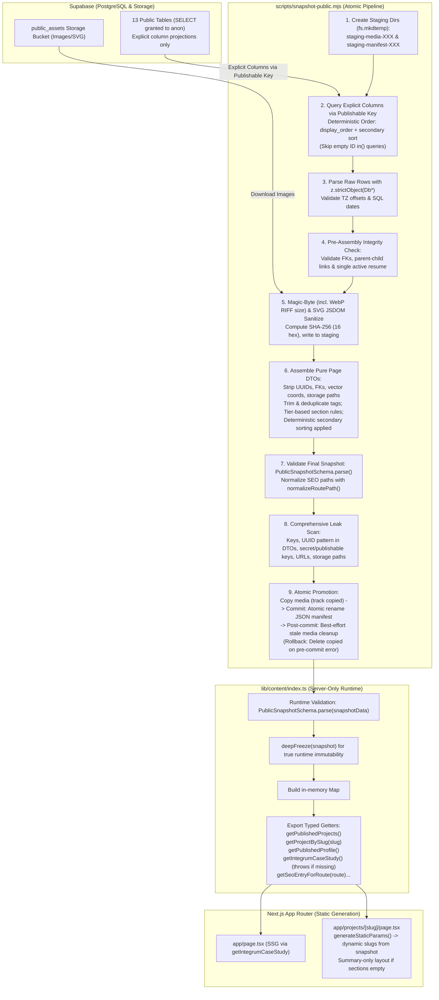

# Phase 4A Design Specification: Public Snapshot Expansion

**Document**: `docs/superpowers/specs/2026-09-20-phase-4a-snapshot-expansion-design.md`
**Date**: 2026-09-20
**Status**: Draft — awaiting review (Revision 3: Final Corrections Incorporated)
**Author**: Antigravity

---

## 1. Executive Summary & Objectives

Phase 4A expands the build-time static snapshot from the single-project Phase 3 slice (`integrum`) to a complete, statically compiled snapshot of all verified public portfolio content.

### Core Guarantees & Constraints
1. **Zero Browser-Time Supabase/Database/Storage/Auth Requests**: 100% of portfolio data required for static page rendering is extracted at build time into `lib/generated/public-snapshot.json`. The browser runtime executes zero database queries, storage requests, or authentication operations. (Normal browser HTTP requests for static assets, fonts, and images continue as standard).
2. **Real Runtime Validation & Deep Immutability in Content Layer**: In `lib/content/index.ts`, `PublicSnapshotSchema.parse(snapshotData)` validates the snapshot at runtime upon server initialization. The parsed snapshot is recursively deep-frozen (`deepFreeze()`) so all getters return immutable, read-safe references. All page-facing TypeScript types are derived directly with `z.infer<typeof Schema>`.
3. **Strict Least Privilege (Publishable Key Only)**: Snapshot generation runs using exclusively the Supabase publishable/anon key under existing RLS policies. No service role key or secret key is permitted or requested.
4. **Strict Decoupling with Pure Page DTOs**:
   - Raw database rows are parsed with strict `Db*` Zod schemas using `z.strictObject(...)` and explicit database column projections (never `select('*')`).
   - Page-facing types are pure presentation DTOs.
   - All database primary keys (UUIDs), foreign keys, bucket identifiers, and storage paths are completely omitted.
5. **No Root-Level `integrum`**:
   - `projects` is stored once as an ordered root-level array: `projects: ProjectCaseStudy[]`.
   - Slugs are determined dynamically from whatever live projects exist in the snapshot.
   - `getProjectBySlug("integrum")` resolves the Integrum case study.
   - A deprecated `getIntegrumCaseStudy()` wrapper is provided in `lib/content` and used by `app/page.tsx`. If Integrum is missing from the snapshot, `getIntegrumCaseStudy()` intentionally throws a descriptive build error rather than returning null.
6. **No Hard-Coded IoT Assumptions**:
   - `generateStaticParams()` dynamically maps over whatever slugs exist in `snapshot.projects`.
   - Exit-gate probes retain the Phase 3 IoT 404 expectation until verified IoT content is published during Phase 4C.
   - Generic route tests use controlled multi-project fixtures; production-snapshot tests require only live projects. No fake IoT content is invented.
7. **Atomic Promotion with Clean Commit Boundary & Rollback**:
   - Media promotion tracks all newly copied files (`copiedFiles`).
   - On pre-commit failure, only `copiedFiles` are deleted; preexisting media is preserved.
   - Manifest replacement (`fs.renameSync` of a temp sibling file) acts as the single commit boundary.
   - Stale-media pruning is a best-effort post-commit operation; pruning failure logs a warning and does not invalidate the committed snapshot.
8. **Pre-Assembly Relational Integrity Validation**:
   - Foreign-key relationships (sections -> projects, section media -> sections, media assets -> public assets, skills -> categories, entities -> media) are verified while internal IDs still exist. Internal IDs are stripped only after relationships pass verification.
9. **Hardened Media Processing**:
   - JPEG: begins with `ffd8ff`, ends with `ffd9`. Standardized strictly to `.jpg` extension.
   - PNG: begins with `89504e470d0a1a0a`.
   - WebP: verifies `RIFF` at bytes 0-3, `WEBP` at bytes 8-11, and little-endian length at bytes 4-7 matches `buffer.length - 8`.
   - Exact byte-count check against database `file_size`.
   - Approved MIME allowlist (`image/jpeg`, `image/png`, `image/webp`, `image/svg+xml`).
   - SVG security parser: Parsed with JSDOM XML DOMParser (`image/svg+xml`), verified well-formed with `<svg>` root and no `DOCTYPE`/entities. Standard SVG namespaces allowed. Strictly rejects `<script>`, `<foreignObject>`, `<animate>`, `<set>`, embedded HTML, attributes starting with `on*`, and any attribute containing external `url(...)`, `javascript:`, `data:`, or external URIs. Allows internal references (`url(#id)`, `href="#id"`).
   - Safe basename sanitization:
     ```ts
     const cleanBase = path.parse(path.basename(asset.file_name)).name
       .toLowerCase().replace(/[^a-z0-9]+/g, '_').replace(/^_+|_+$/g, '').slice(0, 80) || 'asset';
     ```
   - Target filename: `${cleanBase}-${hash16}.${ext}` (where ext is `jpg`, `png`, `webp`, or `svg`).
   - `fileName` in DTO is the generated safe filename.
   - Local path regex strictly enforces: `^/generated/snapshot/[a-z0-9_]+-[a-f0-9]{16}\.(jpg|png|webp|svg)$`.
10. **Deterministic Ordering & Comprehensive Leak Scan**:
    - All collections enforce deterministic primary and secondary sorting in database queries and post-assembly.
    - Leak scan checks forbidden keys, UUID value regex in page DTOs, configured secret keys, publishable keys, project URLs, and storage paths.

---

## 2. Architecture & Data Flow



---

## 3. Shared Helpers & Normalization

```ts
// Route path normalization helper
export function normalizeRoutePath(value: string): string {
  return value.toLowerCase().replace(/\/+/g, '/').replace(/\/+$/, '') || '/';
}

// Reusable Date and Timestamp Schemas
export const IsoDateStringSchema = z.string().regex(/^\d{4}-\d{2}-\d{2}$/, 'Must be YYYY-MM-DD');
export const IsoTimestampSchema = z.string().datetime({ offset: true });
```

---

## 4. Schema Specifications (`lib/schemas/snapshot.ts`)

### 4.1 Raw Database Row Schemas (`Db*`)
All raw schemas use `z.strictObject(...)`. Verified against migration `20260829000000_initial_schema.sql` (profiles does NOT have `is_archived`):

```ts
import { z } from 'zod';
import { IsoDateStringSchema, IsoTimestampSchema } from './helpers';

export const DbProfileSchema = z.strictObject({
  id: z.string().uuid(),
  full_name: z.literal('Sufiyan Shaikh'),
  professional_name: z.string().min(1),
  headline: z.string().min(1),
  bio: z.string().min(1),
  github_url: z.string().url().refine((val) => val.startsWith('https://github.com/'), {
    message: 'GitHub URL must start with https://github.com/',
  }),
  linkedin_url: z.string().url().nullable().optional(),
  email: z.string().email().nullable().optional(),
  is_published: z.literal(true),
  avatar_asset_id: z.string().uuid().nullable().optional(),
});

export const DbProjectSchema = z.strictObject({
  id: z.string().uuid(),
  slug: z.string().regex(/^[a-z0-9]+(?:-[a-z0-9]+)*$/),
  title: z.string().min(1),
  subtitle: z.string().nullable().optional(),
  category: z.string().min(1),
  tier: z.enum(['featured', 'standard', 'mini']),
  description: z.string().min(1),
  problem_statement: z.string().nullable().optional(),
  architecture_overview: z.string().nullable().optional(),
  key_features: z.array(z.string().min(1)).nullable().optional(),
  technologies: z.array(z.string().min(1)).min(1),
  featured_asset_id: z.string().uuid().nullable().optional(),
  demo_url: z.string().url().nullable().optional(),
  github_url: z.string().url().nullable().optional(),
  display_order: z.number().int().nonnegative(),
  state: z.literal('live'),
  is_archived: z.literal(false),
});

export const DbSectionSchema = z.strictObject({
  id: z.string().uuid(),
  project_id: z.string().uuid(),
  title: z.string().min(1),
  content: z.string().min(1),
  display_order: z.number().int().nonnegative(),
});

export const DbSectionMediaSchema = z.strictObject({
  id: z.string().uuid(),
  section_id: z.string().uuid(),
  media_asset_id: z.string().uuid(),
  display_order: z.number().int().nonnegative(),
});

export const DbSkillCategorySchema = z.strictObject({
  id: z.string().uuid(),
  name: z.string().min(1),
  display_order: z.number().int().nonnegative(),
  is_published: z.literal(true),
  is_archived: z.literal(false),
});

export const DbSkillSchema = z.strictObject({
  id: z.string().uuid(),
  category_id: z.string().uuid(),
  name: z.string().min(1),
  proficiency_level: z.string().min(1),
  icon_identifier: z.string().nullable().optional(),
  vector_position_x: z.coerce.number().optional(),
  vector_position_y: z.coerce.number().optional(),
  display_order: z.number().int().nonnegative(),
  is_published: z.literal(true),
  is_archived: z.literal(false),
});

export const DbEducationSchema = z.strictObject({
  id: z.string().uuid(),
  institution: z.string().min(1),
  degree: z.string().min(1),
  field_of_study: z.string().nullable().optional(),
  start_date: IsoDateStringSchema.nullable().optional(),
  end_date: IsoDateStringSchema.nullable().optional(),
  description: z.string().nullable().optional(),
  is_published: z.literal(true),
  is_archived: z.literal(false),
});

export const DbExperienceSchema = z.strictObject({
  id: z.string().uuid(),
  organization: z.string().min(1),
  role_title: z.string().min(1),
  type: z.string().min(1),
  location: z.string().nullable().optional(),
  start_date: IsoDateStringSchema,
  end_date: IsoDateStringSchema.nullable().optional(),
  description_points: z.array(z.string().min(1)),
  display_order: z.number().int().nonnegative(),
  is_published: z.literal(true),
  is_archived: z.literal(false),
});

export const DbCertificationSchema = z.strictObject({
  id: z.string().uuid(),
  name: z.string().min(1),
  issuing_organization: z.string().min(1),
  issue_date: IsoDateStringSchema.nullable().optional(),
  credential_url: z.string().url().nullable().optional(),
  certificate_asset_id: z.string().uuid().nullable().optional(),
  is_published: z.literal(true),
  is_archived: z.literal(false),
});

export const DbAchievementSchema = z.strictObject({
  id: z.string().uuid(),
  title: z.string().min(1),
  date: IsoDateStringSchema.nullable().optional(),
  description: z.string().nullable().optional(),
  achievement_asset_id: z.string().uuid().nullable().optional(),
  is_published: z.literal(true),
  is_archived: z.literal(false),
});

export const DbSeoEntrySchema = z.strictObject({
  id: z.string().uuid(),
  route_path: z.string().regex(/^\/[a-zA-Z0-9_\-\/]*$/),
  title: z.string().min(1),
  description: z.string().min(1),
  keywords: z.array(z.string().min(1)).nullable().optional(),
  og_image_asset_id: z.string().uuid().nullable().optional(),
  is_published: z.literal(true),
  is_archived: z.literal(false),
});

export const DbResumeVersionSchema = z.strictObject({
  id: z.string().uuid(),
  version_label: z.string().min(1),
  file_asset_id: z.string().uuid(),
  is_active: z.literal(true),
  is_archived: z.literal(false),
  uploaded_at: IsoTimestampSchema,
});

export const DbMediaAssetSchema = z.strictObject({
  id: z.string().uuid(),
  bucket_id: z.literal('public_assets'),
  file_name: z.string().min(1),
  file_type: z.enum(['image/jpeg', 'image/png', 'image/webp', 'image/svg+xml']),
  file_size: z.number().int().positive(),
  storage_path: z.string().min(1),
  alt_text: z.string().min(1),
  caption: z.string().nullable().optional(),
  width: z.number().int().positive().nullable().optional(),
  height: z.number().int().positive().nullable().optional(),
  is_archived: z.literal(false),
});
```

### 4.2 Page-Facing Presentation DTO Schemas
All internal IDs, foreign keys, and storage paths omitted. JPEG strictly `.jpg`:

```ts
export const LocalMediaAssetSchema = z.strictObject({
  fileName: z.string().regex(/^[a-z0-9_]+-[a-f0-9]{16}\.(jpg|png|webp|svg)$/),
  localPath: z.string().regex(/^\/generated\/snapshot\/[a-z0-9_]+-[a-f0-9]{16}\.(jpg|png|webp|svg)$/),
  altText: z.string().min(1),
  caption: z.string().nullable().optional(),
  width: z.number().int().positive().nullable().optional(),
  height: z.number().int().positive().nullable().optional(),
});

export const SectionMediaSchema = z.strictObject({
  localPath: z.string().regex(/^\/generated\/snapshot\/[a-z0-9_]+-[a-f0-9]{16}\.(jpg|png|webp|svg)$/),
  altText: z.string().min(1),
  caption: z.string().nullable().optional(),
  width: z.number().int().positive().nullable().optional(),
  height: z.number().int().positive().nullable().optional(),
  displayOrder: z.number().int().nonnegative(),
});

export const ProjectSectionSchema = z.strictObject({
  title: z.string().min(1),
  content: z.string().min(1),
  displayOrder: z.number().int().nonnegative(),
  media: z.array(SectionMediaSchema),
});

export const ProjectCaseStudySchema = z.strictObject({
  slug: z.string().regex(/^[a-z0-9]+(?:-[a-z0-9]+)*$/),
  title: z.string().min(1),
  subtitle: z.string().nullable().optional(),
  category: z.string().min(1),
  tier: z.enum(['featured', 'standard', 'mini']),
  description: z.string().min(1),
  problemStatement: z.string().nullable().optional(),
  architectureOverview: z.string().nullable().optional(),
  keyFeatures: z.array(z.string().min(1)).nullable().optional(),
  technologies: z.array(z.string().min(1)).min(1),
  featuredAsset: LocalMediaAssetSchema.nullable().optional(),
  demoUrl: z.string().url().nullable().optional(),
  githubUrl: z.string().url().nullable().optional(),
  displayOrder: z.number().int().nonnegative(),
  sections: z.array(ProjectSectionSchema),
}).refine((project) => {
  if (project.tier === 'featured' || project.tier === 'standard') {
    return project.sections.length >= 1;
  }
  return true; // mini projects may have 0 sections
}, {
  message: 'Featured and standard projects must contain at least 1 section. Mini projects may have 0 sections.',
  path: ['sections'],
});

export const SkillSchema = z.strictObject({
  name: z.string().min(1),
  proficiencyLevel: z.string().min(1),
  iconIdentifier: z.string().nullable().optional(),
  displayOrder: z.number().int().nonnegative(),
});

export const SkillCategorySchema = z.strictObject({
  name: z.string().min(1),
  displayOrder: z.number().int().nonnegative(),
  skills: z.array(SkillSchema).min(1),
});

export const EducationSchema = z.strictObject({
  institution: z.string().min(1),
  degree: z.string().min(1),
  fieldOfStudy: z.string().nullable().optional(),
  startDate: IsoDateStringSchema.nullable().optional(),
  endDate: IsoDateStringSchema.nullable().optional(),
  description: z.string().nullable().optional(),
});

export const ExperienceSchema = z.strictObject({
  organization: z.string().min(1),
  roleTitle: z.string().min(1),
  type: z.string().min(1),
  location: z.string().nullable().optional(),
  startDate: IsoDateStringSchema,
  endDate: IsoDateStringSchema.nullable().optional(),
  descriptionPoints: z.array(z.string().min(1)),
  displayOrder: z.number().int().nonnegative(),
});

export const CertificationSchema = z.strictObject({
  name: z.string().min(1),
  issuingOrganization: z.string().min(1),
  issueDate: IsoDateStringSchema.nullable().optional(),
  credentialUrl: z.string().url().nullable().optional(),
  certificateAsset: LocalMediaAssetSchema.nullable().optional(),
});

export const AchievementSchema = z.strictObject({
  title: z.string().min(1),
  date: IsoDateStringSchema.nullable().optional(),
  description: z.string().nullable().optional(),
  achievementAsset: LocalMediaAssetSchema.nullable().optional(),
});

export const SeoEntrySchema = z.strictObject({
  routePath: z.string().regex(/^\/[a-zA-Z0-9_\-\/]*$/),
  title: z.string().min(1),
  description: z.string().min(1),
  keywords: z.array(z.string().min(1)).nullable().optional(),
  ogImageAsset: LocalMediaAssetSchema.nullable().optional(),
});

export const ActiveResumeMetadataSchema = z.strictObject({
  versionLabel: z.string().min(1),
  uploadedAt: IsoTimestampSchema,
});

export const ProfileSchema = z.strictObject({
  fullName: z.literal('Sufiyan Shaikh'),
  professionalName: z.string().min(1),
  headline: z.string().min(1),
  bio: z.string().min(1),
  githubUrl: z.string().url().refine((val) => val.startsWith('https://github.com/'), {
    message: 'GitHub URL must start with https://github.com/',
  }),
  linkedinUrl: z.string().url().nullable().optional(),
  email: z.string().email().nullable().optional(),
  avatar: LocalMediaAssetSchema.nullable().optional(),
});
```

### 4.3 Root Snapshot Schema & Cross-Collection Refinements

```ts
export const PublicSnapshotSchema = z.strictObject({
  profile: ProfileSchema,
  projects: z.array(ProjectCaseStudySchema).min(1),
  skillCategories: z.array(SkillCategorySchema),
  education: z.array(EducationSchema),
  experiences: z.array(ExperienceSchema),
  certifications: z.array(CertificationSchema),
  achievements: z.array(AchievementSchema),
  seoEntries: z.array(SeoEntrySchema),
  activeResume: ActiveResumeMetadataSchema.nullable(),
  generatedAt: IsoTimestampSchema,
}).superRefine((data, ctx) => {
  // 1. Slug uniqueness and project display order uniqueness
  const slugs = new Set<string>();
  const projectOrders = new Set<number>();
  for (let i = 0; i < data.projects.length; i++) {
    const p = data.projects[i];
    if (slugs.has(p.slug)) {
      ctx.addIssue({
        code: z.ZodIssueCode.custom,
        message: `Duplicate project slug: "${p.slug}"`,
        path: ['projects', i, 'slug'],
      });
    }
    slugs.add(p.slug);

    if (projectOrders.has(p.displayOrder)) {
      ctx.addIssue({
        code: z.ZodIssueCode.custom,
        message: `Duplicate project displayOrder: ${p.displayOrder}`,
        path: ['projects', i, 'displayOrder'],
      });
    }
    projectOrders.add(p.displayOrder);

    // 2. Section displayOrder uniqueness within project
    const sectionOrders = new Set<number>();
    for (let j = 0; j < p.sections.length; j++) {
      const s = p.sections[j];
      if (sectionOrders.has(s.displayOrder)) {
        ctx.addIssue({
          code: z.ZodIssueCode.custom,
          message: `Duplicate section displayOrder ${s.displayOrder} in project "${p.slug}"`,
          path: ['projects', i, 'sections', j, 'displayOrder'],
        });
      }
      sectionOrders.add(s.displayOrder);

      // 3. Media displayOrder uniqueness within section
      const mediaOrders = new Set<number>();
      for (let k = 0; k < s.media.length; k++) {
        const m = s.media[k];
        if (mediaOrders.has(m.displayOrder)) {
          ctx.addIssue({
            code: z.ZodIssueCode.custom,
            message: `Duplicate media displayOrder ${m.displayOrder} in section "${s.title}" of project "${p.slug}"`,
            path: ['projects', i, 'sections', j, 'media', k, 'displayOrder'],
          });
        }
        mediaOrders.add(m.displayOrder);
      }
    }
  }

  // 4. Skill category uniqueness
  const catNames = new Set<string>();
  const catOrders = new Set<number>();
  for (let i = 0; i < data.skillCategories.length; i++) {
    const cat = data.skillCategories[i];
    const normalizedCatName = cat.name.trim().toLowerCase();
    if (catNames.has(normalizedCatName)) {
      ctx.addIssue({
        code: z.ZodIssueCode.custom,
        message: `Duplicate skill category name: "${cat.name}"`,
        path: ['skillCategories', i, 'name'],
      });
    }
    catNames.add(normalizedCatName);

    if (catOrders.has(cat.displayOrder)) {
      ctx.addIssue({
        code: z.ZodIssueCode.custom,
        message: `Duplicate skill category displayOrder: ${cat.displayOrder}`,
        path: ['skillCategories', i, 'displayOrder'],
      });
    }
    catOrders.add(cat.displayOrder);

    // 5. Skill uniqueness within category
    const skillNames = new Set<string>();
    const skillOrders = new Set<number>();
    for (let j = 0; j < cat.skills.length; j++) {
      const sk = cat.skills[j];
      const normalizedSkillName = sk.name.trim().toLowerCase();
      if (skillNames.has(normalizedSkillName)) {
        ctx.addIssue({
          code: z.ZodIssueCode.custom,
          message: `Duplicate skill name "${sk.name}" in category "${cat.name}"`,
          path: ['skillCategories', i, 'skills', j, 'name'],
        });
      }
      skillNames.add(normalizedSkillName);

      if (skillOrders.has(sk.displayOrder)) {
        ctx.addIssue({
          code: z.ZodIssueCode.custom,
          message: `Duplicate skill displayOrder ${sk.displayOrder} in category "${cat.name}"`,
          path: ['skillCategories', i, 'skills', j, 'displayOrder'],
        });
      }
      skillOrders.add(sk.displayOrder);
    }
  }

  // 6. Normalized SEO route path uniqueness using shared normalizeRoutePath
  const routes = new Set<string>();
  for (let i = 0; i < data.seoEntries.length; i++) {
    const seo = data.seoEntries[i];
    const normalizedRoute = normalizeRoutePath(seo.routePath);
    if (routes.has(normalizedRoute)) {
      ctx.addIssue({
        code: z.ZodIssueCode.custom,
        message: `Duplicate SEO route path: "${seo.routePath}" (normalized: "${normalizedRoute}")`,
        path: ['seoEntries', i, 'routePath'],
      });
    }
    routes.add(normalizedRoute);
  }
});
```

---

## 5. Atomic Snapshot Generation Pipeline (`scripts/snapshot-public.mjs`)

### Step 1: Environment & Staging Creation
- Enforce environment guards (reject localhost when in Vercel or Production).
- Create unique staging directories using `fs.mkdtempSync`:
  - `stagingMediaDir = fs.mkdtempSync(path.join(os.tmpdir(), 'snapshot-media-'))`
  - `stagingManifestDir = fs.mkdtempSync(path.join(os.tmpdir(), 'snapshot-manifest-'))`

### Step 2: Explicit Column Queries & Deterministic Ordering
Explicit column projections only. Primary and secondary deterministic order applied:

1. `profiles`:
   `.select('id, full_name, professional_name, headline, bio, github_url, linkedin_url, email, is_published, avatar_asset_id')`
   `.eq('is_published', true)`
2. `projects`:
   `.select('id, slug, title, subtitle, category, tier, description, problem_statement, architecture_overview, key_features, technologies, featured_asset_id, demo_url, github_url, display_order, state, is_archived')`
   `.eq('state', 'live').eq('is_archived', false)`
   `.order('display_order', { ascending: true })`
   `.order('slug', { ascending: true })`
3. `project_sections`:
   If `projectIds.length === 0`, return `[]` locally. Else:
   `.select('id, project_id, title, content, display_order')`
   `.in('project_id', projectIds)`
   `.order('display_order', { ascending: true })`
   `.order('title', { ascending: true })`
4. `project_section_media`:
   If `sectionIds.length === 0`, return `[]` locally. Else:
   `.select('id, section_id, media_asset_id, display_order')`
   `.in('section_id', sectionIds)`
   `.order('display_order', { ascending: true })`
5. `skill_categories`:
   `.select('id, name, display_order, is_published, is_archived')`
   `.eq('is_published', true).eq('is_archived', false)`
   `.order('display_order', { ascending: true })`
   `.order('name', { ascending: true })`
6. `skills`:
   If `categoryIds.length === 0`, return `[]` locally. Else:
   `.select('id, category_id, name, proficiency_level, icon_identifier, vector_position_x, vector_position_y, display_order, is_published, is_archived')`
   `.eq('is_published', true).eq('is_archived', false)`
   `.in('category_id', categoryIds)`
   `.order('display_order', { ascending: true })`
   `.order('name', { ascending: true })`
7. `education`:
   `.select('id, institution, degree, field_of_study, start_date, end_date, description, is_published, is_archived')`
   `.eq('is_published', true).eq('is_archived', false)`
   `.order('start_date', { ascending: false, nullsFirst: false })`
   `.order('institution', { ascending: true })`
   `.order('degree', { ascending: true })`
8. `experiences`:
   `.select('id, organization, role_title, type, location, start_date, end_date, description_points, display_order, is_published, is_archived')`
   `.eq('is_published', true).eq('is_archived', false)`
   `.order('display_order', { ascending: true })`
   `.order('start_date', { ascending: false })`
9. `certifications`:
   `.select('id, name, issuing_organization, issue_date, credential_url, certificate_asset_id, is_published, is_archived')`
   `.eq('is_published', true).eq('is_archived', false)`
   `.order('issue_date', { ascending: false, nullsFirst: false })`
   `.order('name', { ascending: true })`
10. `achievements`:
    `.select('id, title, date, description, achievement_asset_id, is_published, is_archived')`
    `.eq('is_published', true).eq('is_archived', false)`
    `.order('date', { ascending: false, nullsFirst: false })`
    `.order('title', { ascending: true })`
11. `seo_entries`:
    `.select('id, route_path, title, description, keywords, og_image_asset_id, is_published, is_archived')`
    `.eq('is_published', true).eq('is_archived', false)`
    `.order('route_path', { ascending: true })`
12. `resume_versions`:
    `.select('id, version_label, file_asset_id, is_active, is_archived, uploaded_at')`
    `.eq('is_active', true).eq('is_archived', false)`
    `.order('uploaded_at', { ascending: false })`

### Step 3: Raw Validation & Pre-Assembly Relational Integrity
Parse all rows with `z.strictObject(Db*)`. While database IDs are present, assert:
- Exactly 1 published profile.
- At least 1 live unarchived project.
- Every section's `project_id` matches an existing project.
- Every section-media's `section_id` matches an existing section.
- Every skill's `category_id` matches an existing category.
- Collect all referenced media IDs from:
  `profile.avatar_asset_id`, `project.featured_asset_id`, `section_media.media_asset_id`, `certification.certificate_asset_id`, `achievement.achievement_asset_id`, `seo.og_image_asset_id`.
- If media IDs exist:
  Query `media_assets`: `.select('id, bucket_id, file_name, file_type, file_size, storage_path, alt_text, caption, width, height, is_archived').in('id', mediaIds).eq('bucket_id', 'public_assets').eq('is_archived', false)`.
- Assert every referenced media ID resolves to exactly 1 permitted public asset.
- At most 1 active, non-archived résumé version exists. (Private `resumes` bucket is never queried; résumé is metadata-only).

### Step 4: Hardened Media Processing & SVG Sanitization
- Deduplication cache: `mediaCache = new Map<string, LocalMediaAsset>()` keyed by `asset.id`.
- When processing an asset:
  - Download buffer from Supabase storage (`public_assets`).
  - Verify exact byte count matches `asset.file_size`.
  - **Magic-Byte Inspection**:
    - JPEG: starts `ffd8ff`, ends `ffd9`. Extension strictly `jpg`.
    - PNG: starts `89504e470d0a1a0a`. Extension `png`.
    - WebP: buffer length $\ge 12$. Bytes 0-3 equal `RIFF` (Buffer `52494646`), bytes 8-11 equal `WEBP` (Buffer `57454250`), and `buffer.readUInt32LE(4) + 8 === buffer.length`. Extension `webp`.
  - **SVG XML Sanitizer (using JSDOM)**:
    - Reject if contains `<!DOCTYPE` or `<!ENTITY`.
    - Parse with `new JSDOM(svgText, { contentType: 'image/svg+xml' })`.
    - Assert no XML parser error. Root element must be `<svg>`.
    - Recursively inspect all nodes:
      - Normalize tag name and attribute names to lowercase.
      - Reject tags: `script`, `foreignobject`, `iframe`, `embed`, `object`, `style`, `animate`, `set`.
      - Reject any attribute name beginning with `on` (e.g. `onload`, `onclick`, `onerror`).
      - Inspect EVERY attribute value across all elements:
        - If attribute contains `url(...)`: permit ONLY internal fragment references matching `/^url\(#[-a-zA-Z0-9_]+\)$/`. Any external URL or expression in `url(...)` is strictly rejected.
        - If attribute is `href`, `xlink:href`, or `src`: permit ONLY internal fragment references matching `/^#[-a-zA-Z0-9_]+$/`. Any value with `javascript:`, `data:`, `http:`, `https:`, `//` is strictly rejected.
        - Check for `@import` in any attribute value.
      - Allow standard XML namespaces (`xmlns="http://www.w3.org/2000/svg"`, `xmlns:xlink="http://www.w3.org/1999/xlink"`).
  - **Safe Basename Sanitization**:
    ```ts
    const cleanBase = path.parse(path.basename(asset.file_name)).name
      .toLowerCase().replace(/[^a-z0-9]+/g, '_').replace(/^_+|_+$/g, '').slice(0, 80) || 'asset';
    ```
  - Hashed filename: `${cleanBase}-${hash16}.${ext}` (where `ext` is `jpg`, `png`, `webp`, or `svg`).
  - Write target file to `stagingMediaDir`.
  - DTO created:
    ```ts
    {
      fileName: `${cleanBase}-${hash16}.${ext}`,
      localPath: `/generated/snapshot/${cleanBase}-${hash16}.${ext}`,
      altText: asset.alt_text,
      caption: asset.caption || null,
      width: asset.width || null,
      height: asset.height || null,
    }
    ```

### Step 5: Pure Page DTO Assembly
- Format and assemble nested models:
  - Projects: `sections` and `media` nested and sorted by `displayOrder`, secondary by title.
  - Technologies and feature arrays trimmed and deduplicated: `Array.from(new Set(arr.map(s => s.trim()).filter(Boolean)))`.
  - Skill categories: `skills` nested and sorted by `displayOrder`, secondary by name (vector coordinates discarded).
  - Normalization applied to SEO entries via `normalizeRoutePath()`.
  - Strip all UUIDs and internal foreign keys.

### Step 6: Final Snapshot Validation & Comprehensive Leak Scan
- Parse assembled payload with `PublicSnapshotSchema.parse(payload)`.
- Format JSON string.
- **Comprehensive Leak Scan**:
  1. **Forbidden Key Search**: Object traversal ensures no key is named `id`, `project_id`, `section_id`, `category_id`, `media_asset_id`, `bucket_id`, `bucketId`, `storage_path`, `storagePath`, `service_role`, `is_archived`.
  2. **UUID Value Pattern Rejection**: Traverse all string values in page DTOs (except `activeResume` if none); verify no value matches `/^[0-9a-f]{8}-[0-9a-f]{4}-[0-9a-f]{4}-[0-9a-f]{4}-[0-9a-f]{12}$/i`.
  3. **Credential & Sensitive Value Search**:
     ```ts
     const sensitiveValues = [
       process.env.SUPABASE_SERVICE_ROLE_KEY,
       process.env.TEST_SUPABASE_SERVICE_ROLE_KEY,
       process.env.SUPABASE_PUBLISHABLE_KEY,
       process.env.NEXT_PUBLIC_SUPABASE_ANON_KEY,
       process.env.SUPABASE_ANON_KEY,
       process.env.SUPABASE_URL,
       process.env.NEXT_PUBLIC_SUPABASE_URL,
     ].filter((value): value is string => Boolean(value && value.trim().length > 0));
     ```
     Verify serialized JSON contains none of these sensitive strings.
     Also verify no occurrences of prefixes `sb_secret_`, `SERVICE_ROLE`, private bucket names (`resumes`, `private_assets`), or internal Supabase storage endpoints (`/storage/v1/object/public/`).
- Write validated JSON to `path.join(stagingManifestDir, 'public-snapshot.json')`.

### Step 7: Atomic Promotion & Commit Boundary
- Target locations:
  - Media directory: `public/generated/snapshot/`
  - Manifest file: `lib/generated/public-snapshot.json`
- **Promotion Sequence**:
  1. Ensure target directories `public/generated/snapshot/` and `lib/generated/` exist.
  2. `const copiedFiles = new Set<string>();`
  3. For each file in `stagingMediaDir`:
     - Target path: `path.join(finalMediaDir, file)`.
     - If file does NOT already exist at target:
       - Copy file to target.
       - `copiedFiles.add(targetPath)`.
  4. Write staged manifest to temporary sibling file in `lib/generated/`:
     `tempManifestPath = path.join(rootDir, 'lib', 'generated', 'public-snapshot.json.tmp-' + process.pid + '-' + Date.now())`
     Write JSON content and sync to disk.
  5. **Atomic Commit Boundary**:
     `fs.renameSync(tempManifestPath, finalManifestPath)`.
     Once `renameSync` completes, the snapshot is committed.
  6. **Post-Commit Best-Effort Cleanup**:
     - Read active media localPaths from the committed snapshot JSON.
     - Scan `public/generated/snapshot/` and remove any files (`.jpg`, `.png`, `.webp`, `.svg`) not referenced by the committed snapshot.
     - If pruning fails, log a warning but DO NOT fail the build.
     - Clean up staging directories (`stagingMediaDir`, `stagingManifestDir`).
- **Pre-Commit Failure Recovery**:
  If any error occurs prior to step 5 (`fs.renameSync`):
  - For every file path in `copiedFiles`: `if (fs.existsSync(file)) fs.unlinkSync(file)`.
  - If `tempManifestPath` exists: `fs.unlinkSync(tempManifestPath)`.
  - Remove staging directories.
  - Previous `public-snapshot.json` and previous media remain intact.
  - Exit process with code 1.

---

## 6. Server-Only Content Access Layer (`lib/content/index.ts`)

```ts
import 'server-only';
import snapshotData from '@/lib/generated/public-snapshot.json';
import { PublicSnapshotSchema } from '@/lib/schemas/snapshot';
import { normalizeRoutePath } from '@/lib/schemas/helpers';
import type {
  PublicSnapshot,
  Profile,
  ProjectCaseStudy,
  SkillCategory,
  Education,
  Experience,
  Certification,
  Achievement,
  SeoEntry,
  ActiveResumeMetadata,
} from '@/lib/types/content';

// Deep-freeze helper to enforce true runtime immutability on parsed data
function deepFreeze<T>(obj: T): T {
  if (obj === null || typeof obj !== 'object') return obj;
  Object.freeze(obj);
  for (const key of Object.keys(obj as object)) {
    const val = (obj as Record<string, unknown>)[key];
    if (val !== null && typeof val === 'object' && !Object.isFrozen(val)) {
      deepFreeze(val);
    }
  }
  return obj;
}

// Runtime validation upon server module initialization
const validatedSnapshot: PublicSnapshot = PublicSnapshotSchema.parse(snapshotData);
const snapshot: PublicSnapshot = deepFreeze(validatedSnapshot);

// In-memory Map for O(1) slug resolution
const projectSlugMap = new Map<string, ProjectCaseStudy>(
  snapshot.projects.map((project) => [project.slug, project])
);

export function getSnapshot(): Readonly<PublicSnapshot> {
  return snapshot;
}

export function getPublishedProfile(): Readonly<Profile> {
  return snapshot.profile;
}

export function getPublishedProjects(): ReadonlyArray<ProjectCaseStudy> {
  return snapshot.projects;
}

export function getProjectBySlug(slug: string): Readonly<ProjectCaseStudy> | null {
  return projectSlugMap.get(slug) || null;
}

export function getPublishedProjectSlugs(): string[] {
  return snapshot.projects.map((p) => p.slug);
}

/**
 * @deprecated Use getProjectBySlug('integrum') instead.
 * Retained temporarily during Phase 4A for Phase 3 backward compatibility.
 * Throws a descriptive build error if Integrum is missing from snapshot.
 */
export function getIntegrumCaseStudy(): Readonly<ProjectCaseStudy> {
  const integrum = getProjectBySlug('integrum');
  if (!integrum) {
    throw new Error('Integrum project is missing from snapshot.');
  }
  return integrum;
}

export function getSkillCategories(): ReadonlyArray<SkillCategory> {
  return snapshot.skillCategories;
}

export function getEducation(): ReadonlyArray<Education> {
  return snapshot.education;
}

export function getExperiences(): ReadonlyArray<Experience> {
  return snapshot.experiences;
}

export function getCertifications(): ReadonlyArray<Certification> {
  return snapshot.certifications;
}

export function getAchievements(): ReadonlyArray<Achievement> {
  return snapshot.achievements;
}

export function getSeoEntries(): ReadonlyArray<SeoEntry> {
  return snapshot.seoEntries;
}

export function getSeoEntryForRoute(routePath: string): Readonly<SeoEntry> | null {
  const normalized = normalizeRoutePath(routePath);
  return (
    snapshot.seoEntries.find(
      (entry) => normalizeRoutePath(entry.routePath) === normalized
    ) ?? null
  );
}

export function getActiveResumeMetadata(): Readonly<ActiveResumeMetadata> | null {
  return snapshot.activeResume;
}
```

---

## 7. Re-Export Module (`lib/types/content.ts`)

```ts
export type {
  LocalMediaAsset,
  SectionMedia,
  ProjectSection,
  ProjectCaseStudy,
  Skill,
  SkillCategory,
  Education,
  Experience,
  Certification,
  Achievement,
  SeoEntry,
  ActiveResumeMetadata,
  Profile,
  PublicSnapshot,
} from '@/lib/schemas/snapshot';
```

---

## 8. Dynamic Route Generation & Project Pages

1. **`app/projects/[slug]/page.tsx`**:
   - `generateStaticParams()` calls `getPublishedProjectSlugs()`. It returns dynamically whatever slugs exist in the snapshot (`[{ slug: 'integrum' }, ...]`).
   - Section React key: `${project.slug}-section-${section.displayOrder}`.
   - Section media React key: `${project.slug}-section-${section.displayOrder}-media-${item.displayOrder}`.
   - Summary-only layout: If `project.sections.length === 0` (for `mini` projects), the page renders the executive summary HUD card, technologies, and action links without broken or empty section headings.
2. **`app/page.tsx`**:
   - Uses `getPublishedProfile()` and `getIntegrumCaseStudy()`.
   - If Integrum is missing, it fails the static build with a clear error.
   - Visual output and DOM structure remain 100% identical.

---

## 9. Testing & Verification Strategy

1. **Unit Testing (`__tests__/snapshot/validation.test.ts`)**:
   - Validate all raw `Db*` schemas with `z.strictObject` (rejecting extraneous fields, invalid dates, unaccepted timezones, and archived items).
   - Validate DTO schemas with date enforcement (`IsoDateStringSchema`).
   - Validate filename sanitizer and path regex alignment with hyphens and special characters.
   - Test WebP validation: validates RIFF size header matching buffer length minus 8.
   - Test SVG sanitizer:
     - Positive tests: standard namespaces and internal fragment references (`url(#gradient-id)`, `href="#symbol-id"`).
     - Negative tests: rejects `<!DOCTYPE`, `<!ENTITY`, `<script>`, `<foreignObject>`, `<animate>`, `on*` attributes, external `url(http...)` in fill/filter/style, and remote URIs.
   - Test `SkillSchema` has no vector coordinate fields.
   - Test tier-based section rules (featured/standard require >= 1 section; mini permits 0).
   - Test cross-collection validation refinements:
     - Rejects duplicate project slugs and display orders.
     - Rejects duplicate section/media display orders.
     - Rejects duplicate skill category names/orders.
     - Rejects duplicate skill names/orders.
     - Rejects duplicate SEO route paths using `normalizeRoutePath`.
   - Test comprehensive leak scan: rejects UUID patterns, forbidden keys, sensitive key values, project URLs, and storage paths.
   - Test `deepFreeze` ensures getters return immutable references.
   - Failure-injection tests:
     - Media copy failure (pre-commit abort removes newly copied files, old snapshot preserved).
     - Manifest write failure (temp manifest write fails, newly copied files removed).
     - Manifest promotion failure (rename fails, newly copied files removed, old snapshot preserved).
     - Post-commit stale-media cleanup failure (warning logged, committed snapshot intact).
2. **Static Route Tests (`__tests__/routes/static-routes.test.tsx`)**:
   - Verify `generateStaticParams()` dynamically returns slugs from the snapshot.
   - Verify `getProjectBySlug('integrum')` resolves.
   - Verify `getProjectBySlug('unknown-slug')` returns null.
   - Test `getSeoEntryForRoute()` with various trailing slashes and casing.
   - Generic route tests use controlled multi-project fixtures when testing multi-slug routing.
   - Verify homepage renders unchanged with verified claims.
3. **Security & Bundle Isolation (`__tests__/security/bundle.test.ts`)**:
   - Confirms zero WebGL, Three.js, R3F, GSAP dependencies.
   - Confirms zero `@supabase/supabase-js` in frontend components.
   - Confirms zero secret keys, publishable keys, or private bucket identifiers in snapshot or bundles.
4. **Exit Gate Probes (`scripts/verify-exit-gate.mjs`)**:
   - Maintains the IoT 404 exit-gate expectation until verified IoT content is published during Phase 4C.
5. **Full Local Verification Run**:
   - `npm.cmd run lint`
   - `npm.cmd run type-check`
   - `npm.cmd test`
   - `npx.cmd supabase test db` (pgTAP)
   - `npm.cmd run build` (runs atomic `snapshot:public` followed by `build:next`)
   - `npm.cmd run verify:gate`
